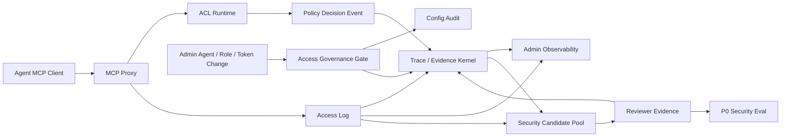

# Lucy 202608 Governance & Observability Gap Analysis

| Metadata | Content |
|---|---|
| Document name | Lucy 202608 Governance & Observability Gap Analysis |
| Document type | Product / Architecture Gap Analysis |
| Version | v0.3 |
| Written date | 2026-08-03；v0.2 更新 2026-08-03（按 202608 Governance & Observability 主线收窄）；v0.3 更新 2026-08-03（删除 Dynamic RLS / CLS POC 超前设计，P2 聚焦当前访问治理复核与发布证据） |
| Goal | 提升 Lucy 成为可信赖的企业级 data agent 平台 |
| Scope | `/admin` 访问治理现状、202608 Governance & Observability specs / plans、权限管理与 Agent 管理相关需求边界、已实现能力与差距 |
| Related blueprint | `docs/lucy-202608-reliable-delivery-upgrade-spec.md` |
| Related plan | `docs/plans/2026-08-03-lucy-enterprise-data-agent-access-governance-plan.md` |

---

## 1. Executive Summary

Lucy 当前已经具备企业级 data agent 平台的关键雏形：`access.yaml` 是访问配置事实源，MCP Proxy 在 `tools/list` 和 `tools/call` 执行 fail-closed ACL，`/admin` 已覆盖 Agent、Role、Token、访问日志、配置审计与权限预览。

主要差距不是 FDE 建模效率，而是：

1. 访问日志、权限裁决、配置变更和审计证据尚未统一成 append-only Trace / Evidence。
2. `/admin/audit` 偏明细查询，缺少 Trace chain 与面向 Agent / Role / Token 的治理可观测聚合。
3. denied / forbidden / raw query 等真实安全事件尚未沉淀成 P0 security Eval。
4. Agent / Role / Token 变更缺少分级治理门禁与周期性风险复核。
5. 发布前缺少基于当前 Agent / Role / Token / ACL / Audit / Eval 事实源的统一证据包。

本地 `http://127.0.0.1:55176/admin` 在审阅时未响应，因此本报告基于代码与文档事实源：`webui/src/pages/admin/**`、`webui/server/admin/**`、`webui/server/proxy/**`、202608 specs 和 plans。

## 2. Current Baseline

| Module | Implemented today | Enterprise value already present |
|---|---|---|
| Agent Admin | Agent list / detail, enablement, Role binding, Token count, recent calls / denied stats, effective permissions preview | 管理员能看到 Agent 是否启用、绑定什么 Role、最近是否异常 |
| Role Admin | Role list / detail, template vs formal Role, usage count, invalid / needs-repair warning, dryRun diff | 权限模板可解释，Role 修改前可预览 |
| Token Admin | Token create / revoke, plaintext one-time return, hash persistence, revoked token table | Token 生命周期有安全边界 |
| MCP Proxy ACL | Bearer identity, Role-first permissions, tool / connection / table checks, raw query forbidden, sensitive metadata guard | 运行时授权 fail-closed |
| Runtime Audit | `access_log`, `access_log_sources`, `permission_snapshots`, query hash / preview, response size, denied reasons, CSV export | 事后访问排查已有基础 |
| Config Audit | `config_change_log`, actor=`local-admin`, diff, export | 配置变更有审计记录 |
| Eval | Eval run / case / monitor exists | 可承接 security regression，但缺候选池 |

## 3. Boundary Model

| Fact source | Role in 202608 | Allowed | Forbidden |
|---|---|---|---|
| `access.yaml` | Access configuration source | Agent、Role、Token hash、defaults deny、static ACL | Runtime events、reviewer decisions、Trace events |
| `.ktx-ui/audit.sqlite` | Audit + Trace / Evidence hot store | access log（含 Spec 125 `generated_sql` 明文）、permission snapshot、policy decision、evidence ref、artifact hash、reviewer / override signature | Raw result rows、raw SQL AST / raw query 攻击载荷、full question、Token plaintext、DB credentials、customer row samples |
| `.ktx-ui/eval/**` | Security Eval run / candidate store | security candidates、reviewer evidence、formal P0 negative cases | Unredacted logs、unreviewed formal Eval cases |

## 4. Three-Layer Gap Table

| Layer | Active task | Current state | Gap | User value |
|---|---|---|---|---|
| P0 | Trace / Evidence Kernel | `access_log` and `permission_snapshots` exist | No append-only `trace_events` / `evidence_events` contract | 审计能还原每次访问的完整证据链 |
| P0 | ACL policy decision trace | `decision_reason` is stored in `access_log` | Not normalized as policy decision event with evidence refs | 能解释 allow / deny 的 Role、Token、权限快照和原因 |
| P0 | Admin Audit Trace Read Model | `/admin/audit` shows rows and heatmap | No trace chain detail from audit row | 管理员在一个页面完成访问核查和权限解释 |
| P1 | Tiered Access Governance Gate | Admin writes config with dryRun and config audit | No P0 / P1 / P2 risk gate for Agent / Role / Token changes | 权限扩张、敏感源暴露、global deny weakening 被发布前拦截 |
| P1 | Safe Log-to-Security-Eval | Eval system exists; denied logs exist | No security candidate pool or reviewer promotion | 真实越权尝试可转成 P0 security regression |
| P1 | Admin Observability Dashboard | Agent / Role pages show some local stats | No unified governance dashboard for Agent / Role / Token risk trends | 运维能快速发现高拒绝率 Agent、过宽 Role、异常 Token |
| P2 | Agent / Role Risk Review Candidates | Usage count and last-used data exist | No read-only periodic review candidate surface | 支持周期性权限复核，减少长期漂移 |
| P2 | Release Readiness Evidence Package | Individual CSV exports exist | No single bounded evidence package for release readiness | 统一汇总当前权限与审计事实，支持发布前治理判断 |

## 5. Deferred Gaps

| Deferred area | Reason |
|---|---|
| FDE Copilot Candidate | FDE work can temporarily use manual + Codex; platform observability is more urgent |
| Generic Static Lint / Reindex Diagnosis | Important for semantic delivery, but not the 202608 governance / Agent management priority |
| Broad Log-to-Eval | Business quality flywheel deferred; 202608 only handles security / permission negative cases |
| Full Visual Debugger | Data contract and Admin read model first; complete visual debugger later |

## 6. Target-State Governance Flow

## 7. Recommendations

1. Reuse the current `/admin` IA. Add Trace read model and dashboard views; do not create a separate governance console.
2. Implement P0 before any P1 dashboard work. Without policy decision events, dashboard metrics are not explainable.
3. Scope Log-to-Eval down to security / permissions first. Denied and forbidden events are the highest-signal enterprise trust data.
4. Gate Agent / Role / Token changes before expanding semantic publish gates.
5. Keep P2 risk review read-only: candidates and optional reviewer evidence only, no auto-remediation.
6. Keep Dynamic RLS / CLS out of 202608 specs and work orders; keep FDE Copilot and generic Static Lint / Reindex as Deferred future specs.

## 8. Beta Readiness Criteria

Lucy 202608 Governance & Observability is beta-ready when:

- Every business `tools/call` writes or can link to access log and policy decision trace.
- P0 denied events can be traced to Role, Token hash, permission snapshot, and reason.
- `/admin/audit` can open a read-only evidence chain.
- Agent / Role / Token governance changes pass a tiered gate or produce explicit warnings.
- Denied access logs can become reviewed P0 security Eval cases.
- Governance dashboard surfaces Agent / Role / Token anomalies.
- Release readiness evidence package includes only current Agent / Role / Token / ACL / Audit / Eval facts and no future multi-tenant or Dynamic RLS / CLS claims.
