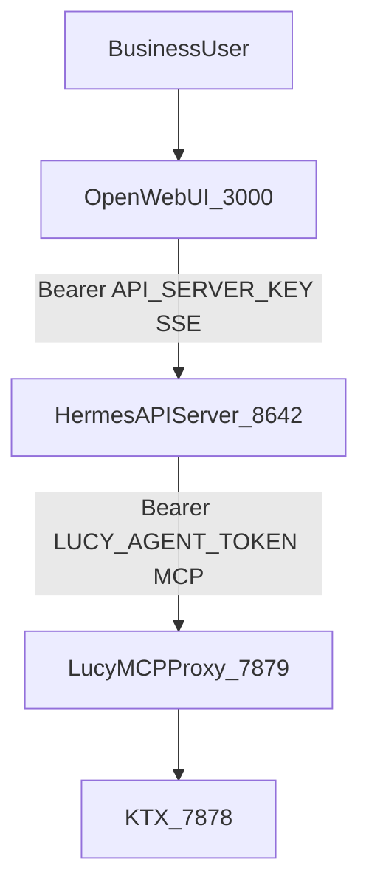

# Lucy 可选 Agent Chat（A3）— Design Spec

| 元数据 | 内容 |
|---|---|
| 文档名称 | Lucy 可选 Agent Chat（A3）设计 |
| 文档类型 | Design |
| 版本 | v0.2 |
| 撰写日期 | 2026-08-26；v0.2 同步可选 compose / Runbook / 烟测出口落地 |
| 撰写人 | Cursor Agent |
| 委托人 | xingchen |
| 基于材料 | 既有架构评估结论（Open WebUI + Hermes API Server → Lucy MCP）；`docs/vision.md`；`docs/agent-integration-guide.md`；`docs/lucy-platform-goal-checklist.md`；Hermes API Server / Open WebUI 官方集成文档 |
| 适用范围 | 可选用户侧流式对话端的设计冻结与单租户验证；**不**作为默认客户交付或 Proxy 实现工单 |
| 输出位置 | `docs/design-lucy-agent-chat-a3.md` |

---

## 0. 硬约束（底线）

本 Spec 的一切设计、验证与后续实现提案必须遵守以下底线；冲突时以本节省略扩展能力。

1. **Lucy 不被干扰，可独立交付**  
   默认 headless / 现有 Docker 交付路径不变。不修改 Lucy MCP Proxy 对外契约，不修改默认 `docker-compose` 主路径，不把对话 UI 嵌进 Lucy WebUI（Data Agent Ops Control Plane）。

2. **Agent 在 Lucy 之上交付**  
   Open WebUI + Hermes 为可选附属层。数据能力仅经 MCP Bearer 调用**已部署**的 Lucy（`LUCY_PUBLIC_MCP_URL`）。Lucy 仍不直接回答业务问题。

3. **只做单租户验证（M0）**  
   一个 Hermes profile、一个 Lucy Agent token；Open WebUI 可有多登录账号，但共享同一 data agent。本 Spec **不**设计多 profile / 多 Lucy role 隔离（M1/M2）。

4. **实现不得破坏 Lucy 独立交付**  
   架构口径以本文为准。可选实现（compose overlay / Runbook / 包装烟测）必须保持旁路：`docker-compose.yml` 与 Proxy / `access.yaml` 运行时默认路径不变；Agent Chat **永不**进入 headless / SOW trust 硬门禁。

---

## 1. 问题与定位

### 1.1 问题

Lucy 是 **data agent context compiler + governed MCP runtime**：编译语义 / wiki / eval / access，经 Proxy 向 Agent 暴露受控 `lucy_*` 工具面。业务用户若没有自备 Claude Code / Hermes / Cursor，则缺少「浏览器里问一句、流式拿到答案」的入口。

该缺口**不是刚需**：客户 headless 交付与 SOW 信任门禁仍以 MCP + 外部 Agent 为准。本设计仅覆盖「可选验证用对话端」。

### 1.2 方案代号 A3

| 层 | 组件 | 职责 |
|---|---|---|
| Chat UI | Open WebUI | 多会话、流式渲染、轻量账号 |
| Agent Runtime | Hermes API Server | Agent loop、MCP 客户端、SSE / tool progress |
| 数据与治理 | Lucy MCP Proxy + KTX | 鉴权、ACL、audit、trace、语义查询 |

产品叙事：**Agent Chat 是可选附属对话端；Lucy 仍是 MCP 治理层。** 禁止称为「Lucy 问答内核」或暗示 Lucy 自身生成分析结论。

### 1.3 非目标

- 不把 Chat 并入 Lucy WebUI 导航或 iframe。
- 不在 Lucy Proxy 内实现 LLM 编排或流式 token 代理。
- 不默认开放 Hermes `terminal` / `browser` / `file` / `delegation` / `cronjob` / `code_execution`。
- 不做多租户记忆隔离、不做企业 SSO 与 Open WebUI 账户打通。
- 不将本能力纳入 `smoke:p0:headless-config`、`e2e:sow-trust-standard` 或客户默认镜像。
- 不交付 Admin「启动 Chat」按钮、Eval runner 的 Open WebUI 适配器、多租户（M1/M2）。
- Compose overlay / Runbook / 可选烟测见 §9（已落地为旁路交付物，非默认 compose）。

---

## 2. 架构

### 2.1 拓扑



文字等价：

```text
BusinessUser
  → Open WebUI (:3000)          # 对外可选暴露
      → Hermes API Server (:8642)  # 默认内网 / loopback
          → Lucy MCP Proxy (:7879/mcp)
              → KTX MCP (:7878)
```

### 2.2 组件职责

| 组件 | 负责 | 不负责 |
|---|---|---|
| Open WebUI | 对话 UX、会话列表、SSE 展示 | 表级 ACL、SQL、语义口径 |
| Hermes API Server | 规划、调用 MCP、流式与 tool progress、本机 profile 配置 | 最终数据权限裁决 |
| Lucy MCP Proxy | Token 鉴权、工具/表 ACL、audit、trace、`initialize` instructions | 对话 UX、模型选型 |
| KTX | 语义查询执行 | 用户会话 |

工具执行位置遵循 Hermes 官方语义：MCP / 本机工具跑在 **Hermes API Server 所在主机**。A3 验证场景下 Hermes 只应调用 Lucy MCP，不依赖本机 shell。

### 2.3 三层身份（必须分离）

| 层 | 凭证 | 持有方 | 作用 |
|---|---|---|---|
| L1 Chat 用户 | Open WebUI 账号 | 业务验证用户 | 会话与 UI 权限 |
| L2 Agent API | `API_SERVER_KEY` | Open WebUI → Hermes | 调用 Hermes OpenAI 兼容 API |
| L3 数据面 | `LUCY_AGENT_TOKEN` | Hermes → Lucy | 调用受治理 MCP |

规则：

- L1 用户不得持有或看见 L3 token 明文。
- L2 与 L3 密钥不得复用；轮换互不影响。
- 数据面审计权威在 Lucy（access_log / conversation_turns / trace）；Chat 历史留在 Open WebUI；Hermes 可有本机 session，但 M0 验证默认不依赖跨用户持久 memory。

### 2.4 网络与端口

| 服务 | 端口 | 对外暴露（验证部署） |
|---|---|---|
| Open WebUI | 3000 | 可（或经 Ingress） |
| Hermes API Server | 8642 | **否**；仅 Open WebUI 容器/进程可达 |
| Lucy MCP Proxy | 7879 或 `LUCY_PUBLIC_MCP_URL` | 按现有 Lucy 部署；Hermes 必须能访问 |
| Lucy WebUI | 既有端口 | 治理用；与 Agent Chat **分离** |
| KTX | 7878 | 仅 Proxy 可达 |

Open WebUI 以 **server-to-server** 调用 Hermes，验证部署**不**为浏览器直连 Hermes 配置 `API_SERVER_CORS_ORIGINS`。

---

## 3. 单租户验证模型（M0）

### 3.1 定义

| 维度 | M0 约定 |
|---|---|
| Hermes | 单一 profile，建议名 `lucy-chat` |
| Lucy Agent | 单一 `access.yaml` 用户 + 单一 Bearer token；role 为明确只读模板（验证环境自选，如 `kx_readonly` / POC 只读 role） |
| Open WebUI | 可创建多个登录账号；模型下拉仅暴露同一 `lucy-data-agent` |
| 记忆 | **默认关闭** Hermes 跨会话持久 memory 写入；接受「无长期共享大脑」。若验证需要开启 memory，必须在验证记录中显式接受「所有 Chat 用户共享同一 Hermes 记忆」 |
| 隔离目标 | 验证「流式对话 → Lucy MCP → 审计可见」；**不**验证用户间数据权限隔离 |

### 3.2 明确不做（本 Spec）

- M1：多 Hermes profile × 多 Lucy role  
- M2：每业务用户独立 Hermes profile  
- Open WebUI 用户与 Lucy Agent / WebUI Admin 的身份联邦  

---

## 4. Hermes profile 契约（`lucy-chat`）

### 4.1 MCP 配置

与现有 Agent 接入一致（见 `docs/agent-integration-guide.md`、Admin Token 首秀 Hermes snippet）：

```json
{
  "mcpServers": {
    "lucy": {
      "type": "http",
      "url": "<LUCY_PUBLIC_MCP_URL>",
      "headers": {
        "Authorization": "Bearer <LUCY_AGENT_TOKEN>"
      }
    }
  }
}
```

- URL 必须来自部署方 `LUCY_PUBLIC_MCP_URL` / `GET /api/project.mcpEndpoint.url`，禁止把仅本机可达的地址当作客户验证入口却不加说明。
- Token 明文只在 Admin 生成时交付一次，写入 Hermes 密钥存储（如 profile `.env`），不得提交进 git。

### 4.2 Toolset 白名单（安全默认）

| 类别 | M0 验证默认 | 说明 |
|---|---|---|
| MCP `lucy_*`（及兼容面若 token 仍暴露） | 开 | 唯一数据通道；优先 R1：`lucy_catalog` / `lucy_read_source` / `lucy_query` / `lucy_explain_query` / `lucy_freshness` / `lucy_begin_question` |
| `web` / `browser` / `terminal` / `file` | **关** | 对话端不得变成运维壳 |
| `delegation` / `cronjob` / `code_execution` | **关** | 降低复杂度与攻击面 |
| `memory` / `session_search` | **关**（默认） | 见 §3.1 |
| `skills` | 关或只读已审技能 | 不自动写入生产 `skills/` |

Lucy 侧既有 `defaults.deny_tools`（如 `sql_execution`、`memory_ingest`）继续生效；Hermes 收窄是纵深防御，不是替代 Proxy ACL。

### 4.3 API Server

| 项 | M0 约定 |
|---|---|
| `API_SERVER_ENABLED` | `true` |
| `API_SERVER_HOST` | `127.0.0.1` 或 compose 内网服务名 |
| `API_SERVER_PORT` | `8642` |
| `API_SERVER_KEY` | 强随机；注入 Open WebUI `OPENAI_API_KEY` |
| `API_SERVER_MODEL_NAME` | **`lucy-data-agent`**（Open WebUI 模型下拉展示名） |
| `API_SERVER_CORS_ORIGINS` | 不设（server-to-server） |
| API 模式 | **Chat Completions** + `stream: true`（SSE） |
| Responses API | 本 Spec 不做 |

LLM provider 密钥只存在于 Hermes；Open WebUI 只配置指向 Hermes `/v1` 的 connection，不直连业务大模型。

### 4.4 请求路径（验证期望）

1. 用户在 Open WebUI 发送问题。  
2. Open WebUI `POST /v1/chat/completions`（SSE）→ Hermes。  
3. Hermes 创建 server-side agent，按需调用 Lucy MCP。  
4. Lucy 写入 audit / trace；Hermes 流式回传 tool progress（若启用）与最终文本。  
5. Open WebUI 渲染流式回复。  

长耗时（多轮 `lucy_*`）属正常；验证记录不得仅因「首包延迟」判失败，须结合 Lucy audit 是否出现对应调用。

---

## 5. 配置矩阵

| 配置项 | 落点 | 说明 |
|---|---|---|
| `LUCY_PUBLIC_MCP_URL` | Lucy 部署 / Hermes MCP URL | Agent 真实 MCP 入口 |
| `LUCY_AGENT_TOKEN` | Hermes secrets（L3） | 单租户只读 Agent token |
| `API_SERVER_ENABLED` / `PORT` / `HOST` / `KEY` / `MODEL_NAME` | Hermes（L2） | 对 Open WebUI 暴露 agent API |
| LLM provider keys | Hermes only | 模型推理 |
| `OPENAI_API_BASE_URL` | Open WebUI | 形如 `http://hermes:8642/v1`（须含 `/v1`） |
| `OPENAI_API_KEY` | Open WebUI | 必须等于 `API_SERVER_KEY` |
| `ENABLE_OLLAMA_API` | Open WebUI | 验证部署设为 `false`，避免空 Ollama 干扰模型列表 |

运维注意：Open WebUI 首次启动后 connection 可能写入自有 DB；仅改环境变量不一定覆盖 Admin UI 中已保存的错误 key——验证排障须检查 Admin → Connections，或重建 Open WebUI 数据卷。

---

## 6. 与现有 Lucy 交付的关系

| 现有能力 | 与 A3 的关系 |
|---|---|
| Docker headless + `customer-config/` | **不变**；默认不启 Agent Chat |
| Lucy MCP Proxy / R1 `lucy_*` | 数据面唯一入口；A3 只作客户端 |
| Admin Agent / Token 首秀（Hermes tab） | 为 M0 的 `lucy-chat` Agent 发卡；配置粘贴进 Hermes |
| `docs/agent-integration-guide.md` | 接入契约事实源；本 Spec 不改写其 endpoint/auth 规则 |
| `npm run e2e:agent:local-hermes` | 数据面 Hermes→Lucy 旁证；**不**替代 Agent Chat UI 验证 |
| Lucy WebUI | 继续只做治理；不承载 Chat |

交付原则一句话：**先有可独立运行的 Lucy；再在其上叠加可选 Agent Chat 做验证。**

---

## 7. 验证门禁（设计级，手工）

本门禁用于 **M0 手工联调**，不进入 headless / SOW trust 硬门禁。

### 7.1 必过

| ID | 检查项 | 通过标准 |
|---|---|---|
| V-1 | Lucy 独立 | 不启 Open WebUI / Hermes Chat 时，既有 Lucy compose / headless 路径仍可启动并通过既有 P0 健康检查 |
| V-2 | 流式对话 | Open WebUI 对 `lucy-data-agent` 提问后可见流式（或最终）文本回复 |
| V-3 | 数据面落地 | 同一次提问在 Lucy audit（或 trace）中出现至少一次允许的 `lucy_*`（或兼容面）`tools/call` |
| V-4 | 密钥分离 | 验证记录确认 L2 / L3 为不同密钥；Chat 用户流程中不出现 L3 明文 |
| V-5 | 能力面收窄 | Hermes 验证 profile 未启用 terminal/browser（配置检查或等价证据） |

### 7.2 明确不测

- 多用户数据权限互斥  
- Open WebUI 公网加固全量清单（可作为部署建议，非本 Spec 退出条件）  
- Hermes 95% QA Accuracy Gate（仍属 R1 / eval 体系，不挂在 Chat UI 上）  

### 7.3 建议旁证（非阻塞）

- 复跑 `npm run e2e:agent:local-hermes` 证明本机 Hermes→Lucy 数据面仍健康（与 Chat UI 解耦）。

---

## 8. 安全基线（验证部署）

1. Hermes toolset 按 §4.2 收窄。  
2. Lucy deny_tools / role ACL 保持现网。  
3. `:8642` 不对公网暴露。  
4. 若 Open WebUI 临时对公网：HTTPS、强管理员密码、按需关闭公开注册。  
5. L3 token 可轮换；泄露影响面限于该只读 Agent。  
6. 不在 Chat UI 中主动展示密钥或完整内部 token。

---

## 9. 实现出口与状态

| 出口 | 状态 | 说明 |
|---|---|---|
| Compose overlay | **已落地** | [`docker-compose.agent-chat.yml`](../docker-compose.agent-chat.yml) + [`agent-chat/`](../agent-chat/)；`--profile agent-chat`；默认 `docker compose up` 不启动 |
| 短 Runbook | **已落地** | [`docs/runbook-lucy-agent-chat-a3.md`](runbook-lucy-agent-chat-a3.md) |
| 可选包装烟测 | **已落地** | `npm run smoke:agent-chat:a3`（静态）；`--live` 可达则探测，否则 blocked；**不**进 headless P0 |
| 端到端「提问 → audit `lucy_*`」CI | 未做 | 需运行中的 LLM + Lucy + Chat；保持手工 / gated |
| M1 | 未做 | 多 profile / 多 Lucy role |
| Responses API | 未做 | 待 Open WebUI 对 function_call 事件成熟后再评 |
| Admin「启动 Chat」 | 未做 | 不在本能力范围 |

---

## 10. Terminology Compliance

This feature follows `webui/docs/00-product-terminology-standard.md`.

本 Spec 引入并已在术语标准登记的主术语：

| 主术语 | 含义 | 禁止说法 |
|---|---|---|
| Agent Chat | 可选用户侧流式对话端（附属层） | Lucy 问答内核、Lucy 自己回答问题 |
| `lucy-data-agent` | Hermes `API_SERVER_MODEL_NAME` / Open WebUI 模型名 | 随意改名导致文档与验证不一致 |
| Open WebUI / Hermes / API Server / MCP / SSE | 保留英文专名 | 机器直译乱造中文专名 |

Protected / `notranslate` 候选（若未来任何 Lucy WebUI 文案提及本能力）：`Agent Chat`、`lucy-data-agent`、`Open WebUI`、`Hermes`、`MCP`、`SSE`、`API Server`。

本 Spec 正文与索引文档不得暗示 Lucy 取代 Agent 生成最终业务结论。

---

## 11. 参考

- `docs/vision.md` — 产品定位  
- `docs/agent-integration-guide.md` — MCP 接入  
- `docs/lucy-platform-goal-checklist.md` — 平台验收边界  
- `webui/docs/14-agent-admin-enterprise-delivery-spec.md` — Token / Hermes 交付  
- `webui/docs/09-lucy-r1-mcp-tool-contract.md` — R1 工具面  
- Hermes：API Server、Open WebUI 集成官方文档（外部）  
