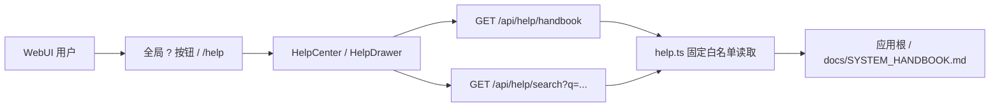

# Lucy 系统手册内置化与 Help Center 设计方案

| 元数据 | 内容 |
|---|---|
| 文档名称 | Lucy 系统手册内置化与 Help Center 设计方案 |
| 文档类型 | Design + Work Orders |
| 版本 | v0.1 |
| 撰写日期 | 2026-07-29 |
| 撰写人 | Codex |
| 状态 | 待实现 |
| 依赖文档 | `docs/SYSTEM_HANDBOOK.md`、`docs/design-webui-ui-refresh.md`、`webui/docs/06-navigation-ia.md`、`webui/docs/17-static-catalog-loading-spec.md` |
| 目标代码范围 | `webui/server/`、`webui/src/`、`docs/SYSTEM_HANDBOOK.md` |

---

## 1. 背景与目标

`docs/SYSTEM_HANDBOOK.md` 已经覆盖 Project Lucy 的系统概述、快速上手、模块操作、MCP 接入、配置速查和排障说明。但如果它只停留在仓库文档里，普通使用者、运维人员和 Agent 协作者仍需要知道文件路径、打开编辑器、手动定位章节，不能在系统使用现场获得帮助。

本设计的目标是把系统手册内置为 Lucy WebUI 的一项产品能力：

1. WebUI 任意页面都能通过 `?` 帮助按钮进入对应操作说明。
2. 用户可以在系统内阅读完整系统手册、搜索问题、复制命令片段。
3. 帮助内容仍以仓库内 `docs/SYSTEM_HANDBOOK.md` 为单一事实源，并在运行时作为应用内置只读资产提供，避免 UI 文案与文档漂移。
4. Help API 只读、固定白名单，不开放任意文件读取，不接触 `.ktx/secrets/**`。
5. 首期不引入 AI 问答；保持 Zero AI Dependency 和本地文件 SSOT。

## 2. 非目标

| 非目标 | 原因 |
|---|---|
| 不做在线知识库 / 外部 CMS | 当前产品以本地文件系统为事实源 |
| 不把 Help 文档写入 `wiki/` | Wiki 属业务语义上下文，受 Agent ACL 影响；系统手册属于产品帮助，不应混入业务检索域 |
| 不让用户在 WebUI 内编辑系统手册 | 手册是仓库级治理文档，首期只读 |
| 不读取任意 `docs/*.md` | 防止把临时审计、敏感交付材料或非用户文档暴露到 UI |
| 不接入 LLM 搜索 / RAG | 首期只做本地关键词搜索，避免引入运行时依赖和权限复杂度 |

## 3. 用户体验方案

### 3.1 信息架构

新增两个入口：

| 入口 | 形态 | 用途 |
|---|---|---|
| 全局 `?` 按钮 | App Shell 右上角或左侧导航底部固定图标 | 打开当前页面上下文帮助抽屉 |
| `/help` | 完整页面 | 阅读完整系统手册、目录跳转、搜索 |

推荐交互：

```text
用户在任意 WebUI 页面
  ├─ 点击 ?              -> 打开 Help Drawer，默认定位当前页面相关章节
  ├─ Drawer 点击完整手册 -> 跳转 /help?section=<section-id>
  └─ 直接访问 /help      -> 打开完整手册，默认显示目录和全文
```

### 3.2 Help Drawer

Help Drawer 是轻量上下文帮助，不替代完整手册。

| 区域 | 内容 |
|---|---|
| 标题 | 当前页面帮助，例如“表白名单帮助” |
| 摘要 | 2-4 条当前页面最常见操作 |
| 关键步骤 | 从手册章节摘取的短流程 |
| 常见故障 | 关联 FAQ，例如 manifest 缺失、401、Access denied |
| 操作按钮 | “打开完整手册”“复制相关命令”“关闭” |

Drawer 设计原则：

- 不覆盖主工作区的关键状态，宽度建议 `420-520px`。
- 打开后 URL 可选写入 `?help=1`，刷新可复现；关闭后移除。
- 当前页面如果无精确映射，则回退到系统概览。
- 帮助内容只读，不提供编辑入口。

### 3.3 Help Center 完整页面

路由：`/help`

布局：

```text
┌──────────────────────────────────────────────────────────────┐
│ 顶部：系统手册 / 搜索框 / 文档更新时间 / 打开源文件路径        │
├───────────────┬──────────────────────────────────────────────┤
│ 左侧目录       │ 右侧 Markdown 正文                           │
│ - 系统概述     │ # Project Lucy 系统使用与运维手册             │
│ - 快速上手     │ ...                                          │
│ - MCP 接入     │                                              │
└───────────────┴──────────────────────────────────────────────┘
```

功能要求：

| 能力 | P0 | P1 |
|---|---:|---:|
| 完整手册只读展示 | 是 | 是 |
| 目录锚点跳转 | 是 | 是 |
| `?section=` 深链定位 | 是 | 是 |
| 文本搜索 | 否 | 是 |
| 表格渲染 | 可降级 | 是 |
| 代码块复制 | 否 | 是 |
| 当前页面上下文 Drawer | 否 | 是 |

## 4. 页面到手册章节映射

新增 `webui/src/lib/helpContext.ts`，维护 route 到章节的稳定映射。

| WebUI 路由 | 默认帮助章节 | 说明 |
|---|---|---|
| `/onboarding` | `deployment-checklist` | 部署向导与上线检查 |
| `/connections` | `database-connections` | 连接概览、连接测试、KTX 状态 |
| `/connections/whitelist` | `table-whitelist` | 表白名单、`enabled_tables`、manifest 对齐 |
| `/connections/test` | `connection-test` | 数据库连通与 KTX CLI 检查 |
| `/` | `semantic-catalog` | 表目录、完成度、Wiki 引用 |
| `/sources/:conn/:schema/:table` | `semantic-table-editor` | 表语义编辑、Human vs AI、Overlay |
| `/joins/:conn/:schema/:table` | `semantic-joins` | Join 维护 |
| `/wiki` | `business-wiki` | Wiki frontmatter、`?sl_ref` 联动 |
| `/review` | `review-validate` | changed files、validate changed |
| `/admin/agents` | `admin-agents` | Agent 实例、Token、Role |
| `/admin/agents/:userId` | `admin-agents` | Agent 详情 |
| `/admin/agents/:userId/tokens/new` | `admin-tokens` | Token 发行、一次性明文、撤销 |
| `/admin/roles` | `admin-roles` | Role 模板、tools、tableSelectors |
| `/admin/audit` | `admin-audit` | MCP 访问日志、`decision_reason` |
| `/admin/audit-sources` | `admin-audit-sources` | 数据源热力、source 审计 |
| `/admin/config-audit` | `admin-config-audit` | 配置变更审计 |
| `/eval/cases` | `eval-cases` | Eval case 维护 |
| `/eval/runs` | `eval-runs` | Run 试跑和 artifact |
| `/eval/monitor` | `eval-monitor` | 趋势监控、阈值 |
| `/help` | `system-overview` | 完整手册 |

章节 ID 不直接依赖中文标题 slug，避免标题改字导致深链失效。建议在服务端解析 Markdown 时维护一张显式别名表。

## 5. 架构设计

### 5.1 拓扑



### 5.2 后端模块

新增文件：`webui/server/help.ts`

职责：

1. 固定读取应用根下的 `docs/SYSTEM_HANDBOOK.md`，例如 Docker 镜像内 `/app/docs/SYSTEM_HANDBOOK.md`；不得依赖客户项目根 `/data/lucy/docs`。
2. 解析标题生成 TOC。
3. 基于手写 alias map 生成稳定 section id。
4. 返回 Markdown 原文、更新时间、hash/etag。
5. 提供本地关键词搜索，返回命中的章节、标题、片段。

不建议复用 `/api/wiki`：

| 原因 | 说明 |
|---|---|
| 权限域不同 | Wiki 是业务上下文，Help 是系统产品文档 |
| 路径边界不同 | Wiki 只允许 `wiki/**/*.md`，Help 只允许固定手册文件 |
| 编辑语义不同 | Wiki 可写，Help 首期只读 |
| Agent 暴露不同 | Wiki 可被 MCP `wiki_search` 暴露，Help 不应进入 Agent 业务语料 |

### 5.3 API 设计

#### `GET /api/help/handbook`

响应：

```json
{
  "ok": true,
  "data": {
    "id": "system-handbook",
    "title": "Project Lucy 系统使用与运维手册",
    "sourcePath": "docs/SYSTEM_HANDBOOK.md",
    "updatedAt": "2026-07-29T12:00:00.000Z",
    "etag": "sha256:<hex>",
    "toc": [
      { "id": "system-overview", "level": 2, "title": "1. 系统概述与架构拓扑" },
      { "id": "quick-start", "level": 2, "title": "2. 快速上手" }
    ],
    "markdown": "# Project Lucy 系统使用与运维手册\n..."
  }
}
```

#### `GET /api/help/search?q=<keyword>&limit=20`

响应：

```json
{
  "ok": true,
  "data": {
    "query": "token",
    "items": [
      {
        "sectionId": "admin-tokens",
        "title": "访问治理 Admin",
        "snippet": "Token 明文只在创建 token 的 HTTP 响应出现一次..."
      }
    ]
  }
}
```

错误：

| code | 场景 |
|---|---|
| `ERR_HELP_DOC_NOT_FOUND` | 应用根下 `docs/SYSTEM_HANDBOOK.md` 不存在 |
| `ERR_HELP_DOC_READ_FAILED` | 文件读取失败 |
| `ERR_HELP_QUERY_TOO_LONG` | 搜索词超过限制，例如 80 字符 |

### 5.4 前端模块

新增/修改文件：

| 文件 | 变更 |
|---|---|
| `webui/src/app/App.tsx` | 注册 `/help` route；App Shell 加 `HelpButton` |
| `webui/src/pages/HelpCenter.tsx` | 完整手册页 |
| `webui/src/components/HelpButton.tsx` | 全局问号入口，带 tooltip |
| `webui/src/components/HelpDrawer.tsx` | 上下文帮助抽屉 |
| `webui/src/components/HelpMarkdown.tsx` | 手册 Markdown 渲染 |
| `webui/src/lib/helpContext.ts` | route 到 section 映射 |
| `webui/src/lib/queryKeys.ts` | 增加 `helpHandbook`、`helpSearch` |
| `webui/src/lib/types.ts` | 增加 Help API 类型 |
| `webui/src/app/app.css` | Help 页、Drawer、目录、搜索样式 |

P0 可暂时复用 `MarkdownPreview`，但它当前不支持 Markdown table，手册中的表格会降级成段落。P1 必须补齐表格渲染，推荐两种路径：

| 路径 | 优点 | 风险 |
|---|---|---|
| 扩展现有 `MarkdownPreview` 支持 GFM table | 无新增依赖，安全边界可控 | 需要维护自研 parser |
| 引入 `marked` + `DOMPurify` 或同等级 sanitizer | GFM 支持完整 | 新增依赖和安全审查成本 |

建议：P0 复用现有渲染器快速上线；P1 引入“受控 GFM 渲染器”，禁止 raw HTML，允许标题、段落、列表、表格、代码块、链接。

## 6. 安全与治理边界

| 边界 | 设计 |
|---|---|
| 读取范围 | 只读应用根下的 `docs/SYSTEM_HANDBOOK.md`，不接受任意 path |
| 写入 | Help API 不提供写接口 |
| secrets | 不读取 `.ktx/secrets/**`；手册内只允许占位符 |
| HTML | Markdown raw HTML 默认转义或丢弃 |
| 外链 | 链接默认新窗口打开，禁止 `javascript:` |
| 缓存 | 可按 `mtimeMs + size` 或 `sha256` 生成 etag；本地开发无需强缓存 |
| Agent 暴露 | Help 不进入 MCP `wiki_search`，避免系统文档被当业务证据 |

## 7. 实施工单

### M15-P0-1 后端 Help API

| 项 | 内容 |
|---|---|
| 目标 | 新增只读 Help API，读取应用内置的 `docs/SYSTEM_HANDBOOK.md` |
| 文件 | `webui/server/help.ts`、`webui/server/index.ts`、`webui/server/__tests__/help.test.ts` |
| 范围 | `GET /api/help/handbook`；标题 TOC；固定白名单；错误 envelope |
| 验收 | 正常返回 markdown/toc/sourcePath/updatedAt；缺文件返回 `ERR_HELP_DOC_NOT_FOUND`；不能读取任意 path；Docker demo 中即使 `/data/lucy/docs` 不存在也能加载 |

实现要点：

1. `HELP_DOCS = { handbook: "docs/SYSTEM_HANDBOOK.md" }` 固定常量。
2. 使用应用根读取内置手册，应用根优先来自 `LUCY_APP_ROOT`，否则由 server 源码位置推导；不暴露 `relPath` 参数给客户端。
3. 用正则解析 `^#{1,3} ` 标题，生成 TOC。
4. 对已知章节标题映射稳定 ID；未知标题使用安全 slug 作为 fallback。

### M15-P0-2 Help Center 页面

| 项 | 内容 |
|---|---|
| 目标 | 新增 `/help` 完整系统手册页面 |
| 文件 | `webui/src/pages/HelpCenter.tsx`、`webui/src/app/App.tsx`、`webui/src/lib/queryKeys.ts`、`webui/src/lib/types.ts` |
| 范围 | 拉取 `/api/help/handbook`；展示目录；展示 Markdown；支持 `?section=` 滚动定位 |
| 验收 | 访问 `/help` 可读完整手册；目录可跳转；刷新深链仍定位到指定章节 |

实现要点：

1. 页面标题为“系统手册”。
2. 左侧目录只展示 H2/H3，H1 不重复。
3. 正文区复用或封装 `MarkdownPreview`。
4. loading/error/empty 状态与现有页面风格一致。

### M15-P0-3 全局 `?` 入口

| 项 | 内容 |
|---|---|
| 目标 | App Shell 增加帮助入口 |
| 文件 | `webui/src/components/HelpButton.tsx`、`webui/src/app/App.tsx`、`webui/src/app/app.css` |
| 范围 | 左侧导航底部或主工作区右上角固定 `?` 图标；点击跳 `/help` |
| 验收 | 任意页面可看到帮助入口；键盘可聚焦；tooltip 显示“系统手册” |

实现要点：

1. 首期如果未引入 icon 库，可用文本 `?`，但按钮要有 `aria-label="打开系统手册"`。
2. 不在导航分组里新增大块文案，保持工作台密度。
3. 移动端按钮不遮挡主要操作。

### M15-P1-1 上下文 Help Drawer

| 项 | 内容 |
|---|---|
| 目标 | `?` 点击后优先打开当前页面相关帮助 |
| 文件 | `webui/src/components/HelpDrawer.tsx`、`webui/src/lib/helpContext.ts`、`webui/src/app/App.tsx` |
| 范围 | route -> section 映射；Drawer 摘要；“打开完整手册” |
| 验收 | `/connections/whitelist` 打开表白名单帮助；`/admin/audit` 打开审计帮助；未知路由回退系统概览 |

实现要点：

1. 使用 `useLocation()` 判断当前路由。
2. `helpContextForPath(pathname)` 返回 `{ sectionId, title, bullets, faqSectionIds }`。
3. Drawer 内只展示短内容，不复制整篇手册。
4. 打开完整手册时跳 `/help?section=<sectionId>`。

### M15-P1-2 Help 搜索

| 项 | 内容 |
|---|---|
| 目标 | 在 `/help` 内搜索手册 |
| 文件 | `webui/server/help.ts`、`webui/src/pages/HelpCenter.tsx`、`webui/server/__tests__/help.test.ts` |
| 范围 | `GET /api/help/search?q=`；标题/正文关键词匹配；返回章节和片段 |
| 验收 | 搜 `token` 命中 Token/401/Access 配置段；空 query 不请求或返回空结果 |

实现要点：

1. 限制 query 长度，建议 80 字符。
2. 搜索只在当前手册内执行。
3. 片段高亮在前端完成，避免后端返回 HTML。

### M15-P1-3 GFM 表格与代码复制

| 项 | 内容 |
|---|---|
| 目标 | 手册表格、代码块在 Help 页面中专业可读 |
| 文件 | `webui/src/components/HelpMarkdown.tsx`、`webui/src/app/app.css`、`webui/src/__tests__/help-center.test.tsx` |
| 范围 | table、thead、tbody、code fence、copy button |
| 验收 | 手册配置表格渲染为真实 table；代码块可复制；raw HTML 不执行 |

实现要点：

1. 优先实现受控 table parser 或引入经审查的 Markdown + sanitizer。
2. 链接协议只允许 `http(s)`、`/`、`#`、`?`。
3. 测试覆盖 `<script>`、`javascript:`、表格、代码块。

### M15-P2-1 帮助内容质量门禁

| 项 | 内容 |
|---|---|
| 目标 | 防止手册与系统 UI / API 漂移 |
| 文件 | `scripts/lint-help-doc.mjs`、`package.json`、`docs/SYSTEM_HANDBOOK.md` |
| 范围 | 检查必备章节、关键路由、关键 env、禁用占位符漂移 |
| 验收 | CI 或本地 `npm run lint:help` 能发现 `LUCY_LOCAL_TOKEN`、缺 `/help` 映射等问题 |

建议规则：

```text
- SYSTEM_HANDBOOK 必须存在。
- 不允许出现 LUCY_LOCAL_TOKEN。
- 必须包含 /mcp、LUCY_AGENT_TOKEN、LUCY_PROXY_PORT、LUCY_AUDIT_DB。
- helpContext.ts 中每个固定导航入口必须有 sectionId。
- docs/SYSTEM_HANDBOOK.md 中每个 sectionId 必须可解析。
```

## 8. 建议排期

| 阶段 | 工单 | 预计复杂度 | 可独立上线 |
|---|---|---:|---|
| P0 | M15-P0-1 后端 Help API | S | 是 |
| P0 | M15-P0-2 Help Center 页面 | M | 是 |
| P0 | M15-P0-3 全局 `?` 入口 | S | 是 |
| P1 | M15-P1-1 上下文 Help Drawer | M | 是 |
| P1 | M15-P1-2 Help 搜索 | M | 是 |
| P1 | M15-P1-3 GFM 表格与代码复制 | M | 是 |
| P2 | M15-P2-1 帮助内容质量门禁 | S | 是 |

推荐首批实现 P0 三个工单。这样系统立即拥有“内置手册”能力；P1 再把它从“文档页”升级为“现场引导”。

## 9. 验收清单

P0 验收：

```bash
cd /Users/zhangxingchen/Projects/project-lucy/webui
npm test -- help
npm run build
```

手工验收：

| 操作 | 预期 |
|---|---|
| 打开 `/help` | 能看到完整系统手册 |
| 点击目录“Agent / 客户端接入指南” | 滚动到 MCP 接入章节 |
| 访问 `/help?section=admin-audit` | 直接定位访问日志/审计相关章节 |
| 任意页面点击 `?` | 能进入系统手册 |
| 查看网络请求 | 只有 `/api/help/handbook`，没有任意 path 参数 |

P1 验收：

| 操作 | 预期 |
|---|---|
| `/connections/whitelist` 点击 `?` | Drawer 显示表白名单与 Reload Catalog 说明 |
| `/admin/audit` 点击 `?` | Drawer 显示 `decision_reason` 与审计排查 |
| `/help` 搜 `expires_at` | 命中 token metadata / 不自动过期说明 |
| 代码块点击复制 | 剪贴板获得完整命令 |
| 手册表格 | 渲染为真实表格，移动端可横向滚动 |

## 10. 风险与取舍

| 风险 | 影响 | 缓解 |
|---|---|---|
| 手册太长，首屏信息密度高 | 用户难以快速定位 | P1 搜索 + Drawer 摘要 |
| Markdown 表格首期渲染降级 | 可读性受影响 | P0 接受，P1 专门补 GFM 表格 |
| 文档与 UI 路由漂移 | 帮助定位失效 | P2 增加 `lint:help` |
| 任意文件读取误开 | 可能泄露仓库敏感材料 | Help API 固定白名单，不接受 path |
| Help 与 Wiki 混淆 | Agent 可能把系统说明当业务证据 | Help 独立 API/route，不进入 `wiki/` |

## 11. 推荐决策

采纳“独立 Help Center + 上下文 Help Drawer”方案。

理由：

1. 与 Lucy 的文件系统 SSOT 原则一致，`docs/SYSTEM_HANDBOOK.md` 仍是唯一手册源。
2. 与现有 WebUI 架构兼容，改动集中在一个只读 API、一个页面、一个全局入口。
3. 不污染业务 Wiki，也不改变 MCP 权限面。
4. 可分阶段交付：P0 当天即可形成可用系统功能，P1/P2 再增强体验和质量门禁。
