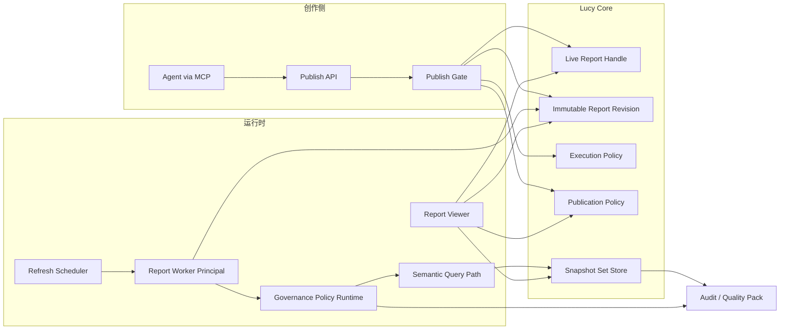

# Agent Live Report 表面 — 技术架构、演进与用户故事

| 元数据 | 内容 |
|---|---|
| 文档名称 | Agent Live Report 表面 — 技术架构、演进与用户故事 |
| 文档类型 | Design |
| 版本 | v1.5 |
| 撰写日期 | 2026-09-29；v1.3 补齐五项架构决策；v1.4 完成首轮交叉对齐；v1.5 同日完成 P0–P2 收口（历史快照授权摘要门禁、Candidate / Snapshot 分层、跨 Binding 禁合并、阶段映射与纠错分期） |
| 撰写人 | Composer |
| 委托人 | zhangxingchen |
| 基于材料 | `docs/governance/vision.md` v1.5；Lucy MCP Proxy / Governance Gateway；访问权限 Row Policy；Audit / Eval 现有闭环；2026-09-29 产品讨论与交叉审阅 |
| 适用范围 | Live Report 产品立项、分期实现、UX 验收与 Spec 拆解的基线设计 |
| 输出位置 | `docs/design/design-agent-live-report.md` |

---

## 1. 目标与边界

### 1.1 目标

建设 **Agent Live Report 表面**：Host Agent 基于 Lucy 受治数据生成报告，托管于 Lucy，经同一治理裁决路径自动或定时刷新，形成人读交付面与治理回流，闭合愿景中的平台数据飞轮。

本设计是「数据库接入 → 上下文编译 → Host Agent 查询与分析 → 发布 → 持续查看与刷新 → 纠错回流」端到端产品路线中的报告交付面设计。它定义产品级边界、关键架构决策、阶段目标与成功指标；当前不进入编号实现 Spec、API 字段冻结、数据表 DDL 或代码开发。

### 1.2 非目标（与愿景 §5 对齐）

- 不做 Tableau / Metabase 类拖拽自助 BI 工作台。
- 不做任意用户上传、任意执行 JS 的通用静态站（无沙箱与契约的 HTML hosting）。
- 不做跨源联邦查询或展示层结果合并。每个 Query Binding 只绑定一个连接并在该连接内只读执行；一份报告可以并列多个 Binding，但每个数据驱动组件只能引用一个 `bindingId`，不允许跨 Binding 公式、Join 或 `computed_text` 合并。
- 首期不做 SSO；**查看 Live Report 必须建立有效 Report Viewer Session**（数据安全管理：无「仅持链接即可看」的匿名 share）。Report Viewer 与 WebUI Admin 分域，刷新身份与查看身份分离，见 §2.3。
- 本轮只完善产品路线图与架构基线，不拆实现 WO，不冻结具体 API / Schema，不承诺迭代工期。

### 1.3 核心不变量

1. **契约优先于壳**：可刷新的是「语义查询契约 + 快照」，不是裸 HTML 里的 SQL。
2. **刷新必经同源治理路径**：Worker 从 Lucy 内部进入与 Agent MCP 查数相同的 Policy Runtime、语义执行与审计语义，ACL / Row Policy / guardrail 不旁路；它不需要伪装成外部 MCP 客户端。
3. **人读、Agent 写**：业务打开固定 URL；创建与改版由 Agent 或受控发布流完成。
4. **失败可见**：刷新失败不得静默展示过期数当作成绩；必须标「上次成功 / 本次失败」。
5. **查看须登录**：未登录不可读报告与 snapshot。
6. **刷新身份强制分离**：Execution Policy 只引用报表专用 SA；Worker 使用内部 principal，不得保存或使用对话 MCP Token。发布伪代码必须把 `serviceAccountId` 送入 Publication Grant 裁决，未允许的 SA 不得开始首刷。
7. **查询权不等于发布权**：能通过 MCP 查询数据，不自动获得把结果分发给其他人的权限。
8. **动态数据不搭配伪动态结论**：静态说明必须标注撰写时间；只有绑定表达式或经治理重新生成的结论才能宣称随数据刷新。
9. **Revision 原子生效**：Shell、bindings、叙事契约与首个完整 Snapshot Set 必须作为同一不可变 Revision 验证并原子激活。
10. **旧快照必须仍可证明可分发**：Viewer 查看时不只验证「当前查询还能执行」，还要比对快照产生时与当前的有效分发授权摘要。任何策略变化、读取失败或无法证明等价，都先停发并要求成功重刷。

### 1.4 端到端闭环与成功信号

Live Report 不是独立终点，而是下列产品漏斗的交付与回流节点：

```text
数据库连接可用
  → Semantic / Knowledge / Query Pack 可被 Host Agent 发现
  → Host Agent 完成受治查询与分析
  → 生成 Report Draft
  → 发布授权通过并激活 Revision
  → 业务消费者重复查看固定 URL
  → 自动刷新、异常与纠错信号回流
  → 治理资产修订并使报告恢复 / 提升
```

路线图评估不能只看「报告是否能打开」，至少跟踪以下产品信号：

| 信号 | 阶段 | 用途 |
|---|---|---|
| `time_to_first_report` | Phase 0B 起 | 从数据库连接可用到第一份报告激活的耗时 |
| `query_to_draft_rate` / `draft_to_active_rate` | Phase 1 起 | Host Agent 查询能否转化为可持续交付 |
| `repeat_view_rate` | Phase 0B 退出条件 | 固定入口是否真正被业务持续消费 |
| `refresh_success_rate` / `stale_report_rate` | Phase 0B 退出条件 | 自动刷新是否可信 |
| 纠错事件数量 | Phase 0B | 最小纠错入口是否被使用；此阶段不算资产转化率 |
| `correction_to_asset_rate` | Phase 2 | 纠错是否沉淀为 Semantic / Knowledge / Query / Quality Pack |
| `time_to_recover_report` | Phase 2 | 治理修复后报告恢复所需时间 |

Phase 0B 只用本阶段退出条件验收，不用 Phase 2 飞轮指标判失败。

---

## 2. 建议技术架构

### 2.1 逻辑拆分：稳定入口 + 不可变 Revision

把「报告」拆成五类对象，避免把 HTML 当成唯一事实源，也避免 Shell、数据和结论各自变更后产生错配：

| 对象 | 内容 | 谁写 | 谁读 |
|---|---|---|---|
| **Live Report Handle** | 稳定 `id` / `slug`、生命周期状态、当前 `activeRevisionId` | 发布流 / Admin | Viewer / Scheduler |
| **Report Revision** | 不可变发布单元：Report Shell、`bindings[]`、Narrative Contract、provenance | Agent 生成 Draft；发布流激活 | Viewer / Refresh Worker |
| **Execution Policy** | schedule、报表专用 SA、Worker principal、刷新失败策略 | 发布者提议；发布授权裁决 | Scheduler / Refresh Worker |
| **Publication Policy** | 谁可发布、允许的数据范围与受众、登录 Viewer 可见范围 | Admin / 预授权发布策略 | Publish Gate / Viewer |
| **Refresh Run / Evidence** | 一次执行及其候选结果、失败或拒绝证据；永不直接面向 Viewer | Refresh Worker | Audit / Quality |
| **Snapshot Set** | 某 Revision 一次通过全部执行、叙事与授权校验后产生的完整、可服务 binding 结果 | Publish Gate / Refresh Worker | Viewer / Audit / Quality |



### 2.2 运行时组件（落在现有 Lucy 边界内）

| 组件 | 职责 | 建议落位 |
|---|---|---|
| **Publish API + Gate** | 接收 Draft，校验 Revision、发布授权、受众与 Shell 安全性，完成首刷后原子激活 | `webui/server`（与现有 admin API 同进程起步） |
| **Report Store** | Handle、不可变 Revision、Execution / Publication Policy | `.ktx-ui/live-reports/` 或独立 SQLite；不与 audit 事件表混作同一模型 |
| **Snapshot Store** | 最近成功的完整 Snapshot Set（展示所需表格/标量 JSON）+ 指纹 + 证据 | 同卷；大结果可对象存储 |
| **Refresh Worker** | 以内部 Worker principal 执行当前 Revision 全部 bindings，经同源裁决路径生成 Candidate Result；通过全部门禁后再晋升为 Snapshot Set | 进程内 scheduler（Phase 0B）→ 独立 worker（Phase 2） |
| **Viewer** | 登录后只读渲染：active Revision + 最新可见 Snapshot Set + 分离的数据/分析状态 | WebUI 路由 `/r/:reportId` 或 `/live/:slug`；不是匿名公开路由 |
| **Audit hooks** | `report.publish` / `report.refresh` / `report.view` 写入现有 audit | 复用 `proxy/audit` 模式 |

刷新路径必须调用 **与 MCP `lucy_query` 同源的参数规范化、ACL / Row Policy、guardrail、查询执行与审计服务**，禁止 Viewer 或 Worker 直连 DB driver。这里的「同源」要求裁决与执行语义一致，不要求 Worker 伪装成 MCP 客户端或持有可恢复的 Bearer Token。

### 2.3 安全模型（最小可用）

| 议题 | 决策 / 建议 |
|---|---|
| 查看身份 | **独立 Report Viewer 身份域**。业务消费者必须登录，但不得因此获得 WebUI Owner / Operator 控制面权限，也不复用 MCP Agent 身份 |
| 刷新身份 | 报告绑定报表专用 SA；Worker 用内部 `ReportWorkerPrincipal` 进入同源治理裁决，不保存、不恢复、不伪造 MCP Bearer Token |
| 发布身份 | 查询权限与发布权限分离；`PublicationGrant` 同时约束发布主体、数据范围和允许受众 |
| 报表 SA 与对话 Token | **已拍板：强制分离**。发布时只能绑定标记为报表用途的专用 SA；对话 / 接入 Token 永不写入报告对象 |
| Shell 执行 | Phase 0B：**无任意脚本**——只用服务端组件渲染（表/KPI/Markdown）；后续若开放 HTML，必须消毒并用 CSP 禁止 inline 网络 |
| 结果集 | Snapshot 只存展示所需列并接受发布授权裁决；没有明确 masking 规则时不得宣称「已脱敏」；未登录或无报告可见权限不可读 snapshot API |

#### 2.3.1 四类身份必须分域

```text
WebUI Admin（Owner / Operator） → 管理控制面，不等于业务消费者
Report Viewer                 → 只查看获授权报告，不获得 Ops 写权限
Report Worker Principal       → 后台刷新执行身份，映射到报表专用 SA 的数据权限
Conversational Agent + Token  → Host Agent 会话查询身份，不进入报告刷新链
```

Phase 0A 可以规划 Lucy 本地 Viewer 账户；未来接入 OIDC / SSO 时，只替换认证来源与群组映射，不改变 Report Viewer 与 WebUI Admin 分域的授权模型。Live Report 上线的前置门禁是 Viewer 鉴权处于 required 状态；现有 WebUI open 模式不能等价为「已登录」，也不能匿名放行 `/r/*` 与 Snapshot API。

#### 2.3.2 Worker 身份与报表 SA

现有 MCP Token 的明文只在签发时出现，运行时事实源是不可逆 hash。Live Report 因此只保存 `serviceAccountId`，不保存 Token 明文、密文副本或可恢复 Token。

刷新时构造内部身份：

```text
ReportWorkerPrincipal {
  kind: "report_worker",
  serviceAccountId,
  reportId,
  revisionId,
  refreshRunId
}
```

Policy Runtime 以该 principal 解析报表 SA 的当前 Role / ACL / Row Policy 与启用状态，生成有效权限快照及 `distributionAuthorizationDigest`，再走与 `lucy_query` 相同的规范化、裁决、guardrail、查询和审计路径。该 principal 只能由 Lucy 内部 Scheduler / Refresh Worker 构造，外部 HTTP / MCP 请求不得声明或冒充。SA 被停用、Role 收紧或数据源被移除时，立即触发相关报告重新授权；下一次刷新也必须按当前策略 fail closed。

| 方案 | 裁决 | 原因 |
|---|---|---|
| 保存对话 MCP Token | 禁止 | 权限过宽、轮换耦合、明文密钥进入长期存储 |
| 为每份报告保存专用 Token | 不采用 | 仍引入秘密存储、恢复和轮换负担，报告数量放大凭据数量 |
| 内部 Worker principal + 报表 SA | **采用** | 不持久化数据面密钥，同时复用同一策略与审计语义 |

若 P2 将 Worker 拆为独立进程，进程间 workload credential 只证明「这是可信 Refresh Worker」，数据授权仍由 `serviceAccountId + reportId + revisionId` 在 Core 内裁决；workload credential 不替代报表 SA。

#### 2.3.3 发布授权：查询权不等于分发权

`PublicationGrant` 是报告发布面的显式授权，至少约束：

```text
PublicationGrant
  publisher_subjects       // 哪些 Agent / Admin 可以提议或激活
  allowed_sources          // 哪些受治 source 可以进入报告
  allowed_audiences        // 可分发给哪些 Viewer / Viewer Group
  allowed_service_accounts // 可绑定哪些报表专用 SA
  allowed_shell_capability // 组件 DSL；是否允许 Markdown / HTML
  activation_mode          // admin_confirm | preauthorized_agent
```

发布必须同时满足：

1. 发布主体具有 `report.publish_draft`；激活主体具有 `report.activate` 或命中预授权 Agent grant。
2. 每个 binding 都来自可验证的成功查询或可重新执行的 canonical query。
3. binding 涉及的数据源属于 grant 的 `allowed_sources`。
4. `visibility` 是 `allowed_audiences` 的子集。
5. Shell / Narrative Contract 通过安全与内容类型校验。
6. 报表 SA 属于 grant 允许的专用 SA，且最小权限足以执行全部 bindings；不得据此推导 Viewer 自动获权。

Phase 0B 由 WebUI Owner / Operator 确认数据范围和受众后激活；Phase 1 才允许 Host Agent 在预先配置的 Publication Grant 内一键发布。超出 grant 的 Agent 请求只生成 Draft，不得自行扩权或扩大受众。

#### 2.3.4 刷新失败与历史快照可见性

「保留最后成功快照」只适用于非安全类故障：

| 失败类别 | 示例 | Viewer 行为 |
|---|---|---|
| 暂时运行故障 | timeout、上游不可用、并发限制 | 保留最后成功 Snapshot Set，明确显示过期与本次失败 |
| 查询 / 语义故障 | measure 缺失、shape 不兼容 | 保留旧 Snapshot Set，但标记「定义或查询待修复」，不得显示正常 |
| 授权 / 安全故障 | SA 停用、任一 Binding 的 ACL / Row Policy deny、Publication Grant 撤销、source 被限制 | **整份报告**立即进入 `restricted` 并停止返回全部历史快照；不只隐藏失败的那一块。历史快照只保留作受控审计，或按策略清除 |
| Viewer 授权撤销 | Viewer 被移出 visibility | 下次请求立即 403，不受缓存影响 |

配置或 Grant 生效当时就要停止分发，不能等下一次定时刷新。调度上的后续刷新只是再记一条 deny 审计，不是开始收口的时刻。重新验证必须在一个一致策略读中纳入**当前** Publication Grant、当前 `visibility`、active Revision 的 source 与 Shell capability、报表 SA 启用状态与 Role，以及每个 Binding 的 ACL / Row Policy。这些归一化为 `distributionAuthorizationDigest`。快照只有在其记录的 digest 与当前 digest 一致时才可分发；策略无论收紧还是放宽，只要 digest 变化，MVP 都不尝试对旧结果二次过滤，而是整份报告 `restricted` 并要求成功重刷。读取失败或无法证明一致时同样 fail closed；不得只用激活时的摘要自比自。

手动「立即刷新」只是在具备报告查看 / 触发权限时排队一个 refresh run，真正查数仍使用 Report Worker principal，不继承 Viewer 或 WebUI Session 的数据权限。

### 2.4 数据模型（概念）

```text
LiveReport
  id, slug, title
  lifecycle_status(draft|active|paused|restricted|archived)
  active_revision_id
  execution_policy_id, publication_policy_id
  last_success_at, last_attempt_at, last_error_code

ReportRevision
  id, report_id, revision_no
  status(draft|validating|ready|active|superseded|failed)
  shell, binding_ids[]
  narrative_contract
  created_by, source_agent_session?, provenance_trace_ids[]
  created_at, activated_at?

QueryBinding
  id, revision_id
  connection_id
  canonical_query: { measures, dimensions, filters, segments, order_by, limit }
  expected_grain, freshness_sla_sec

NarrativeContract
  blocks: [{ kind: static_annotation | computed_text | agent_analysis,
             binding_id?: exactly_one_for_data_driven_block, ... }]

ExecutionPolicy
  schedule: { cron | intervalSec, timezone }
  service_account_id             // 报表专用 SA；不保存 Token
  transient_failure_policy

PublicationPolicy
  publication_grant_id
  visibility: { viewer_ids[], viewer_group_ids[] }

RefreshRun
  id, report_id, revision_id
  status(running|succeeded|failed|restricted|rejected)
  failure_class?, failure_reason?
  evidence_refs[]
  started_at, finished_at?

CandidateResult
  refresh_run_id
  binding_results[], source_refs[]
  canonical_query_hashes[], semantic_release_digest
  distribution_authorization_digest, policy_generation
  generated_sql_hashes[], audit_request_ids[]
  visibility(internal_only)

RefreshRunEvidence
  id, refresh_run_id
  candidate_result_ref?
  validation_decisions[], failure_fingerprint?
  visibility(internal_only)

SnapshotSet
  id, report_id, revision_id, refresh_run_id
  binding_snapshots[]
  source_refs[]
  canonical_query_hashes[], semantic_release_digest
  distribution_authorization_digest, policy_generation
  generated_sql_hashes[]
  refreshed_at, audit_request_ids[]
```

`LiveReport.slug` 是稳定入口，`ReportRevision` 与 `SnapshotSet` 不可原地修改。`SnapshotSet` 按定义就是通过全部门禁的完整可服务产物，不再承载 `failed` 或 `rejected` 状态；部分结果、执行失败和叙事校验失败只进入 `RefreshRunEvidence`。受众与紧急禁用属于安全策略，可以立即收紧而无需等待内容 Revision；任何扩大受众的变更仍须重新经过 Publish Gate。

Shell 中的表格、图表、KPI 和 `computed_text` 都必须显式绑定且只绑定一个 `bindingId`；`static_annotation` 可不绑定数据。多个 source 可以在一页上并列展示，但不得在 Shell、Narrative Contract 或 Viewer 中跨 Binding 计算、排序、聚合或推导。

### 2.5 发布与刷新控制流（伪代码）

```text
function activateReportDraft(actor, reportId, draft):
  revision := createImmutableDraft(draft)
  validation := validateShellNarrativeAndSingleBindingReferences(revision)
  if validation != allow:
    markRevisionFailed(revision, validation.reason)
    audit("report.publish_failed", validation.reason)
    return failed_without_changing_active_revision

  canonicalization := canonicalizeAll(revision.bindings)
  if canonicalization.failed:
    markRevisionFailed(revision, canonicalization.reason)
    audit("report.publish_failed", canonicalization.reason)
    return failed_without_changing_active_revision
  canonicalBindings := canonicalization.bindings
  if any binding is not single-connection:
    markRevisionFailed(revision, "cross_source_binding")
    audit("report.publish_failed", "cross_source_binding")
    return failed_without_changing_active_revision

  decision := evaluatePublicationGrant(
    actor,
    canonicalBindings.sources,
    draft.visibility,
    draft.shell.capabilities,
    draft.serviceAccountId
  )
  saDecision := evaluateReportPurposeServiceAccount(draft.serviceAccountId)
  effectiveDecision := firstDeny(decision, saDecision)
  if effectiveDecision != allow:
    keepDraftWithDecision(effectiveDecision)
    audit("report.publish_denied", effectiveDecision.reason)
    return denied

  workerPrincipal := resolveReportWorkerPrincipal(draft.serviceAccountId, reportId, revision.id)
  run, candidate := executeAllBindings(workerPrincipal, canonicalBindings)
  if run.status != succeeded:
    markRevisionFailed(revision, run.failureReason)
    persistRefreshRunEvidence(run, candidate)
    audit("report.publish_failed", run.failureReason)
    return failed_without_changing_active_revision

  narrativeDecision := validateNarrativeAgainstCandidate(revision.narrativeContract, candidate)
  if narrativeDecision != allow:
    markRevisionFailed(revision, narrativeDecision)
    markRunRejected(run, narrativeDecision)
    persistRefreshRunEvidence(run, candidate)
    audit("report.publish_failed", narrativeDecision)
    return failed_without_changing_active_revision

  if currentAuthorizationDigest(reportId, revision) != candidate.distributionAuthorizationDigest:
    markRevisionFailed(revision, "authorization_changed_during_publish")
    persistRefreshRunEvidence(run, candidate)
    audit("report.publish_failed", "authorization_changed_during_publish")
    return failed_without_changing_active_revision

  transaction:
    snapshotSet := promoteCandidateToSnapshotSet(run, candidate)
    persistServable(revision, snapshotSet)
    previous := report.activeRevisionId
    report.activeRevisionId := revision.id
    markActive(revision)
    markSuperseded(previous)
  audit("report.publish", reportId, revision.id)
  return fixedUrl(report.slug)

function refreshReport(reportId, trigger):
  report := loadReport(reportId)
  if report.lifecycleStatus not in {active, restricted}: return
  if report.lifecycleStatus == restricted and trigger != operator_reauthorize:
    audit("live_report.refresh_denied", reportId, "operator_reauthorization_required")
    return
  revision := loadRevision(report.activeRevisionId)
  principal := resolveReportWorkerPrincipal(report.executionPolicy, reportId, revision.id)
  beginAudit("live_report.refresh", principal)

  run, candidate := executeAllBindings(principal, revision.bindings)
  if run.status == succeeded:
    narrativeDecision := validateNarrativeAgainstCandidate(revision.narrativeContract, candidate)
    if narrativeDecision != allow:
      markRunRejected(run, narrativeDecision)
      persistRefreshRunEvidence(run, candidate)
      retainLastCompleteSnapshotSet()
      markRefreshFailureAndStale(reportId, narrativeDecision.reason)
      return
    if report.activeRevisionId != revision.id:
      persistRefreshRunEvidence(run, candidate)
      audit("live_report.refresh_superseded", revision.id)
      return
    if currentAuthorizationDigest(report, revision) != candidate.distributionAuthorizationDigest:
      markRestricted(reportId, "authorization_changed_during_refresh")
      persistRefreshRunEvidence(run, candidate)
      denySnapshotServing(reportId)
      return
    snapshotSet := promoteCandidateToSnapshotSet(run, candidate)
    atomically:
      commitSnapshotSet(reportId, revision.id, snapshotSet)
      markRefreshSuccess(reportId)
      if report.lifecycleStatus == restricted: markActive(reportId)
    emitFlywheelSignal("refresh_ok", reportId)
  else if run.failureClass in {authorization, security}:
    markRestricted(reportId, run.failureReason)
    persistRefreshRunEvidence(run, candidate)
    denySnapshotServing(reportId)
    emitFlywheelSignal("refresh_restricted", reportId, run.failureReason)
  else:
    persistRefreshRunEvidence(run, candidate)
    retainLastCompleteSnapshotSet()
    markRefreshFailureAndStale(reportId, run.failureReason)
    emitFlywheelSignal("refresh_fail", reportId, run.failureReason)
  endAudit(...)

function serveReport(viewerSession, slug):
  viewer := requireReportViewer(viewerSession)
  report := loadReportBySlug(slug)
  if report is missing or report.lifecycleStatus == draft:
    return not_found
  if report.lifecycleStatus == archived:
    return not_found
  if report.lifecycleStatus == restricted:
    audit("report.view_denied", report.id, viewer.id, "restricted")
    return restricted_without_snapshot

  authorizeViewer(report.publicationPolicy.visibility, viewer)

  currentAuthorization := revalidateSnapshotDistribution(
    loadCurrentPublicationGrant(report.publicationPolicy),
    report.publicationPolicy.visibility,
    loadCurrentServiceAccount(report.executionPolicy.serviceAccountId),
    loadCurrentAclAndRowPolicy(report.executionPolicy.serviceAccountId),
    report.activeRevision.bindings.sources,
    report.activeRevision.shell.capabilities
  )
  if currentAuthorization.errored or currentAuthorization.decision != allow:
    markRestricted(report.id, currentAuthorization.reason or "revalidation_unavailable")
    denySnapshotServing(report.id)
    audit("report.view_denied", report.id, viewer.id, currentAuthorization.reason)
    return restricted_without_snapshot

  snapshotSet := loadLatestCompleteSnapshotSet(report.activeRevisionId)
  if snapshotSet is missing
     or snapshotSet.distributionAuthorizationDigest != currentAuthorization.digest:
    markRestricted(report.id, "snapshot_authorization_digest_mismatch")
    denySnapshotServing(report.id)
    audit("report.view_denied", report.id, viewer.id, "snapshot_reauthorization_required")
    return restricted_without_snapshot
  if currentPolicyGeneration() != currentAuthorization.policyGeneration:
    return retry_once_then_fail_closed
  audit("report.view", report.id, viewer.id, snapshotSet.id)
  if report.lifecycleStatus == paused:
    return renderPaused(report.activeRevisionId, snapshotSet)
  return render(report.activeRevisionId, snapshotSet)
```

多 binding 默认采用「全部成功才提交新 Snapshot Set」。任一 Binding 出现授权或安全失败时，整份报告进入 `restricted`，不得只摘掉失败卡片后继续展示其余历史快照。未来若产品需要独立刷新卡片，必须作为显式一致性模式新增，不能由实现自行降级为部分更新。

失败、部分成功或叙事校验被拒绝的候选结果只能作为不可对 Viewer 展示的 `RefreshRunEvidence`，不得创建 `SnapshotSet`，也不能成为 `loadLatestCompleteSnapshotSet` 的候选。

访问配置、Publication Grant 或 source 状态发生变化时，应主动标记受影响报告重新授权；即使该主动失效链尚未完成，Viewer 请求仍必须执行上述当前策略再验证和 digest 等值门禁。响应写出前如果 `policyGeneration` 已变，只允许重试一次，再次漂移则 fail closed，避免「再验证后、响应前」的 TOCTOU。定时刷新晚于这次查看发生时，只追加审计，不再是停止分发的起点。

刷新提交前必须再次确认 `activeRevisionId` 仍是本次执行的 Revision。改版激活抢先成功时，丢掉迟到的旧 Revision 快照，不覆盖新版本。

### 2.6 Narrative Contract：数据刷新与结论刷新分离

| 类型 | 含义 | 新鲜度展示 | 路线图 |
|---|---|---|---|
| `static_annotation` | 标题、背景、口径说明、Agent 在发布时写下的解释 | 显示 `authoredAt`，不得跟随数据时间戳宣称最新 | Phase 0B |
| `computed_text` | 基于单一 `bindingId` 的 Snapshot 字段的受限模板 / 表达式，如「收入较上期增长 8%」；禁止跨 Binding 公式 | 与 Snapshot 同步刷新；无模型调用 | Phase 0B |
| `agent_analysis` | Host Agent 基于最新 Snapshot 与治理上下文重新生成的分析 | 单独显示 `analysisRefreshedAt`、模型 / Prompt / Context 版本及证据状态 | Phase 2 |

Phase 0B 的「Live」只承诺受治数据和确定性文案可刷新，不暗示所有 Agent 结论自动重写。Phase 1 允许 Host Agent 在发布新 Revision 时生成静态分析；Phase 2 才引入定时 `agent_analysis`，并要求独立的质量门、成本预算、失败状态与回滚。数据刷新成功但 Agent 分析失败时，Viewer 可以继续看到最新数据，但旧分析必须标明其撰写时间和过期状态。

### 2.7 五项架构决策与取舍

| 决策 | 采用 | 不采用 | 主要取舍 |
|---|---|---|---|
| Viewer 身份 | 独立 Report Viewer 身份域 | 复用 WebUI Admin 或 MCP Agent | 增加一套只读身份模型，换取业务消费与运维控制面的安全隔离 |
| Worker 身份 | 内部 Worker principal 映射报表 SA | 保存 / 恢复 MCP Token | 需要抽取同源策略服务，但避免长期秘密与 Token 生命周期耦合 |
| 发布授权 | Publication Grant 同时约束主体、数据源、受众、报表 SA 与 Shell capability | 查询成功即可分享 | 发布路径多一道裁决，换取可解释的数据分发边界 |
| 动态结论 | 三类 Narrative Contract | 静态 Markdown 冒充实时结论，或 P0 每次都跑 Agent | 产品状态更复杂，但避免结论漂移与不可控模型成本 |
| 版本发布 | 不可变 Revision + 完整 Snapshot Set 原子激活 | shell / binding / snapshot 分别就地更新 | 增加 Revision 模型，换取可回滚、无半新半旧状态 |

以上五项是后续实现 Spec 的前置架构事实；本阶段只确认产品方向与边界，不冻结表结构和接口字段。

### 2.8 产品级非功能边界

- 当前部署仍遵循 Lucy 单实例、单副本边界；P0 只需进程内串行与持久化 refresh run，不引入分布式锁。
- Scheduler 必须能识别重启漏跑、同一计划重复触发和手动 / 定时并发；同一 `reportId + revisionId + scheduledAt` 只能提交一个 Snapshot Set。
- Viewer 首屏优先返回已持久化 Snapshot Set，不同步等待数据库查询或 Agent 生成。
- 每个 binding 必须有查询超时、行数 / 列数 / payload 上限；超限作为可解释失败，不允许无界快照。
- Viewer 触发的「立即刷新」与定时刷新共用报表 SA 的数据权限，并受同一 `reportId` 并发约束；不得让 Viewer Session 直接查库。具体每人限频留到实现 Spec。
- Snapshot 保留、审计保留、备份、RPO / RTO 与恢复演练在实现 Spec 前形成明确目标；本设计不预设多区域或多副本能力。

---

## 3. 演进方式（分期）

原则：**先建立可信分发边界，再验证固定入口；先确定性刷新，再引入 Agent 动态结论。** 本路线图表达依赖和验证目标，不在当前阶段承诺具体工期。

**阶段口径**：`docs/governance/vision.md` 中 Live Report 的 **P1** 是仓库级产品模块优先级；本文 **Phase 0A / 0B / 1 / 2** 是该 P1 模块内部的验证与演进里程碑。两套编号不表示全局 Phase 0 已新增 Live Report 工程交付。

### Phase 0A — Trust Foundation（Live Report 前置门禁）

**交付**

- Report Viewer 与 WebUI Admin 分域的产品模型；首期可用本地 Viewer 账户，保持未来 SSO 映射空间。
- 内部 Report Worker principal + 报表专用 SA，不引入可恢复 Token。
- Publication Grant：主体 × 数据源 × 受众 × 报表 SA × Shell capability 的多维发布边界。
- 不可变 Report Revision + Snapshot Set 原子激活模型。
- Narrative Contract 三分类与刷新状态语义。

**验收**

- 业务消费者不需要获得 Owner / Operator 权限即可成为 Viewer。
- 任意对话 Token 都不能成为报告刷新秘密。
- 查询成功但超出允许受众的数据不能被激活发布。
- 新 Revision 首刷失败时，旧 active Revision 完全不变。
- 静态结论与数据刷新时间不会被合并成一个误导性「最新」状态。

### Phase 0B — Governed Live Card（验证消费价值）

**交付**

- 从一次成功的语义查询「钉住」为单表或单 KPI 组 Live Card，无自由 HTML。
- Operator 确认 Publication Grant、报表 SA、受众和 schedule 后激活。
- 固定 URL；手动刷新 + 简单 interval（如 15m / 1h / 1d）。
- 受限组件 Shell；只允许 `static_annotation` 与 `computed_text`。
- 审计 publish / refresh / view；提供最小纠错入口，记录纠错类型、说明与当前 Report / Revision / Snapshot Set 证据，进入人工分拣；提供产品漏斗事件。

**验收**

- 业务同学不打开 Agent，只打开固定 URL，且形成重复查看而非一次性访问。
- 暂时故障显示旧 Snapshot Set + 过期状态；授权故障立即停止返回数据。
- 每个数字可追溯到 Revision、canonical query、semantic digest、分发授权摘要与 audit request。
- 能计算 `time_to_first_report`、`repeat_view_rate`、`refresh_success_rate` 和纠错事件数量。

**刻意不做**：自定义 HTML、分享外链给匿名公网、复杂筛选器。

### Phase 1 — Host Agent Publishable Report

**交付**

- Host Agent 生成 Report Draft：受限组件 DSL + bindings[] + Narrative Contract + schedule proposal。
- 命中预授权 Publication Grant 时可直接激活；超出边界时只生成待确认 Draft。
- 多块卡片的一页报告；全部 bindings 首刷成功后才原子激活 Revision。
- Viewer 分别展示数据刷新时间、静态分析撰写时间和 provenance。
- Admin：查看 Draft 决策、启停调度、更换 SA、回滚 Revision、归档。

**验收**

- 「数据库已接入 → Host Agent 完成查询 → 生成 Draft → 授权激活 → 明日自动刷新」主路径可端到端追踪，无人工拷贝 HTML。
- Agent 不能通过发布工具自行创建更宽的 Publication Grant、Viewer Group 或报表 SA 权限。
- 多 binding 任一失败时不出现新 Shell 配旧数据或部分卡片静默更新。

### Phase 2 — Governed Live Analysis 与飞轮深化

**交付**

- 刷新失败聚类进 Ops / Quality Pack；一键跳转相关 semantic / wiki。
- 可选参数槽（日期范围等）——仍是 binding 参数，不是 BI 筛选器工作室。
- `agent_analysis` 定时再生成：模型 / Prompt / Context 版本、证据与成本预算可追溯。
- 邀请链接只用于登录后定位并申请 / 获得报告权限，不引入「持链接即读」的匿名 share token。
- 将 Phase 0B 的纠错记录升级为「纠错 → 治理资产 → 恢复证据」链路；view / refresh / correction / governance fix 信号进入飞轮指标；语义变更前可检查受影响报告。
- Worker 进程化、快照归档、报告质量 Eval 与「报告仍绿」门禁（可选）。

**验收**

- 语义变更导致报告失败或结论漂移时，治理队列出现可处理项并能回到受影响 Revision。
- 一次业务纠错能转化为治理资产修订，并通过刷新 / Eval 证明报告恢复。
- 数据刷新成功但 Agent 分析失败时，页面诚实展示最新数据和过期分析，不把两者混为「正常」。

### 演进决策树

```text
若 Phase 0B 没有形成重复查看
  → 先别做自由 HTML；先验证「固定入口」是否真有人要

若 Phase 0B 有人持续使用，但抱怨「不够好看 / 不能多图」
  → Phase 1 上组件 DSL 报告，仍禁止拖拽建模

若业务首先要求「结论也每天自动变化」
  → 不把静态 Markdown 伪装成实时结论
  → 先验证 computed_text；必须用 Agent 时再进入 Phase 2 质量门

若客户坚持任意 HTML
  → 仅允许消毒 + CSP + 无客户端直连 DB；binding 仍是唯一刷新源
  → 任意 HTML 永不成为 P0
```

---

## 4. 用户故事与体验叙述

角色约定：

| 角色 | 说明 |
|---|---|
| **研析 Agent 用户**（如数据同学用 Cursor/Codex） | 通过 Host Agent + Lucy MCP 查数并生成 Report Draft |
| **Report Viewer（业务消费者）** | 使用独立只读登录身份查看获授权报告，不配置 MCP、不进入 Ops 控制面 |
| **报告发布者** | 在 Publication Grant 内激活 Draft；可为预授权 Agent 或 WebUI Owner / Operator |
| **平台管理员** | 管理 Viewer、Publication Grant、报表 SA、报告启停与紧急限制 |
| **语义治理者** | 维护 semantic / wiki，处理刷新失败回流 |

---

### US-1 · 从一次问答到固定入口（研析用户）

**作为**用 Agent 问数的数据同学，**我想**把今天对齐过的周报结论钉成 Lucy 上的 Live Report，**以便**业务明天不用再找我重问同一题。

共同体验：

1. 在 Cursor 里问：「上周各区域利润与折扣，按利润排序」。Host Agent 调 `lucy_catalog` / `lucy_query`，给出表与简短结论。
2. 用户说：「发布成 Live Report，每天早上 9 点刷新，标题用『区域利润周报』。」
3. Host Agent 把刚成功的查询固化为单连接 binding，生成受限组件 Shell、Narrative Contract 与受众提议，提交 Report Draft。它只能选择预先存在且标记为报表用途的 SA，不能使用当前对话 Agent 身份或 Token。
4. 激活成功后回复固定 URL：`https://lucy.example/r/region-profit-weekly`，说明下次数据刷新时间、静态分析撰写时间与绑定的报表 SA。
5. 用户把链接丢进飞书群；链接本身不授予权限，同事必须以 Report Viewer 身份登录且在可见范围内才能打开。

阶段差异：

| 阶段 | 激活方式 |
|---|---|
| Phase 0B | Host Agent 或人手路径只生成 Draft。WebUI Owner / Operator 确认 Publication Grant、报表 SA、受众和 schedule 后，系统首刷并原子激活 |
| Phase 1 | Publish Gate 命中预先配置的 Publication Grant 时，Host Agent 路径可以直接首刷并激活；超出数据范围、受众或报表 SA 时只保留 Draft，Agent 不得自行扩权 |

**验收要点**：发布后不经 Agent 也能打开；binding 中是语义键而非裸 SQL；审计同时保留发布决策、Revision、受众与 provenance。Phase 0B 不把「Agent 直接激活」算作已交付。

---

### US-2 · 早会前打开即最新（业务消费者）

**作为**区域负责人，**我想**每天开会前打开同一个链接看到已刷新的表，**以便**不依赖分析师是否在线。

**体验叙述**

1. 打开书签中的报告 URL；未登录则跳转 Viewer 登录，登录后方可进入（无匿名预览，也不需要成为 WebUI Operator）。
2. 若账号不在该报告可见范围 → 403，不泄露标题以外的敏感摘要（实现 Spec 再钉）。
3. 页头分别显示：**数据刷新于 09:01**、**分析撰写于昨日 16:30**；不能用一个「最新」状态掩盖静态分析较旧。
4. 主区是确定性计算文案、静态说明与表；无「编辑仪表盘」「添加图表」等 BI 控件。
5. 若需要，点「立即刷新」只是排队刷新；真正查数仍走 Report Worker principal + 报表 SA，不继承 Viewer 身份。
6. 数字异常时，页脚可见 provenance（来源连接 / 语义对象），方便丢回数据团队，而不是自己改 SQL。

**验收要点**：未登录无法读数；首屏可分别理解数据与分析是否最新；Viewer 不获得任何 Ops 写能力；无拖拽编辑入口。

---

### US-3 · 权限收紧后立即停止分发（管理员 + 消费者）

**作为**管理员，**我想**收回报表 SA 对任一块数据的权限后，相关 Live Report 立刻停止把历史快照发给 Viewer，**以便**不必等到下一次定时刷新才收口。

**体验叙述**

1. Admin 在访问治理里下调报表 SA 的表白名单或行级策略。
2. 配置生效后，下一次查看就做当前策略再验证。任一 Binding 不再被允许时，整份报告进入 `restricted`。
3. Viewer 打开链接只看到受限说明，昨日快照的任何卡片都不再返回。
4. 之后的定时任务不会查询数据库，只追加 `live_report.refresh_denied` 审计；Operator 发起重新授权刷新时才重新进入 Policy Runtime。这是留痕与恢复入口，不是开始停发的时刻。
5. 历史 Snapshot Set 仅供受控审计或按策略清除。Admin 修正 Publication Grant / SA 权限并重新验证通过后，才能再次分发；也可以直接归档。

**验收要点**：授权收紧在下一次查看即生效；多卡片报告不会剩下「未失败的那几块旧数」；暂时运行故障才允许显示明确标记的旧 Snapshot Set。

---

### US-4 · Agent 改版报告（研析用户）

**作为**数据同学，**我想**让 Agent 在原 URL 上升级报告（多加一块「退货率」），**以便**业务书签不用换。

**体验叙述**

1. 用户：「在区域利润周报上加退货率，binding 用 returns 相关语义。」
2. Agent 读取当前 active Revision，创建包含新 Shell、全部 bindings 与 Narrative Contract 的新 Draft Revision。
3. Publish Gate 重新裁决数据范围和受众，并对全部 bindings 首刷；只有完整 Snapshot Set 成功后才原子切换 `activeRevisionId`。
4. 若新 Revision 验证失败，业务仍看到完全未变的旧 Revision；成功后同一 slug 一次性切换到新报告。

**验收要点**：slug 稳定；Revision 可追溯和回滚；不存在新 Shell 配旧数据或部分卡片半更新。

---

### US-5 · 刷新失败驱动治理（语义治理者）

**作为**语义治理者，**我想**从连续刷新失败定位到过期 measure 或 wiki 缺口，**以便**飞轮反哺 Pack，而不是只在业务侧背锅。

**体验叙述**

1. Ops / 报告列表：「区域利润周报」连续 3 次 `MEASURE_NOT_FOUND`。
2. 点进详情：失败指纹、最近 audit requestId、Revision、semantic release digest、分发授权摘要与绑定的语义键列表。
3. 一键跳转 Catalog 对应 source；修好 overlay / wiki 后手动「重试刷新」变绿。
4. （Phase 2）可选用失败生成 eval case 草稿或待办。

**验收要点**：从报告失败到治理对象的路径短于「翻聊天记录猜用了哪张表」。

---

### US-6 · 暂停与归档（管理员）

**作为**管理员，**我想**活动结束后暂停调度并归档报告，**以便**减少无意义刷库与权限面。

**体验叙述**

1. 在报告列表选「暂停调度」：URL 仍可打开最后快照，标注「已暂停自动刷新」。
2. 「归档」后 Viewer 路径始终 404，不存在通过额外 Viewer 权限继续查看的分支；只有 Ops 控制面可按管理权限查看归档元数据与审计历史。

---

### US-7 · 不想用 Agent 时的逃生舱（研析用户 · Phase 0B）

**作为**尚不熟练 Agent 发布的用户，**我想**在 WebUI 里把一条已成功的查询钉成 Live Card，**以便**先用上固定入口，不等 MCP 发布工具就绪。

**体验叙述**

1. 在 Audit / MCP Playground 打开一次成功的 `lucy_query`。
2. 点「钉成 Live Report」→ 填标题、选择预建报表 SA、Publication Grant、Viewer / Viewer Group 与每日 9:00。
3. Operator 确认后，系统创建 Revision、执行首刷并原子激活，得到与 US-1 相同的 URL 体验。

**验收要点**：Phase 0B 不阻塞在 Agent 工具形态上；Phase 1 与该人手路径走同一 Publish Gate、Report Store 与 Revision 状态机。

---

### US-8 · 从业务纠错回到治理资产（Report Viewer + 语义治理者 · Phase 0B → Phase 2）

**作为**Report Viewer，**我想**在看到数字或口径疑问时直接对当前报告提交纠错，**以便**治理者拿到准确上下文，而不是靠转述猜测问题发生在哪个版本。

**体验叙述**

1. **Phase 0B**：Viewer 在报告中点「反馈数据或口径问题」，选择问题类型并填写说明。
2. **Phase 0B**：系统自动关联 `reportId`、Revision、Snapshot Set、binding、数据 / 分析时间和可安全展示的 provenance，进入人工分拣；不把完整业务数据或凭据复制进反馈。
3. **Phase 2**：语义治理者从治理队列跳到相关 Semantic / Knowledge / Query / Quality Pack，修订后触发报告重新验证。
4. **Phase 2**：新 Snapshot Set 或新 Revision 激活后，反馈项关联治理资产与恢复证据并关闭。

**分阶段验收**：Phase 0B 只要求反馈可提交、证据可追溯、人工可分拣，并计数纠错事件；Phase 2 才要求计算 `correction_to_asset_rate` 与 `time_to_recover_report`，证明反馈可追溯到治理资产和恢复结果。

---

## 5. 体验原则（写 UI / Agent 文案时用）

| 原则 | 做法 |
|---|---|
| 新鲜度分层 | 分别展示数据刷新时间、分析撰写 / 刷新时间，不用单一「最新」掩盖差异 |
| 像报告，不像 BI | 无「添加图表 / 数据源面板 / 拖拽画布」 |
| 一词对外 | 产品称 **Live Report**；对内可说看板，对外少用 Dashboard |
| 刷新可解释 | 失败给原因码与人话，不给栈轨迹 |
| 默认保守壳 | 组件 DSL > 消毒 HTML > 任意 HTML |
| 权限不随链接传播 | URL 只定位报告；Viewer 身份与 Publication Policy 决定能否查看 |
| 改版整体验证 | Revision 完整首刷后一次性生效，不让业务看到半新半旧状态 |

---

## 6. 与现有模块的衔接

| 现有能力 | 衔接方式 |
|---|---|
| Lucy MCP Proxy / `lucy_query` | Report Worker principal 复用同源规范化、ACL / Row Policy、guardrail、执行与审计服务，不复用 MCP Token |
| ACL + Service Account | 报告绑定专用 SA；数据查询授权、报告发布授权、Viewer 查看授权三层分离 |
| WebUI Auth | 新增 Report Viewer 产品身份域；不得把业务消费者塞进 Owner / Operator |
| Audit | 新增 report draft / publish decision / revision activation / refresh / restricted / view / correction 事件 |
| Eval / Quality | Phase 2：刷新失败、叙事证据、纠错与 eval 回流 |
| WebUI Ops Control Plane | 管理 Draft、Publication Grant、Revision、调度、受限状态与失败队列 |
| Vision 飞轮 | 报告持续消费与纠错成为 Pack 改进的可度量入口，而不只是多一个页面 |

---

## 7. 当前产品路线图推进顺序

当前阶段只推进愿景和产品路线图，不进入实现 Spec 与代码开发：

1. **确认五项架构事实**：Viewer 身份分域、Worker principal、Publication Grant、Narrative Contract、Revision 原子发布。
2. **验证核心产品假设**：客户是否接受登录查看；谁承担发布确认；业务是否能理解「数据最新」与「分析最新」分离；固定 URL 是否形成重复查看。
3. **定义 Phase 0A / 0B 退出指标**：不仅是功能完成，还要明确安全门禁与 `time_to_first_report`、重复查看、刷新成功、纠错回流指标。
4. **梳理 Host Agent 端到端旅程**：从已接入数据库发现上下文、完成查询、生成 Draft、获得发布裁决到返回固定 URL，确保 Lucy 与 Host Agent 的责任边界清楚。
5. **仅在上述产品决策稳定后**，再进入术语标准登记、编号实现 Spec、数据模型 / API 冻结、WO 和工程验证。

本阶段不安排开发 Spike，不给出 2–4 周等工期承诺，也不以「先做出来再补身份 / 授权」作为验证方式。

---

## 8. 未决问题（需产品拍板后再写实现 Spec）

- ~~查看侧是否允许仅持链接即看~~ → **已拍板：必须建立有效 Report Viewer Session**（数据安全管理；不做匿名 share）。
- ~~查看主体是否复用 WebUI Admin~~ → **已拍板：不复用**；建立独立 Report Viewer 身份域。
- ~~报表 SA 是否强制与对话 Token 分离~~ → **已拍板：强制分离**；Worker 使用内部 principal，不保存 MCP Token。
- ~~查询权限是否自动赋予发布权限~~ → **已拍板：否**；由 Publication Grant 约束发布主体、数据范围和受众。
- ~~Agent 结论是否默认随数据刷新~~ → **已拍板：否**；按 Narrative Contract 分别管理静态、确定性与 Agent 分析。
- ~~Shell / bindings / snapshot 是否分别更新~~ → **已拍板：否**；不可变 Revision 完整首刷后原子激活。
- Shell 首期只做服务端组件，是否满足「Agent 生成 HTML」的客户话术；若必须 HTML，CSP 与消毒标准谁定。
- 固定 URL 的部署路径与品牌（`/r/:slug` vs 子域）。
- Viewer 首期只支持显式账户，还是同时支持 Viewer Group；本地账户邀请、停用与离职回收体验如何设计。
- Publication Grant 的产品配置入口、默认模板、Owner 与定期复核机制。
- 哪些 source 默认允许进入报告，是否引入数据分类标签；未定义 masking 时不得对外声称「自动脱敏」。
- 「报表用途」如何标记：独立 Agent 类型、SA 上的用途标记，还是发布时的 allowlist。未决前只要求发布路径能拒绝对话 Token，不冻结标记实现。
- 报表专用 SA 的创建引导：必须预先创建，还是允许发布流提议最小权限 SA 并由 Operator 确认；按单报告还是报告族复用。
- 授权失败后的历史 Snapshot Set 保留 / 清除时限，以及紧急数据撤回的产品操作。
- Phase 2 `agent_analysis` 的模型选择、成本预算、质量门和人工确认边界。

---

## 9. 小结

| 问题 | 决策 / 建议 |
|---|---|
| 技术架构 | 稳定 Report Handle + 不可变 Revision + Execution / Publication Policy + 完整 Snapshot Set |
| 身份 | WebUI Admin、Report Viewer、Report Worker、Conversational Agent 四域分离 |
| 刷新 | Worker principal 映射报表专用 SA，复用同源治理裁决，不持久化 MCP Token |
| 发布 | Publication Grant 明确约束主体、数据范围和受众；查询权不等于分发权 |
| 结论 | 静态说明、确定性文案、Agent 分析三类分治，各自展示新鲜度 |
| 演进 | Phase 0A 信任底座 → Phase 0B Live Card 消费验证 → Phase 1 Host Agent 发布 → Phase 2 Live Analysis 与飞轮深化 |
| 体验主线 | Host Agent 生成 Draft → 发布裁决与完整首刷 → 原子激活 → Viewer 登录持续消费 → 刷新 / 纠错反哺治理 |

该设计把「托管」提升为 **可信的数据分发与持续分析平面**，而不是静态文件柜或传统 BI 工作台。Lucy 的护城河不只是能生成报告，而是能把数据权限、发布授权、版本证据、持续消费和治理回流统一在同一信任域内。

---

## 10. Terminology Compliance

This feature follows `webui/docs/00-product-terminology-standard.md`.

New terms（当前 Design 登记；进入实现 Spec 前同步到系统术语标准）：

| 英文 / 内部 | UI 主术语 | 禁止或避免 | 说明 |
|---|---|---|---|
| Host Agent | Host Agent | 把 Cursor / Codex 称为 Lucy 内置 Agent | 经 Lucy MCP 查数并生成 Report Draft 的外部 Agent |
| Live Report | Live Report | Dashboard（作产品主称）、实时报告（暗示所有分析都实时） | Lucy 托管并受治刷新的 Agent 报告 |
| Report Viewer | 报告查看者 | WebUI 管理员、普通用户 | 只读消费身份，不获得 Ops 权限 |
| Report Revision | 报告版本 | shell 版本、binding 版本（分别对外展示） | Shell、bindings、叙事契约的不可变整体 |
| Snapshot Set | 数据快照组 | 最新数据（缺少时间与状态时） | 某 Revision 一次完整刷新的全部结果 |
| Publication Grant | 发布授权 | 查询权限、分享 Token | 约束发布主体、数据范围与允许受众 |
| Narrative Contract | 分析刷新方式 | 自动实时结论 | 区分静态说明、确定性文案与 Agent 分析 |
| Report Worker Principal | 报告刷新身份 | 报表 Token、Viewer 身份 | 内部执行身份；映射报表专用 SA |
