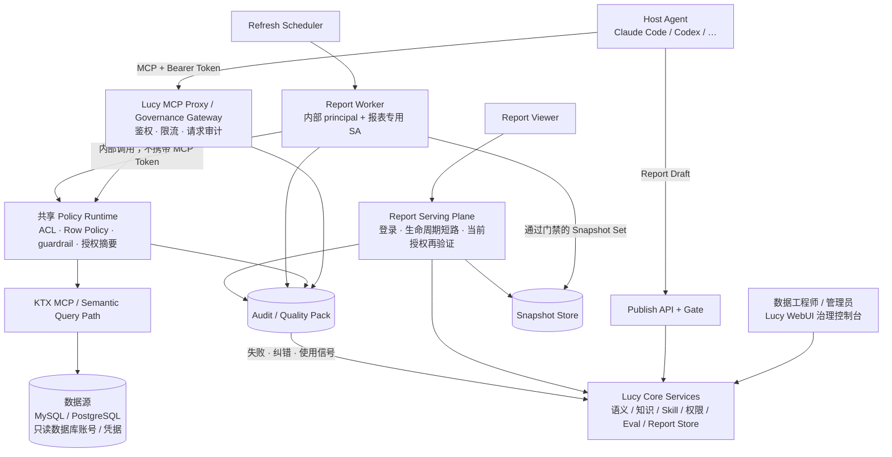

# Lucy 产品愿景

| 元数据 | 内容 |
|---|---|
| 文档名称 | Lucy 产品愿景 |
| 文档类型 | Design |
| 版本 | v1.5 |
| 撰写日期 | 2026-06-18；v1.3 更新 2026-09-29（纳入 Agent Live Report 与数据飞轮）；v1.4 同日完成首轮交叉对齐；v1.5 同日完成 P0–P2 收口（修正运行拓扑、历史快照授权摘要门禁、阶段与身份口径） |
| 撰写人 | Claude |
| 委托人 | zhangxingchen |
| 基于材料 | 用户产品愿景输入、Anthropic 自助数据分析架构参考、project-lucy 现状、2026-09-29 产品定位讨论、`docs/design/design-agent-live-report.md` v1.5 |
| 适用范围 | Lucy 产品后续开发、需求拆解与评审的基线文档 |
| 输出位置 | /Users/zhangxingchen/Projects/project-lucy/docs/governance/vision.md |

---

## 1. 产品定位

Lucy 是面向中小企业的 **data agent context compiler + governed MCP runtime + Agent Live Report plane**：
把数据库、BI、文档、人工口径编译成 Agent 可安全使用、可审计、可回归的数据服务；并把 Agent 基于该服务生成的报告与看板托管在同一信任域内，经 Lucy 受控路径自动 / 定时刷新，形成可被人持续消费的交付面。

中文产品口径：Lucy 是面向中小企业的 **data agent 上下文编译器、受治理 MCP 运行时，以及 Agent 原生报告 / 看板平面**。它不试图复制 OpenAI 内部完整数据平台，也不做 Tableau 类自助 BI；而是把中小企业已有的数据库、语义定义、业务知识、可信查询与质量用例整理成可交付给 Claude Code、Codex、Hermes、Cursor 等 Agent 的受控 MCP 能力，并让 Agent 的分析产出能在 Lucy 上托管、刷新、回馈治理。

Lucy 解决的核心问题不是“再做一个传统 BI”，而是：

1. 让 Agent 在回答数据问题前先拿到正确上下文，并在查询时受到权限、guardrail、审计和 eval 约束；
2. 让 Agent 生成的报告与看板有固定入口、可刷新、可审计，而不是只存在于一次性会话里。

长期目标是成为中小企业采用 data agent 时的标准上下文编译层、安全运行时，以及 **Agent 数据交付的默认宿主**。

Lucy 的 context compiler 最小交付单元由四类 context pack 组成：

| Context Pack | 内容 | 目的 |
|---|---|---|
| Semantic Pack | schema、grain、measures、dimensions、segments、joins、freshness | 让 Agent 理解“有什么数据、怎么算、怎么连” |
| Knowledge Pack | wiki、业务口径、owner/caveat、使用禁区 | 让 Agent 理解“为什么这样用、哪里容易错” |
| Query Pack | 可信 SQL、BI/dashboard 查询范式、常见问题样例、Live Report 绑定的语义查询契约 | 让 Agent 学习可复用的查询路径，而不是模仿一次性探索 SQL |
| Quality Pack | eval cases、安全回归、audit trace、纠错记录、报告刷新失败与口径漂移信号 | 让回答质量、安全边界和修正经验可回归 |

---

## 1.1 平台数据飞轮

仅有「编译上下文 → Agent 查数」不足以形成平台飞轮：价值停在会话里，业务侧看不到持续入口，治理侧也缺少来自真实消费的回流。

**只有把 Agent 生成的报告与看板托管在 Lucy，并支持自动 / 定时刷新，才能闭合飞轮：**

```text
治理资产（语义 / Wiki / Skill / ACL / Eval）
        │
        ▼
  Agent 经 Lucy MCP 查数与分析
        │
        ▼
  发布为 Live Report / 看板（托管于 Lucy）
        │
        ▼
  业务持续打开固定 URL；自动 / 定时经 Lucy 刷新
        │
        ▼
  审计 · 刷新失败 · 口径争议 · 使用热度回流
        │
        ▼
  反哺 Semantic / Knowledge / Query / Quality Pack
```

飞轮成立的充要条件：

| 条件 | 说明 |
|---|---|
| 同源托管 | 报告壳与刷新数据路径同属 Lucy 信任域，避免「HTML 在外、查数在内」导致的 token / 口径漂移 |
| 受控刷新 | 自动 / 定时刷新必须进入与 Agent 查询同源的 Policy Runtime 与语义契约，不得直连数据库；Worker 不需要伪装成外部 MCP 客户端 |
| 人读、Agent 写 | 业务消费固定入口；页面由 Agent（或受控发布流）生成，不是人在 Lucy 里拖拽建模 |
| 消费回流 | 打开、刷新、失败、纠错进入审计与 Quality Pack，驱动下一轮治理 |

没有托管与刷新面，Lucy 停留在「给 Agent 的中间件」；有了 Live Report 平面，Lucy 才成为业务每天会打开的 **数据 Agent 平台**。

---

## 2. 功能模块

| 模块名 | 说明 | 优先级 |
|---|---|---|
| 多数据源接入 | MVP 支持 MySQL 与 PostgreSQL；StarRocks 进入 R1 P1 gated support，先完成 MySQL wire 只读目标源配置、证据路径和 stub 测试，live certification 通过前不进入 release verified matrix | P0 |
| 语义与知识治理 | 维护语义层（字段别名、业务定义）、Wiki 文档、Knowledge Base；解决概念-实体歧义 | P0 |
| Skill 管理 | 将结构化程序性知识（查询模板、计算逻辑）封装为可版本化的 Skill，供 KTX MCP Server 分发 | P0 |
| 权限管理 | 表级 ACL 为基线；已配置的 Row Policy 必须在查询与 Live Report 刷新时执行；不做列级脱敏；不支持 SSO | P0 |
| Agent Live Report / 看板托管 | 托管 Agent 基于 Lucy 生成的报告与看板；固定 URL；自动 / 定时经 Lucy 受控刷新；刷新与访问进入审计；为平台数据飞轮的人读交付面。设计文档中的 Phase 0A / 0B / 1 / 2 是本 P1 模块的内部里程碑，不是仓库全局优先级 | P1 |
| 访问日志与审计 | 所有 Agent 查询请求及 Live Report 刷新 / 访问持久化记录；热查走 SQLite，冷数据归档对象存储，保留 180 天+ | P1 |
| Eval 质量监控 | 定期调度 + 语义层/Skill 变更触发 Eval Runner；结果写入 Ops Dashboard，支持准确率趋势看板与告警 | P1 |

---

## 3. 系统架构



网络拓扑的权威顺序是 **Host Agent → Lucy MCP Proxy / Governance Gateway → KTX MCP**，与现有 MCP Proxy 规范一致。Report Worker 不伪装成 MCP 客户端，也不把内部 principal 暴露成外部网络身份；它在 Lucy Core 内部进入同一 Policy Runtime 与语义执行语义。Report Viewer 只读取已持久化 Snapshot Set，不进入数据库查询链。

**各层说明：**

- **Lucy WebUI（治理控制台）**：面向数据工程师和管理员的操作界面，管理语义层、Skill、权限、Eval Case，以及 Live Report 的发布状态与刷新策略。
- **Lucy Core Services**：系统核心，维护语义/知识库、Skill 仓库、权限 & Token 管理，以及 Live Report 仓库（报告壳、绑定的语义查询契约、调度元数据）。共享 Policy Runtime 是 Agent 查询和 Report Worker 刷新的共同授权语义边界。
- **Lucy MCP Proxy / Governance Gateway**：Host Agent 的外部 MCP 入站，顺序位于 KTX MCP 之前，完成 Token 鉴权、限流、策略检查与请求审计；不得把 KTX 画成 Gateway 的上游入口。
- **KTX MCP / Semantic Query Path**：在治理裁决之后提供语义查询执行。Report Worker 通过 Lucy 内部接口复用同一 Policy Runtime 与执行语义，不携带、不恢复 MCP Token，也不走外部 Bearer 入站。
- **数据源层**：MVP 支持 MySQL 和 PostgreSQL；StarRocks 进入 R1 P1 gated support，作为 MySQL wire 只读 OLAP target source 推进配置、证据路径和 stub 测试。live certification 通过前不作为 release verified 数据源。数据源使用只读数据库账号 / 凭据；该账号不等同于 Lucy 的报表专用 SA。Host Agent、Report Viewer 与报告刷新均不直连数据库。
- **审计存储层**：SQLite 保留近期热数据用于快速查询；历史数据归档至对象存储，保留 180 天以上。
- **Agent Live Report 平面**：托管 Host Agent 生成的报告，提供固定 URL 与自动 / 定时刷新。查看必须使用独立的 Report Viewer 登录，不复用 WebUI 管理权限，也不接受匿名链接。刷新必须复用语义契约；历史快照只有在其分发授权摘要与当前 Grant、SA、ACL / Row Policy、受众及 Shell capability 的有效摘要一致时才可返回。架构基线见 `docs/design/design-agent-live-report.md`。
- **Eval / 飞轮闭环**：语义层或 Skill 变更、以及报告刷新失败 / 口径争议，触发 Eval 或治理回写，结果进入 Quality Pack 与 Ops 视图。

产品架构的权威全屏图见：

- [`docs/user-guide/lucy-architecture-diagram.html`](../user-guide/lucy-architecture-diagram.html)
- [`docs/user-guide/lucy-docs-flows.html`](../user-guide/lucy-docs-flows.html)

WebUI `/help?section=product-architecture-diagrams` 同步入口。

---

## 4. 关键设计决策

| 决策 | 内容 | 原因 |
|---|---|---|
| Token 手动分配 | Service Account Token 由管理员在 WebUI 中手动创建和分配，不提供自助申请或自动颁发 | 初期用户规模小，手动管理成本可接受；避免过度设计 |
| Audit 持久化策略 | 审计日志写入 SQLite 作为热存储供即时查询；定期批量归档至对象存储（S3 兼容），保留 180 天+ | 兼顾查询性能与存储成本，SQLite 免运维 |
| StarRocks R1 P1 范围 | StarRocks 作为 gated read-only OLAP target 推进；不把 MySQL Wire Protocol 兼容性直接写成 release verified 支持承诺 | 本期先做配置/模型识别、证据路径和 stub 测试；SQL 生成、join/measure/派生列行为仍需 live certification 验证 |
| 行级策略服从现行访问权限 | Live Report 的发布与刷新执行当时生效的表级 ACL；若该 SA 配置了 Row Policy，必须同时执行，不得绕过。列级脱敏与「自动 masking」仍不承诺 | 访问权限升级已经引入 Row Policy；愿景旧稿「完全不做行级」不再覆盖 Live Report |
| Agent 不直连数据库 | 所有数据查询必须经过治理裁决，Agent 与 Report Worker 都无法绕过鉴权和审计 | 保证审计完整性，防止未授权的直接查询 |
| Eval 触发机制 | 语义层或 Skill 变更时自动触发 Eval，同时保留定期调度（如每日）兜底 | 变更触发保证即时质量反馈，定期调度防止数据源漂移导致的隐性退化 |
| Live Report 同源托管 | Agent 生成的报告默认托管在 Lucy；每个查询契约单连接只读，刷新走同一治理裁决与语义契约 | 没有托管与受控刷新，业务消费与治理回流断裂，平台数据飞轮无法闭合 |
| 人读、Agent 写 | Live Report 由 Host Agent 或受控发布流生成；业务用 Report Viewer 打开固定 URL；不提供拖拽自助建模 | 与传统 BI 工作台划界，同时保留给人看的持续交付面 |
| Live Report 查看须登录 | 打开报告必须建立 Report Viewer Session；不复用 WebUI Owner / Operator 身份，不做匿名 share link | 数据安全管理：能管控制面不等于能看报告，能看报告不等于能管控制面 |
| Live Report 刷新身份强制分离 | 报告只绑定报表专用 SA；Worker 使用内部 principal，禁止保存或使用对话 MCP Token | 最小权限、吊销面分离、审计区分问数与刷新 |
| Live Report 分发可立即撤回 | 每个可服务 Snapshot Set 记录有效分发授权摘要；当前 Grant、visibility、SA、ACL / Row Policy、source 或 Shell capability 的摘要只要变化或无法读取，下一次查看即停止返回整份历史快照，成功重刷后才恢复 | 数据分发权与查询权分离；「当前查询仍能执行」不能证明旧快照不含已被 Row Policy 排除的数据，也不能等下一次定时刷新才收口 |

---

## 5. 明确不做

以下能力在 Lucy 首版 MVP 范围内明确不实现，以防范围蔓延：

- **跨源 Join / 展示层合并**：不支持跨不同数据源的联邦查询或结果合并。所有查询在单数据源内执行；多 Binding 只可并列展示，每个数据驱动组件绑定一个 Binding，禁止跨 Binding 公式与 `computed_text` 合并。
- **列级脱敏**：不实现字段脱敏，也不把未定义的 masking 宣称为已脱敏。
- **Live Report 专属行级策略**：不在本愿景重写或另造访问权限域。Live Report 必须服从当时已生效的 ACL 与 Row Policy，不得因为「报告快照已生成」而绕过后来的收紧。
- **SSO / 统一身份认证**：不集成 LDAP、SAML、OIDC 等企业 SSO 协议。首期 Report Viewer 使用独立本地账户 / Session；管理员手动管理的是 Host Agent 的 MCP Token，Viewer 不持有 MCP Token，Report Worker 也不保存 Token。
- **SaaS 多租户**：不支持多组织隔离的 SaaS 部署模式，仅支持单组织私有部署。
- **传统自助 BI / Tableau 类工作台**：不提供字段拖拽建模、自助仪表盘构建器、面向分析师的探索式 BI 编辑器。Lucy **做** Agent 原生 Live Report / 看板的托管与受控刷新，**不做**第二个 Tableau。
- **写操作**：所有数据源访问均为只读，Lucy 不支持任何 DML 写入操作。

---

## 6. 未决问题

- 是否追加真实外部 PostgreSQL 客户环境验收；当前 demo PostgreSQL smoke gate 已作为 CI verified 路径。
- StarRocks live certification 何时启动；通过前不进入 release verified matrix。
- Kubernetes / Helm 部署路径进入哪个 roadmap 阶段。
- Release metadata 是否在首版强制包含 SBOM。
- Live Report 的架构、阶段路线、仍未拍板的载体与 SA 标记方式，以 `docs/design/design-agent-live-report.md` v1.5 为准。已拍板且不再沿用旧问法的是：Report Viewer 独立登录、Worker principal 映射报表专用 SA、查询权不等于发布权、叙事新鲜度分层、Revision 原子激活、授权摘要变化后立即停止整份历史快照分发。
