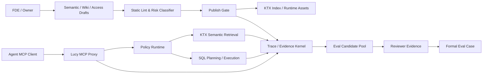

# Lucy 202608 可靠性交付系统升级蓝图

| 元数据 | 内容 |
|---|---|
| 文档名称 | Lucy 202608 可靠性交付系统升级蓝图 |
| 文档类型 | Product / Architecture Upgrade Spec |
| 版本 | v0.2 |
| 撰写日期 | 2026-08-03；v0.2 更新 2026-08-03（补充 Open Questions 首轮决策结论） |
| 适用范围 | Lucy 202608 版本升级：Trace / Evidence Kernel、静态防御、分级发布门禁、Safe Log-to-Eval、FDE Copilot 候选建议与 Dynamic RLS POC |
| 事实源层级 | 仓库级平台蓝图；后续 WebUI / API / 数据模型实现规格需拆到 `webui/docs/` |
| 执行总控 | `docs/lucy-202608-upgrade-execution-control.md` |

---

## 1. 升级定位

Lucy 202608 的升级目标不是堆叠 AI 生成功能，而是把 Lucy 从“可配置的 data agent context compiler + governed MCP runtime”推进为“可验证、可审计、可回滚的企业级数据 Agent 可靠性交付系统”。

核心 PM 判断：

- “看似合理但未经验证的语义”比“缺少语义”危险。
- FDE 交付效率的 10 倍提升不主要来自少写 YAML，而来自少返工、少扯皮、少排障、不泄露。
- AI 只能负责拉取候选、提示冲突、生成 Diff；FDE / Owner 才能确认、签名、提交。
- 安全与核心指标质量必须分层治理：安全底线零容忍，探索型问答允许 warning 和漂移观察。

因此，本版本围绕一条主线推进：

```text
每一次语义变更、Agent 回答、发布决策和 Eval 入库，都必须可追溯到证据。
```

## 2. 非目标

202608 不承诺以下能力全量上线：

- 不承诺自动生成并自动发布 semantic-layer YAML。
- 不承诺 Log-to-Eval 日志直接转正式评测基准。
- 不承诺 Dynamic RLS / CLS 全量生产可用。
- 不承诺 OIDC / SSO / SaaS 多租户 Workspace 全量上线。
- 不承诺替代业务 Owner 的口径仲裁。
- 不承诺把所有 trace 数据做成完整上层 Visual Debugger UI。

这些能力可以进入候选池、POC 或后续 spec，但不得作为 202608 发布承诺。

## 3. 交付原则

| 原则 | 要求 |
|---|---|
| 证据高于生成 | AI 辅助建议必须附带 evidence ref；无证据内容不得进入主建议流 |
| 人是唯一审核者 | AI 产物只能成为 draft / patch / candidate；落库、发布、Eval 入库必须有人签名 |
| 证据不可变 | Evidence 以 append-only 事件记录；错误证据通过追加 superseded / override 事件修正，不原地改写 |
| Gate 分级 | P0 安全 / 权限 / 核心财务指标零容忍；P1 业务高频问答阈值发布；P2 探索型问答 warning |
| 默认拒绝 | 权限、策略、工具暴露和数据访问均按 deny-by-default 设计 |
| 边界先于能力 | Dynamic RLS / CLS POC 必须先输出不支持场景和失败标准，再谈产品化 |

## 4. 目标系统图



Trace / Evidence Kernel 是本升级的底座。WebUI、CLI、Eval Runner、MCP Proxy、KTX reindex 诊断都应写入同一套 trace envelope 或映射到同一套 evidence ref，不允许各模块各自定义不可互通的日志语义。

## 5. Phase 1：Trace / Evidence Kernel

### 5.1 核心定位

先定义平台统一的数据契约，不优先做上层 UI。202608 的 Phase 1 MVP 应覆盖统一 trace envelope、span type、evidence ref、policy decision、artifact hash，而不是试图一次性保存所有 SQL AST、结果明细或调试界面。

### 5.2 核心交付

| 交付物 | 要求 |
|---|---|
| Trace Envelope | 统一 `traceId`、`sessionId`、`turnId`、`spanId`、`parentSpanId`、`actor`、`requestId` |
| Span Taxonomy | 至少覆盖 `reindex`、`mcp_initialize`、`mcp_tools_list`、`mcp_tools_call`、`policy_decision`、`ktx_retrieval`、`sql_plan`、`sql_execute`、`eval_run`、`publish_gate` |
| Evidence Ref | 能引用 semantic-layer YAML 节点、Business Wiki 段落、access policy、Eval case、物理表快照或 artifact hash |
| Policy Decision | 记录 allow / deny / warn、reason、role ids、permission snapshot hash |
| Append-only Store | 证据事件只追加，不原地修改；支持 superseded / reviewer_override |

### 5.3 最小数据契约

```ts
type LucyTraceEnvelope = {
  traceId: string;
  sessionId?: string;
  turnId?: string;
  spanId: string;
  parentSpanId?: string;
  spanType: LucySpanType;
  actor: {
    kind: "agent" | "fde" | "owner" | "system";
    id?: string;
  };
  status: "started" | "succeeded" | "failed" | "denied" | "warned";
  startedAt: string;
  endedAt?: string;
  evidenceRefs: LucyEvidenceRef[];
  policyDecision?: LucyPolicyDecision;
  artifactHashes?: string[];
};
```

```ts
type LucyEvidenceRef = {
  kind:
    | "semantic_yaml_node"
    | "wiki_section"
    | "access_policy"
    | "eval_case"
    | "sql_ast_hash"
    | "result_snapshot_hash"
    | "physical_table_snapshot"
    | "reviewer_decision";
  ref: string;
  version?: string;
  hash?: string;
};
```

### 5.4 Definition of Done

- 新增 trace envelope spec 并被 MCP Proxy、Eval Runner、Publish Gate 后续实现引用。
- 任何 Agent 回答至少能追溯到 tool call、policy decision、semantic / wiki evidence ref 中的一类。
- P0 deny 事件必须记录 policy decision，且可用于安全审计。
- Evidence store 支持 append-only 写入和 superseded 事件表达。

## 6. Phase 2：静态防御、Reindex 诊断与分级 Publish Gate

### 6.1 核心定位

把风险拦截在发布前，但拒绝单一通过率粗暴卡死交付。Lint、Reindex 诊断、Gate 都必须产出 trace / evidence，不只是 UI 状态。

### 6.2 核心交付

| 能力 | 要求 |
|---|---|
| Static Lint | 检查环形 join、grain 缺失、同名异义维度、manifest / overlay 归类错误、measure expr 高风险模式 |
| Reindex Diagnosis | 定位失败 scope、source、YAML 文件、行号、依赖对象和错误类型 |
| Patch Suggestion | 只生成 patch 草稿和影响面 Diff；禁止自动写入 semantic-layer |
| Owner Approval | Patch 落库前必须有 Owner approve 事件 |
| Publish Gate | 按 P0 / P1 / P2 风险等级分别处理 block、threshold、warning |

### 6.3 Gate 分级

| 等级 | 范围 | 发布规则 |
|---|---|---|
| P0 | 安全、权限、核心财务指标、客户承诺指标 | 必须 100% 通过；默认不可 override |
| P1 | 高频业务问答、标准管理报表、常用语义路径 | 通过率达到配置阈值后允许发布，例如 90% |
| P2 | 探索型问答、长尾问题、低风险解释类问题 | 不阻断发布，只输出 warning、漂移提示和候选跟进 |

### 6.4 Override 协议

P0 默认不可 override。若企业交付出现紧急发布，必须满足：

- 双人审批。
- 写入风险说明、有效期和回滚方案。
- 自动生成 follow-up case。
- 在 trace / evidence 中记录 override reason 和 reviewer identity hash。

### 6.5 Definition of Done

- Lint 结果可被 CLI 和 WebUI 复用。
- Reindex 失败能定位到可操作对象，不只展示 stack trace。
- Patch suggestion 默认停留在 draft，不触发落库。
- Publish Gate 能按 P0 / P1 / P2 输出不同 gate decision。

## 7. Phase 3：带 Reviewer Evidence 的 Safe Log-to-Eval

### 7.1 核心定位

真实访问日志不是 ground truth。Log-to-Eval 只能先进入候选池，必须经 reviewer evidence 审定后才能成为正式回归基准。

### 7.2 核心交付

| 能力 | 要求 |
|---|---|
| Candidate Pool | 从 Proxy 日志抽取高频提问、失败请求、权限拒绝和人工修正请求 |
| Reviewer Evidence | 要求确认 SQL 正确性、结果数据快照、业务口径 / 时间窗口 |
| Formal Eval Promotion | 只有挂载 reviewer evidence 的 candidate 才能晋升为正式 Eval case |
| Dedup | 基于 normalized question、semantic route、SQL AST hash、result snapshot hash 去重 |
| Redaction | 自动识别并剔除个人敏感信息、token、secret、直接联系方式 |
| Negative Case Library | 将非法跨部门查询、越权工具调用等转成安全回归 case |

### 7.3 Reviewer 分层

| 风险等级 | Reviewer 要求 |
|---|---|
| P0 | FDE + 业务 Owner 双确认 |
| P1 | FDE 确认；必要时业务 Owner 抽样 |
| P2 | 可批量确认或抽样确认；默认不进入发布阻断 suite |

### 7.4 Definition of Done

- Candidate 与 Formal Eval Case 物理隔离，禁止未审定 candidate 参与正式发布 gate。
- 每个 Formal Eval Case 都能追溯 reviewer evidence。
- 负样本能进入权限 / 安全回归 suite，而不是被简单丢弃。
- 脱敏失败必须 fail-closed，不允许进入候选池。

## 8. Phase 4：FDE Copilot 候选建议与 Dynamic RLS POC

### 8.1 FDE Copilot 边界

FDE Copilot 在 202608 只做“候选补全与冲突提示”，不做自动落库。

允许能力：

- 基于 DDL、manifest、历史 SQL、已有 semantic-layer 和 wiki 提供候选维度 / measure / join。
- 给出证据引用、出现频率、冲突提示和风险等级。
- 生成 semantic-layer patch draft 和 Diff。

禁止能力：

- 不得自动写入 manifest / overlay。
- 不得把无证据建议展示为主推荐项。
- 不得绕过 Owner approve。
- 不得把历史 SQL 的偶然写法直接沉淀为标准口径。

低置信度建议可以进入 `unverified candidate` 隔离区，但不能作为默认推荐项或发布候选。

### 8.2 Dynamic RLS / CLS POC 边界

202608 只做安全设计与 POC，不做全量生产承诺。

POC 必须覆盖：

- `tenant_id` / 部门代码隔离的 AST 注入路径。
- Join 泄露风险。
- 聚合小样本泄露风险。
- 派生 measure 泄露风险。
- cache / snapshot 跨权限泄露风险。
- ACL 合并冲突与 deny-by-default 语义。

POC 必须输出：

- 支持场景。
- 不支持场景。
- 已知绕过路径。
- 失败标准。
- 后续产品化前置条件。

### 8.3 静态 ACL 边界强化

在 Dynamic RLS 产品化前，202608 仍以静态 `access.yaml`、role template、tool surface、connection / table selector 为主线强化 MCP Proxy 硬隔离。

Definition of Done：

- MCP Proxy 对禁止工具、禁止 connection、禁止 table / measure 继续 fail-closed。
- 工具列表暴露与工具调用裁决一致。
- 负样本安全 Eval 可证明权限边界未退化。

## 9. 关键设计决策

| 决策 | 结论 | 取舍 |
|---|---|---|
| Trace Kernel 先于 Visual Debugger | 先冻结数据契约，再做 UI | 避免每个页面生成不可互通的调试数据 |
| Evidence append-only | 证据只追加，不原地改写 | 增加存储与查询复杂度，换取审计可信度 |
| Log-to-Eval 两段式 | 日志先入候选池，审定后入正式 Eval | 降低自动化速度，避免错误自繁衍 |
| AI 建议不自动落库 | Copilot 只能生成 draft / Diff | 少一点“魔法”，换取可控交付和责任边界 |
| Dynamic RLS 先 POC | 202608 不承诺全量上线 | 避免把深水区安全能力包装成轻量功能 |

## 10. 风险与缓解

| 风险 | 影响 | 缓解 |
|---|---|---|
| Trace 采集过宽导致敏感数据进入日志 | 安全与合规风险 | 默认记录 hash / metadata；原始结果快照需脱敏和策略授权 |
| Reviewer 流程变成人肉瓶颈 | Eval 候选堆积，飞轮失效 | 按 P0 / P1 / P2 分级审核，P2 支持批量或抽样 |
| Gate 过严阻塞交付 | 发布节奏受损 | P0 强阻断，P1 阈值，P2 warning；保留紧急 override 协议 |
| Copilot 建议污染语义层 | 错误口径沉淀 | evidence ref、risk label、Owner approve、Git Diff 四道防线 |
| Dynamic RLS POC 被误读为 GA | 安全承诺过度 | POC 文档必须列不支持场景和失败标准 |

## 11. 后续规格拆分

本文件是 202608 仓库级平台蓝图。进入实现前，应拆出以下 builder-facing spec：

| 后续 spec | 建议位置 | 范围 |
|---|---|---|
| Trace / Evidence Kernel API Spec | `webui/docs/62-trace-evidence-kernel-spec.md` | 数据模型、存储、MCP Proxy / Eval / Publish Gate 写入契约 |
| Static Lint & Reindex Diagnosis Spec | `webui/docs/63-static-lint-reindex-diagnosis-spec.md` | Lint rule、错误定位、patch draft、影响面 Diff |
| Tiered Publish Gate Spec | `webui/docs/64-tiered-publish-gate-spec.md` | P0 / P1 / P2 gate rule、override、release evidence |
| Safe Log-to-Eval Spec | `webui/docs/65-safe-log-to-eval-spec.md` | Candidate Pool、reviewer evidence、promotion、redaction |
| FDE Copilot Candidate Spec | `webui/docs/66-fde-copilot-candidate-spec.md` | 候选建议、证据引用、冲突提示、draft Diff |
| Dynamic RLS POC Spec | `docs/lucy-202608-dynamic-rls-poc-spec.md` | 安全模型、失败标准、POC 验收 |

执行调度、并行边界、minimax handoff、状态追踪和 code review / commit gate 见 `docs/lucy-202608-upgrade-execution-control.md`。

## 12. Terminology Compliance

This feature follows `webui/docs/00-product-terminology-standard.md`.

New terms:

- `Trace / Evidence Kernel`: 202608 平台级底层证据与追踪契约。
- `Evidence Ref`: 指向 semantic-layer YAML、Business Wiki、access policy、Eval case、SQL AST hash、result snapshot hash 等可追溯证据的引用。
- `Candidate Pool`: 从日志或 AI 建议中抽取、但尚未被 reviewer 审定的候选集合。
- `Reviewer Evidence`: FDE / Owner 对 SQL 正确性、结果数据快照、业务口径 / 时间窗口的审定证据。
- `unverified candidate`: 无足够证据或低置信度的隔离候选，不能作为主推荐项或发布候选。

UI 文案、API 用户可见错误、Toast、Modal、Drawer、测试断言、Spec、Plan、Runbook 必须继续保护 `Agent`、`MCP`、`KTX`、`YAML`、`Trace`、`Eval`、`SQL AST`、`RLS`、`CLS`、`access.yaml`、`semantic-layer` 等专业术语。

## 13. 首轮决策结论

以下结论采用 `Accepted with Constraints` 状态：先给 202608 实现明确工程落点，同时保留企业安全系统需要的收敛边界。

| 问题 | 决策 | 约束 |
|---|---|---|
| Trace / Evidence Store 选型 | MVP 阶段沿用现有 SQLite，并开启 WAL 模式；新增 append-only 的 `trace_events` 和 `evidence_events` 表 | 表结构从第一天按 event model 设计，禁止把证据建成可覆盖的状态表；后续如迁移到独立 event store，不应破坏历史 event 语义 |
| Result Snapshot 存储策略 | 默认 100% 只存 `result_snapshot_hash` | `DEBUG_SAMPLE` 默认关闭；只有 P0 安全评测失败且显式启用时，才允许保存脱敏 Top-N 样本；样本必须记录 TTL、policy decision 和脱敏策略 |
| P0 / P1 / P2 风险等级归属 | Eval Case 静态声明为主，Publish Gate 动态提升为辅 | 关键词只能作为 signal，不能单独决定 P0；动态提升需结合 `access.yaml` deny 标签、semantic-layer tags、source classification、measure risk metadata |
| Reviewer 身份识别 | 单管理员阶段使用 `local-admin + token_hash` 作为 reviewer evidence 身份锚点 | `local-admin` 只能代表 deployment-local actor，不等同真实个人身份；事件字段需预留 `actorKind`、`actorId`、`tokenHash`、`identityProvider`，后续可平滑接入 OIDC `sub` |
| Dynamic RLS 第一验证场景 | 首选 `tenant_id` 强隔离作为 POC 场景 | POC 必须同时验证正确注入 tenant filter 和不支持场景 fail-closed；重点覆盖跨租户 join、聚合小样本、缓存复用和派生 measure 泄露 |

## 14. Remaining Open Questions

- SQLite append-only event 表的 retention、归档和 vacuum 策略如何定义。
- `DEBUG_SAMPLE` 的脱敏策略由内置规则、部署方配置，还是 reviewer 手动确认。
- `source classification` 和 `measure risk metadata` 的事实源落在 semantic-layer overlay、access policy，还是独立 policy 文件。
- P0 紧急 override 的双人审批在单管理员部署中如何模拟或降级。
- Dynamic RLS POC 的 fixture 数据集是否复用现有 demo 数据，还是新建专用多租户测试源。
