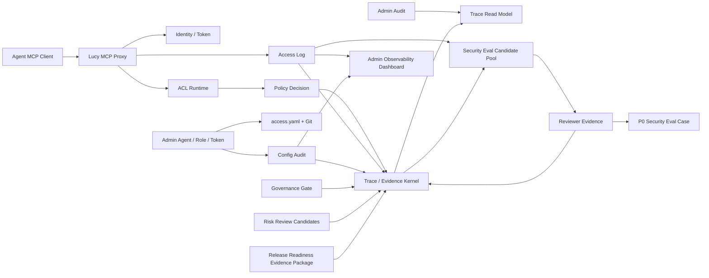

# Lucy 202608 Enterprise Governance & Observability Upgrade Spec

| Metadata | Content |
|---|---|
| Document name | Lucy 202608 Enterprise Governance & Observability Upgrade Spec |
| Document type | Product / Architecture Upgrade Spec |
| Version | v0.5 |
| Written date | 2026-08-03；v0.4 更新 2026-08-03（收窄 202608 主线为企业访问治理与可观测性，移出 FDE Copilot 与通用 semantic delivery 提效）；v0.5 更新 2026-08-03（删除 Dynamic RLS / CLS POC 超前设计，收敛 P2 为当前访问治理复核与发布证据包） |
| Scope | Lucy 202608 版本升级：Access Governance Trace / Evidence、ACL policy decision trace、Admin Audit Trace read model、Tiered Access Governance Gate、Safe Log-to-Security-Eval、Admin Observability、Agent / Role Risk Review、Release Readiness Evidence Package |
| Execution control | `docs/lucy-202608-upgrade-execution-control.md` |
| Gap analysis | `docs/access-control/gap-analysis-202608.md`（旧路径 `docs/lucy-202608-access-governance-gap-analysis.md` 为跳转桩） |

---

## 1. Upgrade Positioning

Lucy 202608 只做一条主线：

```text
Lucy Enterprise Governance & Observability Upgrade
```

目标不是提升 FDE 自动建模效率，也不是扩张 AI 生成菜单，而是把 Lucy 从“已有访问控制与审计日志的 MCP runtime”推进为“可解释、可审计、可观测、可复核的企业级 data agent 平台”。

核心判断：

- 企业客户首先需要知道 Agent 为什么能访问、为什么被拒绝、谁改了权限、边界有没有退化。
- 当前 FDE 建模工作可以继续通过人工 + Codex 完成，痛点不如平台可观测性、日志能力和访问治理闭环突出。
- 202608 的价值应优先证明“可信治理”，再谈“自动化提效”。

因此，本版本围绕一条主线推进：

```text
每一次 Agent 访问、权限裁决、治理变更、安全回归与企业审计导出，都必须可追溯到证据。
```

## 2. Non-Goals

202608 不承诺以下能力进入本轮迭代：

- 不做 FDE Copilot Candidate 主线开发。
- 不做通用 semantic-layer Static Lint / Reindex Diagnosis 主线开发。
- 不承诺 Log-to-Eval 覆盖全部业务质量用例；本轮只做安全 / 权限负样本方向。
- 不做 Dynamic RLS / CLS POC 或生产路径；Lucy 当前没有多租户，相关设计不进入 202608。
- 不承诺 OIDC / SSO / SaaS 多租户 Workspace 全量上线。
- 不承诺完整 Visual Debugger UI；本轮只做 Admin Audit Trace read model。
- 不替代业务 Owner 的指标口径仲裁。

`webui/docs/63-static-lint-reindex-diagnosis-spec.md` 与 `webui/docs/66-fde-copilot-candidate-spec.md` 保留为后续资料，但状态为 Deferred，不作为 202608 主线执行对象。Dynamic RLS / CLS POC 已从 202608 删除，不保留 active spec 或 work order。

## 3. Three-Layer Scope

| Layer | Theme | Active tasks | User value |
|---|---|---|---|
| P0 MVP | Governance evidence kernel | Trace / Evidence Kernel；ACL policy decision trace；Admin Audit Trace Read Model | 管理员能解释每次访问的身份、权限、裁决、证据与结果规模 |
| P1 Reliable Governance | Permissions / Agent observability loop | Tiered Access Governance Gate；Safe Log-to-Security-Eval；Admin Observability Dashboard | 访问治理从事后查日志升级为门禁、趋势、异常与安全回归闭环 |
| P2 Governance Review | Access review / release evidence | Agent / Role Risk Review Candidates；Release Readiness Evidence Package | 基于当前 Agent / Role / Token / ACL / Audit 事实源，提供权限复核候选项和统一发布证据包 |

## 4. Target System Diagram



## 5. P0 MVP: Governance Evidence Kernel

### 5.1 Trace / Evidence Kernel

The existing `.ktx-ui/audit.sqlite` remains the single local audit hot store. 202608 adds append-only `trace_events` and `evidence_events` to the same SQLite database.

Required outcomes:

- Unified `traceId`、`sessionId`、`turnId`、`spanId`、`parentSpanId`、`actor`、`requestId`.
- `mcp_tools_call` and `policy_decision` events for business tool calls.
- Evidence refs for access policy, permission snapshot, access log row, source refs, result snapshot hash when available.
- Retention defaults: 365 days, 500000 rows, 1GB.
- SQLite safety: WAL, `busyTimeout: 5000`, new DB `auto_vacuum = INCREMENTAL`, tests isolated to memory or temp DB.
- Hot store black / white list enforced by helper, not repeated ad hoc in callers.

### 5.2 ACL Policy Decision Trace Integration

Every allow / deny decision made by MCP Proxy ACL must be representable as an append-only event.

Required outcomes:

- `decision = allow | deny | warn`.
- `reason`, `roleIds`, `permissionSnapshotHash`, `effectiveTablesCount`, `tokenHashPrefix`.
- Denied P0 paths include `tool_forbidden_global`、`table_forbidden:*`、`raw_query_forbidden`、`unknown_or_forbidden_connection:*`、`sensitive_metadata_forbidden:*`.
- Trace write failure must not break MCP traffic, but must be logged and counted by verification.

### 5.3 Admin Audit Trace Read Model

`/admin/audit` remains the primary audit workbench. It gains read-only trace chain inspection instead of becoming a new debugger product.

Required outcomes:

- Audit rows can link to trace events by `traceId`、`turnId`、`requestId` or access log reference.
- Trace detail shows ordered spans, policy decisions, evidence refs, artifact hashes, and redacted metadata.
- No raw result rows, raw SQL AST, full question text, Token plaintext, DB credentials, or customer row samples are exposed.

## 6. P1 Reliable Governance

### 6.1 Tiered Access Governance Gate

This replaces the previous generic Publish Gate as the 202608 active gate. It focuses on Agent / Role / Token / access policy changes and governance-sensitive release checks.

Scope:

- Agent create / enable / role change.
- Role create / edit / copy / delete.
- Token create / revoke.
- `access.yaml` defaults / deny tools / sensitive metadata defaults.
- Optional hook for core semantic publish only when changes touch access-classified sources.

Gate behavior:

| Tier | Scope | Behavior |
|---|---|---|
| P0 | Permission expansion, global deny weakening, sensitive source exposure, raw query path, core finance / security suite | Block unless all P0 security checks pass; emergency override requires two approvers, TTL, rollback plan |
| P1 | High-frequency Agent / Role changes, role selector widening, Token lifecycle anomalies | Threshold / review required |
| P2 | Cleanup, unused Role, stale Token, low-risk docs-only governance changes | Warning and follow-up |

### 6.2 Safe Log-to-Security-Eval

This narrows previous Log-to-Eval into a security / permissions loop.

Candidate sources:

- Denied access logs.
- Forbidden table / forbidden tool / forbidden connection.
- Raw query forbidden.
- Sensitive metadata forbidden.
- Repeated upstream errors tied to permissions or source access.
- Reviewer-marked suspicious successful access.

Required outcomes:

- Candidate Pool is separate from Formal Eval Case.
- High-entropy credentials are rejected; semantic words like Token / API key remain valid security candidates.
- P0 negative cases can be promoted only after reviewer evidence.
- Unreviewed candidate never participates in gate.

### 6.3 Admin Observability Dashboard

Current `/admin/audit` is detail-first. 202608 adds governance-first aggregation for operators.

Required signals:

- Agent calls, denied rate, error rate, p95 latency, active Token count.
- Role usage, denied count, over-broad selector warnings, unused / broken Role.
- Token last used, high-denial Token, stale Token, revoked Token attempts.
- Denial reason trends and top affected sources.
- Links into Audit Trace detail and Agent / Role pages.

## 7. P2 Governance Review

### 7.1 Agent / Role Risk Review Candidates

Periodic access review is a P2 workflow, not a prerequisite for P0 trace.

Required outcomes:

- Detect unused Role, over-broad Role, broken Role, long-unused Token, Agent with high deny rate.
- Generate review candidates, not automatic changes.
- Allow reviewer note / evidence on candidate review.
- Do not implement a remediation lifecycle or automatically mutate `access.yaml`.

### 7.2 Release Readiness Evidence Package

202608 should be able to produce one bounded release readiness evidence package. There are no audience-specific variants, and the package must only use current Agent / Role / Token / ACL / Audit / Eval facts.

Package includes:

- Access configuration hash and relevant `access.yaml` summaries.
- Agent / Role / Token inventory.
- Denied events and top reasons.
- Config changes.
- Security Eval candidate / formal case summary.
- Risk review candidate summary.
- Known limitations: no SSO, no full Visual Debugger, no FDE Copilot mainline.

## 8. Key Decisions

| Decision | Accepted direction | Trade-off |
|---|---|---|
| 202608 mainline | Governance & Observability only | Defers FDE automation and generic semantic delivery tooling |
| SQLite store | Reuse `.ktx-ui/audit.sqlite` with append-only trace / evidence tables | Keeps MVP operationally light; requires explicit retention / vacuum safeguards |
| Access config source | Keep `access.yaml` / Git as configuration fact source | SQLite remains evidence store, not policy source |
| Log-to-Eval | Narrow to Log-to-Security-Eval | Faster enterprise trust signal; broader business quality flywheel deferred |
| Dynamic RLS / CLS | Removed from 202608 | Lucy 当前没有多租户；避免把未来动态隔离设计提升为本轮任务或交付承诺 |

## 9. Risks And Mitigations

| Risk | Impact | Mitigation |
|---|---|---|
| Trace captures sensitive payloads | Security / compliance incident | Hot store guard rejects or hashes blacklisted payloads |
| Gate slows local admin operations | Operational friction | P0 blocks only real permission expansion / sensitive exposure; P2 only warning |
| Security Eval candidate pool becomes noisy | Reviewer fatigue | Start with denied logs and high-confidence ACL reasons; require reviewer promotion |
| Release package implies future capabilities | Unsafe expectation | Package includes only current Agent / Role / Token / ACL / Audit / Eval facts and known limitations |
| Existing `/admin` gets crowded | UX degradation | Use detail links, summary dashboard, and current PageHeader / table / Drawer patterns |

## 10. Builder-Facing Specs

| Spec | Status in 202608 | Scope |
|---|---|---|
| `webui/docs/62-trace-evidence-kernel-spec.md` | Active P0 | Trace / Evidence store, policy decision events, MCP Proxy integration |
| `webui/docs/64-tiered-publish-gate-spec.md` | Active P1, renamed in content to Access Governance Gate | Agent / Role / Token / access policy gate and override evidence |
| `webui/docs/65-safe-log-to-eval-spec.md` | Active P1, narrowed in content to Safe Log-to-Security-Eval | Security candidate pool, negative cases, reviewer evidence |
| `webui/docs/69-admin-governance-observability-spec.md` | Active P1/P2 | Admin dashboard, trace read model, risk review candidates, release readiness evidence package |
| `webui/docs/63-static-lint-reindex-diagnosis-spec.md` | Deferred | Future semantic delivery tooling |
| `webui/docs/66-fde-copilot-candidate-spec.md` | Deferred | Future FDE productivity tooling |

## 11. Terminology Compliance

This feature follows `webui/docs/00-product-terminology-standard.md`.

Protected terms: `Agent`、`MCP`、`KTX`、`Trace`、`Evidence`、`Eval`、`SQL AST`、`Token`、`Role`、`ACL`、`access.yaml`、`semantic-layer`。
