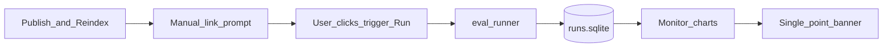
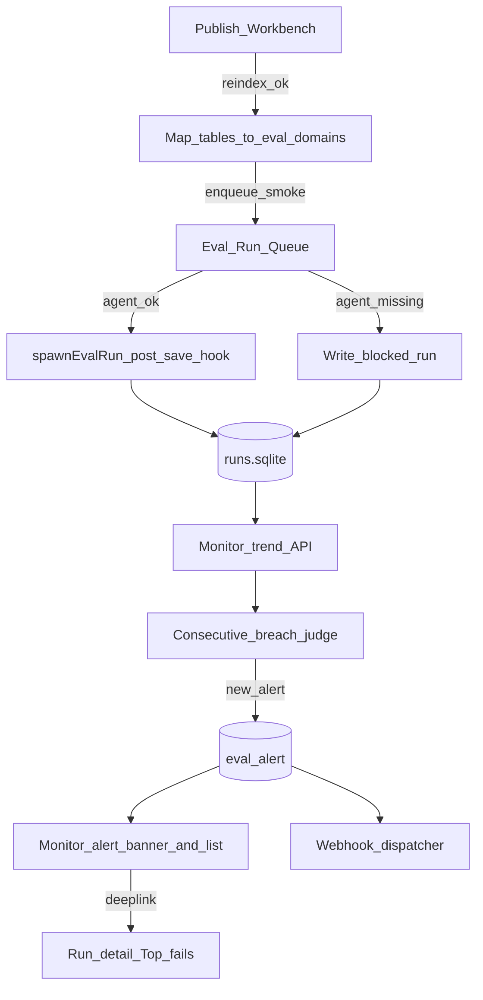

# Eval 优化方案：准确率闭环 + 变更触发回归

| 元数据 | 内容 |
|---|---|
| 文档名称 | Eval Accuracy Closed Loop & Change-Triggered Regression |
| 文档类型 | Product / Architecture Optimization Plan（形态 A：目标态与分阶段路线，**不含**实现工单拆解） |
| 版本 | v0.1 |
| 撰写日期 | 2026-08-26 |
| 委托人 | xingchen |
| 基于材料 | 当前 eval 能力调查结论；[`docs/design-eval-monitoring.md`](../design-eval-monitoring.md)；[`webui/docs/46-eval-yaml-exchange-and-result-archive-spec.md`](../../webui/docs/46-eval-yaml-exchange-and-result-archive-spec.md)；[`docs/lucy-aicon-online-capability-scorecard.md`](../lucy-aicon-online-capability-scorecard.md) §4.3 |
| 事实源代码 | [`webui/server/eval/monitor.ts`](../../webui/server/eval/monitor.ts)、[`webui/server/eval/runner.ts`](../../webui/server/eval/runner.ts)、[`webui/src/pages/eval/Monitor.tsx`](../../webui/src/pages/eval/Monitor.tsx)、[`webui/src/pages/publish/PublishWorkbench.tsx`](../../webui/src/pages/publish/PublishWorkbench.tsx) |
| 输出位置 | `docs/plans/2026-08-26-eval-accuracy-closed-loop-and-change-triggered-regression.md` |

---

## 1. 问题与目标

### 1.1 一句话

把现有「可看趋势的 Monitor + 可手动触发的 Run」升级为：**变更后自动冒烟回归**，以及**准确率跌破后可判定、可通知、可下钻的运营闭环**。

### 1.2 本方案范围（已冻结）

| 纳入 P0 产品目标 | 明确不纳入本方案 P0 |
|---|---|
| 准确率闭环：连续跌破判定 + 页内告警态 + Webhook 外发 | 问题集 / Golden 自动生成与一键刷新 |
| 变更触发回归：Publish + reindex 成功后自动 enqueue smoke suite | 产品内 cron / 日调度器 |
| | 业务质量 Log→Eval 飞轮 |
| | 多模型 A/B、硬阻断 Publish（P0 仅咨询性） |

形态约定：本文是**产品/架构优化方案**，描述目标态、契约、阶段与验收口径；后续再开独立 WO 落地实现。

### 1.3 成功标准（产品层）

1. 语义发布生效后，相关 domain **自动产生**一条 `trigger=post_save_hook` 的 smoke Run（有 Agent 则执行；无 Agent 则明确 `blocked` 留痕，不静默跳过）。
2. Monitor 不仅画折线：当连续 N 个统计日通过率低于黄/红线时，产生**可确认（ack）的告警记录**，并按配置 POST 到 Webhook。
3. 从告警 / Publish 结果均可一跳到失败 Run / Top 失败 Case，形成「发现 → 定位 →（人工）修复 → 再跑」闭环。

---

## 2. 现状基线（为何不够企业级）

### 2.1 准确率监控

| 已有 | 缺口 |
|---|---|
| `/eval/monitor` 通过率趋势、黄/红阈值线、Top 失败、drift 分布 | `consecutiveFailThreshold` 仅可配置，**不参与判定** |
| 页顶 banner 只看「最新一个点」vs 阈值 | 无「连续 N 日/次」跌破逻辑 |
| 阈值落盘 `.ktx-ui/eval/monitor-config.json` | 无告警记录表、无 ack、无 Webhook / 邮件 / Slack |
| | 无跑则无趋势；监控被动依赖人工触发 |

### 2.2 变更触发回归

| 已有 | 缺口 |
|---|---|
| Publish Workbench 在 reindex 成功后展示「下一步 · 触发相关 Domain 的评测 Run」| 仅为 **Link 到 `/eval/runs`**，不自动 enqueue |
| 设计模型已预留 `trigger: post_save_hook` | [`runner.ts`](../../webui/server/eval/runner.ts) INSERT **写死** `trigger='manual'` |
| | `postPublishEvalDomains` 当前用 **impacted 表名** 当 domain（表 ≠ eval domain），映射错误 |
| `coverage` 选择模式 | 后端返回 `UNSUPPORTED_SELECTION_MODE`；无正式 smoke 子集选择 |
| Spec 46：服务器无 LLM 时不假装能跑 | 变更钩子需显式处理 blocked，当前无该路径 |

### 2.3 架构示意（现状）



---

## 3. 目标架构

### 3.1 目标数据流



### 3.2 设计原则

1. **YAML + runs.sqlite 仍是事实源**；告警与钩子是其上的运营层，不另造第二套 case 库。
2. **服务器无 Agent 时诚实失败**：写 `status=failed`（或扩展 `blocked`）+ `trigger_reason`，进入 Monitor / Publish 可见，不伪造 PASS。
3. **P0 变更回归咨询性**：smoke FAIL 不回滚 Publish、不阻断 reindex；结果挂在 Publish「下一步」与 Monitor 告警上。硬门禁留 P1。
4. **告警外发只做通用 Webhook**：企业用自有中继接到 Slack/飞书/PagerDuty；本产品不内建各 IM SDK。
5. **串行 run 不变**（现有 `RUNNER_BUSY`）：钩子入队，若忙则 `queued` 等待或返回可重试状态；不引入多进程并发。

---

## 4. 能力 A：准确率闭环

### 4.1 判定语义（Normative）

对每个 `domain`（及可选「全局聚合」视图）：

1. 取 Monitor 现有日聚合点：`DATE(started_at)`、`passRate = pass_count / total_cases`，仅 `status='succeeded'`。
2. 配置沿用：
   - `passRateYellow` / `passRateRed`
   - `consecutiveFailThreshold`（整数 N，默认 3）
3. **连续跌破**定义：最近 N 个**有数据的统计日**（跳过无 run 的日子，避免「没跑」被当成跌破）均满足：
   - 黄线告警：`passRate < passRateYellow`
   - 红线告警：`passRate < passRateRed`（红覆盖黄，只发一条 critical）
4. 无足够历史点（有数据日 &lt; N）：不发连续告警；仍保留「最新点跌破」的即时 banner（与现网一致）。
5. 恢复：最近一个有数据日 `passRate >= passRateYellow` → 自动将未 ack 的同 domain 活跃告警标为 `resolved`。

### 4.2 告警对象

建议新增表（概念模型，落在 `.ktx-ui/eval/runs.sqlite`）：

```text
eval_alert
  id, domain, severity(yellow|red),
  kind(consecutive_breach|latest_point_breach),
  window_start, window_end, pass_rate_series_json,
  status(open|acked|resolved),
  created_at, acked_at, acked_by, resolved_at,
  webhook_delivery_status, webhook_last_error
```

### 4.3 Monitor 产品行为

| 表面 | 行为 |
|---|---|
| KPI / banner | 展示「连续 N 日低于黄/红线」文案；红优先于黄 |
| 告警列表 | open / acked；支持 ack（记录 actor） |
| 下钻 | 链到该 domain 时间窗内失败 Run、Top 失败 Case（复用现有 API） |
| 阈值表 | 继续编辑黄/红/连续次数；新增 Webhook URL（可空=仅页内） |

### 4.4 Webhook 契约

配置挂在 `monitor-config.json`：

```json
{
  "domains": { "superstore": { "passRateYellow": 0.9, "passRateRed": 0.8, "consecutiveFailThreshold": 3 } },
  "webhook": {
    "enabled": true,
    "url": "https://hooks.example.com/lucy-eval",
    "timeoutMs": 5000
  }
}
```

Payload（稳定字段，便于企业中继）：

```json
{
  "event": "eval.accuracy.breach",
  "severity": "red",
  "domain": "superstore",
  "kind": "consecutive_breach",
  "threshold": { "yellow": 0.9, "red": 0.8, "consecutive": 3 },
  "passRates": [0.81, 0.77, 0.74],
  "dates": ["2026-08-24", "2026-08-25", "2026-08-26"],
  "monitorPath": "/eval/monitor?domain=superstore",
  "alertId": "..."
}
```

规则：同一 `(domain, severity, kind)` 在 `open` 期间不重复轰炸；状态变为 `resolved` 后再次跌破才新建。可选后续发 `eval.accuracy.resolved`（P1）。

### 4.5 判定触发时机

| 时机 | 动作 |
|---|---|
| 任意 Run `succeeded` 写库结束 | 对该 domain 重算连续跌破 |
| `GET /api/eval/monitor/trend` 或 Monitor 页加载 | 可读缓存的 alert 状态；不强制重算亦可，但 Run 结束必须重算 |
| 配置变更（阈值变严） | 立即重算；可变严导致新建 open alert |

---

## 5. 能力 B：变更触发回归

### 5.1 触发点（Normative）

唯一 P0 钩子：

> Publish Workbench：**语义资产写入成功且 KTX reindex `ok`** 之后。

不挂钩：单表编辑保存、Wiki 单页保存、dryRun validate（避免噪声）。Wiki/Skill 变更触发属 P1。

### 5.2 Domain 映射（修正现网错误）

现状：`postPublishEvalDomains = impactedTables`（表名误当 domain）。

目标映射规则：

1. 从变更文件路径解析 `connection/schema/table`（已有 `classifyChangedSemanticFiles` / `impactedTableNames`）。
2. 扫描 `evals/*/eval/*-eval-cases.yaml`，建立 **table/source → domain** 索引：优先 case 内 `expected_measures` / notes / metadata 引用；若无结构化引用，用 domain 名与 schema/业务包约定的静态映射表（`.ktx-ui/eval/domain-map.json` 或 suite metadata `affected_sources`）。
3. 映射为空时：不瞎跑；Publish 面板提示「未解析到 eval domain，请手工选择」，并允许用户勾选 domain 后手动 enqueue（保留现网能力升级为真触发）。
4. 禁止再把 table name 填进 `/eval/runs?domain=`。

### 5.3 Smoke 子集选择

新增 case 选择模式（概念）：

```text
caseSelection.mode = "smoke"
```

解析规则：

1. 读取该 domain YAML；收集 `gate_tier: smoke` 的 case id（新可选字段；缺省视为 `full`）。
2. 若 smoke 集合为空：回退为 `coverage` 语义中的 `basic` **仅当** case 已标 `coverage: basic`；若仍空，取稳定排序后的前 `min(5, total)` 条并在 `trigger_reason` 中注明 `smoke_fallback_first_n`。
3. Runner 以 `mode: ids` 实际执行（实现可内部展开），但 DB `case_selection` 保留 `{"mode":"smoke"}` 便于审计。

不在 P0 实现通用 `coverage` 全模式；只交付 smoke 门禁所需最小选择能力。

### 5.4 Run 元数据

| 字段 | P0 值 |
|---|---|
| `trigger` | `post_save_hook`（不再写死 manual） |
| `triggered_by` | 当前登录用户或 `publish:<actor>` |
| `trigger_reason` | 如 `publish+reindex; tables=a,b; smoke=12` |
| 并发 | 若已有 running/queued：本请求写入 `queued` 或返回明确忙并在 Publish UI 显示「将在空闲后自动跑」（产品选择：**入队 queued**，与现网「拒绝第二 run」相比更适合钩子） |

> 产品决策（冻结）：钩子路径允许 `queued`；纯手工 `POST /api/eval/runs` 可继续 409 `RUNNER_BUSY`，避免用户双点。实现阶段需拆两条入口语义。

### 5.5 无 Agent / Precheck 失败

对齐 Spec 46：

1. Precheck 失败 → 落一条 run：`status=failed`，`trigger=post_save_hook`，`trigger_reason` 含 `RUNNER_PRECHECK_FAILED`。
2. Publish 面板展示「自动回归未执行（环境无 Agent），请下载 suite 本地跑或配置 Agent」。
3. 此类失败**不**计入准确率连续跌破分母（仅 `succeeded` 计入，与现 Monitor 一致）；另计「钩子成功率」运营指标（P1 看板可加）。

### 5.6 Publish UI 目标态

| 状态 | UI |
|---|---|
| reindex 成功，已 enqueue | 「已触发 smoke 回归 · Run #id」+ 进度链到 `/eval/runs/:id` |
| reindex 成功，映射失败 | 「未匹配 domain」+ domain 多选 +「立即触发」 |
| run PASS | 绿态摘要通过率 |
| run FAIL | 黄/红摘要 + Top 失败 case 链 |
| blocked/precheck | 明确「未跑成」而非「无下一步」 |

P0：**不**因 FAIL 自动 revert Publish。

---

## 6. 与现有模块边界

| 模块 | 关系 |
|---|---|
| [`design-eval-monitoring.md`](../design-eval-monitoring.md) | 补齐其 D2 告警「只配不发」与设计稿 cron 之外的 **Webhook + 连续判定**；cron 仍不在本方案 |
| Spec 46 YAML 交换 | 变更钩子走服务器 runner；无 Agent 时 blocked + 本地 runner 指引不变 |
| Safe Log-to-Security-Eval | 正交；本方案不消费 access_log |
| `smoke:p0:business-eval` CI | 仍只做 catalog 可读；本方案不把 LLM full eval 塞进默认 CI |
| lucy-eval-author Skill | 出题仍人工/Skill；本方案只消费已有 YAML 的 `gate_tier` |

---

## 7. 分阶段路线

### Wave 0 — 本方案（文档）

- 冻结目标态、判定语义、钩子边界、非目标。
- 评审通过后拆 WO（不在本文展开任务列表）。

### Wave 1 — P0 落地（准确率闭环 + 变更钩子）

1. Alert 判定 + 存储 + Monitor UI ack + Webhook。
2. `post_save_hook` 真触发 + domain 映射修正 + `gate_tier: smoke` + Publish 结果面板。
3. Runner `trigger` 字段按来源写入；钩子支持 queued。

### Wave 2 — P1 加固

- Publish 可选「硬门禁」：smoke FAIL 时 Publish 标记 `quality_gate=failed`（仍不自动 rollback 文件，但阻断「发布完成」话术 / 对外 READY）。
- 告警 `resolved` Webhook；钩子成功率 KPI。
- Wiki/Skill publish 纳入映射；静态 `domain-map` 编辑 UI。
- 手工补跑与 failed_in_last 一键从告警页发起。

### Wave 3 — 后续（本方案仅挂号）

- Golden 刷新提案、覆盖缺口报告。
- 外部 crontab 日跑 + 结果归档（文档化 CLI，非 WebUI 内 cron）。
- 业务 Log→Eval 候选池。

---

## 8. 验收口径（产品 UAT，非实现 checklist）

### 8.1 准确率闭环

| ID | 场景 | 期望 |
|---|---|---|
| A-1 | domain 连续 3 个有数据日通过率 &lt; 黄线 | 产生 `severity=yellow` open alert；Monitor 可见 |
| A-2 | 其中至少一日 &lt; 红线且连续条件满足红 | 仅 critical/red 一条（或 yellow 升级为 red），不双开骚扰 |
| A-3 | 配置了 webhook | 收到一次 JSON；重复刷新 Monitor 不重复 POST |
| A-4 | 用户 ack | 列表状态 acked；再跌破不因 ack 抑制（仅抑制同 open 重复投递） |
| A-5 | 次日通过率回到黄线以上 | alert → resolved；页内恢复正常态 |
| A-6 | 中间有无 run 的日期 | 不计入连续窗口（跳过空日） |

### 8.2 变更触发回归

| ID | 场景 | 期望 |
|---|---|---|
| B-1 | 修改并发布某 domain 相关语义 + reindex ok + Agent 可用 | 自动出现 `post_save_hook` smoke run |
| B-2 | 同上但 Agent 不可用 | blocked/failed 留痕 + Publish 明示原因 |
| B-3 | 变更表无法映射 domain | 不误用表名当 domain；引导手选 |
| B-4 | smoke 子集有 `gate_tier: smoke` | 只跑该子集；reason 可审计 |
| B-5 | 钩子跑失败（逻辑 FAIL） | Publish 仍成功；UI 显示回归失败与下钻；Monitor 纳入通过率 |
| B-6 | 已有 run 在执行时再次 Publish | 新钩子进入 queued，不丢 |

### Terminology Compliance

- 用户可见文案遵守 [`webui/docs/00-product-terminology-standard.md`](../../webui/docs/00-product-terminology-standard.md)：使用「质量评测 / 评测用例 / 运行 / 通过率」，保留 `Eval` / `Run` / domain id 等专业英文节点的 `notranslate`。
- 不引入未登记产品词；若新增「告警 / 质量门禁」对外文案，实现 Spec 阶段补术语表。

---

## 9. 风险与依赖

| 风险 | 缓解 |
|---|---|
| 私有化环境无 LLM，钩子大量 blocked | 诚实留痕 + Spec 46 本地 runner；P0 不以钩子成功率为发布硬条件 |
| Smoke 未标注导致 fallback 前 N 条代表性差 | 文档要求核心 domain 至少标注 smoke；Wave 1 验收列出标注率 |
| Webhook 泄露内网 URL / 失败重试打爆 | timeout 短、失败记 `webhook_last_error`、P0 不做无限重试（最多 1 次即时 POST） |
| Domain 映射不准 | 映射失败走手选，禁止表名冒充 domain |
| 与「只咨询不阻断」预期冲突 | 文档与 UI 明确 P0 advisory；硬门禁进 Wave 2 |

---

## 10. 结论

本优化方案把企业级 eval 最痛的两段运营链路先补齐：

1. **准确率闭环**：连续跌破可判定、可 ack、可 Webhook。  
2. **变更触发回归**：Publish 生效后自动 smoke，修正 domain 映射，无 Agent 时诚实 blocked。

问题集/Golden 生产维护、日 cron、业务 Log→Eval 仍是已知缺口，但不挤占本波次；待 Wave 1 验证闭环后再开下一方案。
