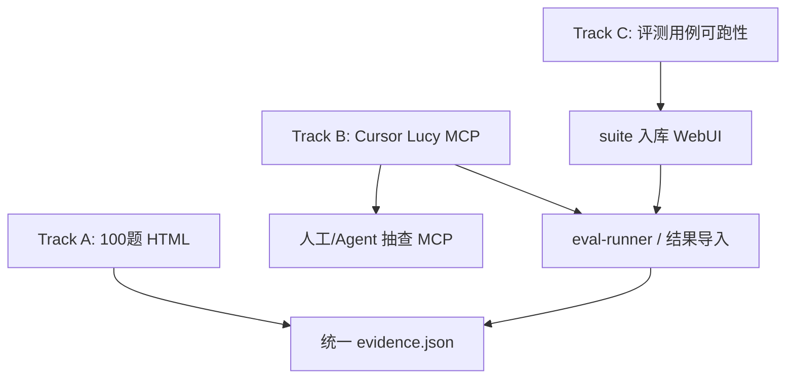

# O-202608-49 chatbi Eval HTML / Cursor MCP / 评测用例接入方案

| 元数据 | 内容 |
|---|---|
| 文档名称 | chatbi Eval HTML 扩至 100 题、Cursor Lucy MCP、评测用例可跑性方案 |
| 文档类型 | Design / Plan |
| 版本 | v1.4 |
| 撰写日期 | 2026-08-06 |
| 撰写人 | Cursor Agent |
| 委托人 | zhangxingchen |
| 基于材料 | v1.3；用户确认「只认 Cursor Lucy MCP」且每题须带可回查时间戳与问询 ID |
| 适用范围 | chatbi 评测报告、Cursor 直连 Lucy MCP、WebUI「评测用例」套件与运行日志可见 |
| 输出位置 | `docs/plans/o-202608-49-chatbi-semantic-publish-and-100-eval.md`；副本 `~/Desktop/lucy_upload/o-202608-49-….md` |

## 0. 已锁定决策

| 项 | 决策 |
|---|---|
| 对照库 | **路径 A**：Lucy 与对照 SQL 均打 Docker `demo-db` / `chatbi` |
| 首版 | 12 道 numeric HTML 已跑通（`results/latest-numeric-12/`，12/12） |
| 本版目标 | HTML **扩到 100 题**；Cursor 配置 Lucy MCP token；评估并改造 100 题使能进 Lucy **评测用例**体系 |
| **正式报告路径（v1.4）** | **只认 Cursor → `lucy-demo` MCP**。`results/latest-100/report.html` 必须由该路径证据生成 |
| **反作假硬条件（v1.4）** | 每题 Lucy 侧须有 `queried_at` + **问询 ID**（优先 `lucy_turn_id`，并回填 `access_log_id` / `request_id` / `trace_id`），用户可在 WebUI 访问日志点开同一条 |

### 0.3 正式路径与废弃项（2026-08-06 用户确认）

| 项 | 规则 |
|---|---|
| 正式 HTML | 仅 `results/latest-100/report.html`（Cursor Lucy MCP 审计版） |
| 编排脚本 | `eval/scripts/run-cursor-lucy-mcp-audited-html.mjs`：每题 `lucy_begin_question` → 业务工具 → 审计回填 |
| 同 endpoint 无审计 ID 的 Node 直连 HTML | **不作正式交付**（旧 `run-chatbi-100-html-report.mjs` 仅作对照/调试） |
| `demo_readonly` 工具 | 须含 `lucy_begin_question`（否则无 reported turn） |
| 回查入口 | WebUI 访问日志 / `GET /api/admin/audit` / `GET /api/admin/audit/turns/:turnId` |

### 0.2 题库修复与后续 Eval（2026-08-06 已执行）

| 项 | 结果 |
|---|---|
| `result_assertions` | **100/100** 已补：20×`scalar` + 80×`text/must_mention` |
| 矩阵 | `~/Desktop/lucy_upload/eval/runnability-matrix.md` |
| HTML 100 | 以 **v1.4 审计版** 为准（见 §0.3）；旧无 ID 版本已废弃为正式交付 |
| WebUI 评测用例 | `evals/chatbi_intl/` 已挂载可见（domain=`chatbi_intl`, 100 cases）；**未 git commit**（默认 A） |
| Cursor MCP | `~/.cursor/mcp.json` 已加 `lucy-demo` → `:57881` |
| eval-runner LLM | 仍受本机 `claude` CLI 缺失阻塞；MCP 批跑不依赖 claude |

### 0.1 首版沉淀（仍有效）

- 报告：`~/Desktop/lucy_upload/eval/results/latest-numeric-12/report.html`
- 复跑：`node ~/Desktop/lucy_upload/eval/scripts/run-numeric-12-html-report.mjs`
- 比率 measure（`cpi_af_usd` / `ctr` / `retention_rate`）直查会 `Invalid use of group function` → 报告侧用派生除法；语义写法/产品修复另开项
- Overlay 已去 `pk`/`nullable`；`demo_agent` 已 `enabled: true` 且 ACL 含 chatbi 四表
- Demo MCP：`http://127.0.0.1:57881/mcp` + Bearer `lucy-demo-agent-token`（仅本地 demo，勿提交仓库）

---

## 1. 本版目标（用户要看到什么）

| # | 目标 | 你怎么「看见日志」 |
|---|---|---|
| G1 | HTML 报告覆盖 **100** 题（numeric 对照 + logic checklist，结构不变） | 打开 `report.html`：汇总 / bad case / 逐题 |
| G2 | **Cursor** 配置 Lucy MCP，Agent 会话直接调 `sl_query` 等 | Cursor MCP 面板 + 对话 tool call；Proxy/WebUI 访问日志可对账 |
| G3 | 100 题可进入 Lucy **评测用例**（WebUI `/eval/cases`）并留下运行/导入日志 | WebUI 评测用例 / 运行历史；本地 `eval-runner` 结果 JSON 可上传归档 |

三线并行，依赖关系：



---

## 2. Track A — HTML 扩大到 100 题

### 2.1 原则

- **保留**现有 HTML IA（背景 / 工具 / 分拆准确率 / bad case 前置 / 逐题双栏 / 附录）。
- **禁止**给纯口径题伪造 DBeaver 数字表。
- 100 题按 `comparison_mode` 分流展示：

| mode | 题量目标（建议） | HTML |
|---|---:|---|
| `numeric` | 20–30（在 12 基础上扩展） | 金标 SQL + 对照表 ‖ Lucy 表 |
| `logic_only` | 70–80（现有 100 题主体） | 期望要点 / Agent 要点 / 工具断言；无假数字对照 |
| `blocked` | 按环境如实计 | 单独卡片，不进「准确」分母 |

合计仍 **恰好 100**（或「100 logic 套件 + numeric 子集重叠标注」——默认采用 **单一 suite 100 条，其中标注 mode**）。

### 2.2 用例改造

1. 以 `chatbi_intl-eval-cases.yaml` 为底，合并 `chatbi_intl-numeric-12.yaml` 的 numeric 字段。  
2. 每条补：
   - `comparison_mode`
   - numeric：`golden_sql` +（可选）`lucy_query` / `lucy_derived`
   - logic：`expected_points[]`（从现有 `notes` 拆）
3. 扩展 numeric：在 demo 快照日期（2026-07-13～15）上按四表+跨表补到 **≥20**。  
4. 报告器从 `run-numeric-12` 泛化为 `run-chatbi-eval-html-report.mjs`（支持 100 + 分页/折叠默认仅 FAIL）。

### 2.3 验收（Track A）

- [x] `report.html` 含 100 条详情锚点  
- [x] KPI 分拆：numeric 一致率 / logic 通过率 / blocked  
- [x] bad case 前置可跳转  
- [x] 无 token/密码落盘  
- [x] **每题审计框**：`queried_at` + `lucy_turn_id` + `access_log_id`（v1.4）  

---

## 3. Track B — Cursor 配置 Lucy MCP Token

目的：在 Cursor 里直接跑 Lucy MCP，便于观察 **Agent tool 调用日志**（与批量 HTML 脚本互补）。

### 3.1 推荐配置（Docker demo）

在 **用户级或项目级** Cursor MCP 配置中增加（二选一；项目级勿把明文 token 提交 Git）：

**项目级示例**（建议用环境变量占位，或加入 `.gitignore` 的本地文件）：

```json
{
  "mcpServers": {
    "lucy-demo": {
      "url": "http://127.0.0.1:57881/mcp",
      "headers": {
        "Authorization": "Bearer ${env:LUCY_DEMO_AGENT_TOKEN}"
      }
    }
  }
}
```

本地 shell：

```bash
export LUCY_DEMO_AGENT_TOKEN=lucy-demo-agent-token
```

若 Cursor 当前版本不支持 `${env:…}` 展开，则使用 **用户级** `~/.cursor/mcp.json` 写 Bearer（不进仓库）。

对齐文档：`docs/agent-integration-guide.md` §3 Generic MCP Config。

### 3.2 前置条件（已部分完成）

| 项 | 状态 |
|---|---|
| Proxy 端口 `:57881` | Docker demo 映射 |
| Token `lucy-demo-agent-token` | 对应 `demo_agent` |
| `demo_agent.enabled` | 须为 `true`（已改） |
| ACL 含 chatbi 四表 + `sl_query` | 已改 |
| `tools/list` 非空 | 启用后应见 `sl_query` / `sl_read_source` / `wiki_*` / `kx_catalog` |

### 3.3 烟测清单（Cursor 内）

1. MCP 面板显示 `lucy-demo` 已连接。  
2. `tools/list` 含 `sl_query`。  
3. 对话触发：查询「2026-07-13 韩国 Android DAU」→ 应出现 `sl_query` tool call。  
4. 对账日志位置（实施时写进 README）：
   - Cursor：对话内 tool 轨迹  
   - Lucy：WebUI **访问日志 / Agent**（若开）；Proxy 容器日志  
   - 可选：`GET` audit / turns API（若环境已开）

### 3.4 护栏

- Demo token **仅本地**；禁止提交 `mcp.json` 含明文 Bearer。  
- 不在 HTML/ops-log 正文打印完整 token（可用 `lucy-demo-agent-token` 字面量出现在私有桌面 README，仓库文档写「见本地 env」）。  
- Cursor 与正式批跑脚本共用同一 token/role（`lucy-demo`），保证权限一致。  
- 正式批跑必须先 `lucy_begin_question`，禁止跳过问询 ID。

### 3.5 验收（Track B）

- [x] Cursor 可列出 Lucy 工具（`user-lucy-demo`）  
- [x] 对话内成功 `sl_query`（chatbi）  
- [x] 配置步骤写入 `~/Desktop/lucy_upload/eval/CURSOR-MCP.md`  
- [x] `latest-100/report.html` 每题含时间戳与问询 ID（v1.4）  

---

## 4. Track C — 100 题能否在 Lucy「评测用例」中跑

### 4.1 现状评估（结论先写）

| 维度 | 当前 `chatbi_intl-eval-cases.yaml` | 能否直接进 WebUI 评测用例 |
|---|---|---|
| 文件形态 | legacy（`metadata` + `cases`） | ⚠️ 可上传，会走 **legacy → canonical v1 迁移预览**（spec 46） |
| `domain` | `chatbi_intl` | 需落到 `evals/chatbi_intl/eval/chatbi_intl-eval-cases.yaml` 或 `.ktx-ui/eval/suites/**` |
| 必填 case 字段 | 有 `id` / `case_type` / `question` | ✅ 基本满足 |
| 可自动判分 | 多数仅有 `notes` + `tool_assertions`，**无** `result_assertions` / `expected_measures` / `sql_assertions` | ⚠️ **能入库、能跑 Agent，但难自动打分** |
| numeric 对照 | 在桌面 numeric-12，未并入 100 套件 | 需合并 |
| 服务器跑分 | Docker demo 未必配 Claude/Hermes | 通常走 **本地 eval-runner + 结果 JSON 上传归档** |
| 本机 `claude` CLI | 曾 `ENOENT` | 阻塞本地 runner，须修复或改 Hermes |

**总评：**  
- **可以进入评测用例列表**（上传/迁移后）。  
- **不能指望「原样 100 题」在评测体系里得到可靠自动准确率**——必须先补 canonical 字段与判分契约，或接受「只归档 Agent 轨迹、人工看 HTML」。

### 4.2 改造分级（建议）

| 级别 | 内容 | 评测用例价值 |
|---|---|---|
| L0 入库 | 迁到 `evals/chatbi_intl/…` 或桌面套件上传；补 `lucy_eval_schema_version: 1` / `kind: lucy_eval_suite` / `suite_id` | WebUI 可见套件 |
| L1 可跑 | 每题可被 runner 执行（question + MCP）；结果 JSON 可导入 `/eval/runs` | 有运行历史 |
| L2 可判 | numeric：`result_assertions`；logic：`sql_assertions` 或文本断言 / quiz | 准确率可信 |
| L3 对照 | 与 Track A HTML 共用 evidence；运行详情链到 report | MCP 日志 + Eval 日志一体 |

本版计划默认做到 **L1 + 部分 L2（numeric≥20）**；其余 logic 题 L1（工具断言 / 人工 notes）。

### 4.3 推荐落位

```text
# 仓库（可选，需你确认是否入库）
evals/chatbi_intl/eval/chatbi_intl-eval-cases.yaml

# 或仅桌面 + WebUI 上传（默认更安全，不强制进 Git）
~/Desktop/lucy_upload/eval/chatbi_intl-eval-suite.v1.yaml
→ WebUI「评测套件 (YAML)」上传
```

### 4.4 运行与日志

```text
# 本地 runner（需 claude 或配置的 runner）
EVAL_KTX_MCP_URL=http://127.0.0.1:57881/mcp
EVAL_KTX_MCP_TOKEN=$LUCY_DEMO_AGENT_TOKEN
node scripts/eval-runner.mjs \
  --cases <suite.yaml> \
  --format json \
  > eval/results/<run_id>/lucy-runner.json

# WebUI：上传运行结果 → /eval/runs 可见
```

同时保留 Track A HTML 生成，使「人类报告」与「评测归档」双轨。

### 4.5 验收（Track C）

- [ ] 出具《100 题可跑性矩阵》表：每题 L0/L1/L2、缺字段、阻塞原因  
- [ ] 至少 1 个 suite 在 WebUI 评测用例页可见（上传或仓库路径）  
- [ ] 至少 1 次运行结果进入运行历史（服务器跑或结果导入）  
- [ ] README 写明：Cursor MCP 日志看哪、Eval 运行日志看哪  

---

## 5. 更新后的实施阶段（替代 v1.1 §7）

| 阶段 | Track | 内容 | 验证方式 |
|---|---|---|---|
| **P0** | B | 写好 Cursor Lucy MCP 配置说明；确认 `tools/list`；对话烟测 1 题 DAU | Cursor 可见 tool call |
| **P1** | C | 产出 100 题可跑性矩阵；标出缺 `result_assertions` / 比率 measure 坑 | 矩阵 md 落盘 |
| **P2** | C | 生成 canonical suite v1（桌面）；WebUI dry-run 上传 | dry-run 无阻断错误 |
| **P3** | A | 合并 numeric≥20 + logic；HTML 报告器支持 100 | `report.html` 100 锚点 |
| **P4** | A+C | 跑 numeric 全量对照 + logic 抽样；生成 evidence + HTML | KPI 分拆正确 |
| **P5** | C | 修复/绕过 `claude` CLI 或改用可用 runner；导入结果到 `/eval/runs` | 运行历史有记录 |
| **P6** | 文档 | 更新本 O 文档 §0.x、eval README、ops-log；可选 DBeaver 配 `:53306` | 复跑命令可复制 |

建议执行顺序：**P0 → P1 → P2 → P3 → P4 → P5 → P6**（MCP 先通，便于你同时看 Agent 日志）。

---

## 6. 交付物清单

| 交付物 | 路径（建议） |
|---|---|
| 更新后的本方案 | `docs/plans/o-202608-49-….md` |
| Cursor MCP 配置说明 | `~/Desktop/lucy_upload/eval/CURSOR-MCP.md` |
| 100 题可跑性矩阵 | `~/Desktop/lucy_upload/eval/runnability-matrix.md` |
| Canonical suite v1 | `~/Desktop/lucy_upload/eval/chatbi_intl-eval-suite.v1.yaml` |
| 100 题 HTML | `~/Desktop/lucy_upload/eval/results/latest-100/report.html` |
| evidence | `…/evidence.json` |
| （可选）仓库套件 | `evals/chatbi_intl/eval/…` — **默认不入库，确认后再提交** |

---

## 7. 风险与护栏（增补）

| 风险 | 护栏 |
|---|---|
| 100 题全 numeric 对照 | 不做；logic 不造假表 |
| Cursor 明文 token 进 Git | 用户级配置或 env；`.cursor/mcp.json` 若含密钥则 gitignore |
| 评测用例「能上传」被误当成「能判分」 | 矩阵区分 L0/L1/L2 |
| 比率 measure 双层 SUM | numeric 继续派生；另记产品/语义债 |
| 异库 DBeaver | 仍禁止与 demo-db 混算；配齐 `:53306` 后改标「真 DBeaver MCP」 |
| claude ENOENT | P5 显式阻塞项；不虚报复现通过率 |

---

## 8. 验收标准（本版汇总）

1. **HTML**：100 题可读报告，结构符合 §2.1；numeric/logic/blocked 分母清晰。  
2. **Cursor MCP**：配置文档齐全；对话内成功调用 Lucy `sl_query` 至少 1 次。  
3. **评测用例**：可跑性矩阵完成；canonical suite 可在 WebUI 上传预览；至少 1 条运行/导入记录可在评测运行历史看到。  
4. **正式报告可回查（v1.4）**：`latest-100/report.html` 每题展示 `queried_at` + `lucy_turn_id` + `access_log_id`（及 request/trace）；抽样用 WebUI `/admin/audit` 能对上。  
5. **路径唯一**：无审计 ID 的 Node 直连 HTML 不得作为正式交付。  
6. 无 secrets 进入 Git 跟踪文件。

---

## 9. 明确不做

- 用 `mysql-aliyun` 与 `demo-db` 混算准确率。  
- 未确认前把 100 题强制 commit 进仓库 `evals/`。  
- 未补 L2 断言前宣称「评测用例准确率已门禁」。  
- 在 Cursor 全局配置写入生产 token。

---

## 10. 相关路径

| 路径 | 说明 |
|---|---|
| `docs/plans/wo-202608-49-….md` | 发布+Eval 执行计划 |
| `docs/agent-integration-guide.md` | Agent / MCP 接入 |
| `webui/docs/46-eval-yaml-exchange-and-result-archive-spec.md` | 评测套件 YAML / 结果归档 |
| `~/Desktop/lucy_upload/eval/` | 用例、脚本、HTML |
| `http://127.0.0.1:55176` | WebUI（评测用例 / 访问日志） |
| `http://127.0.0.1:57881/mcp` | Docker demo Lucy MCP Proxy |

---

## 11. 请你确认的 1 个点（其余已按默认推进）

**100 题套件是否写入仓库 `evals/chatbi_intl/`？**

| 选项 | 含义 |
|---|---|
| **A（默认）** | 只留桌面 + WebUI 上传；不进 Git |
| B | 确认后 commit 进 `evals/chatbi_intl/` |

确认 A/B 后即可按 §5 从 **P0（Cursor MCP）** 开工。
