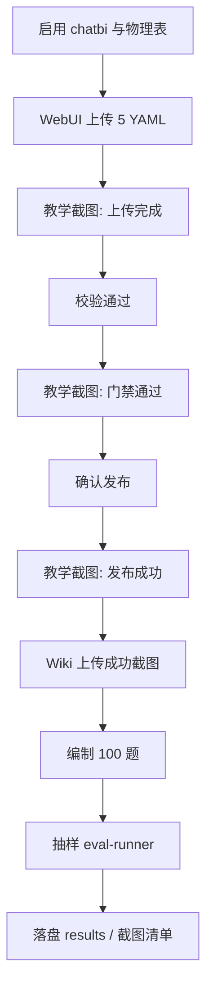

# WO-202608-49 chatbi 语义发布 + 100 题 Eval

| 元数据 | 内容 |
|---|---|
| 文档名称 | chatbi 语义发布与 100 题 Eval 执行计划 |
| 文档类型 | Checklist / Plan |
| 版本 | v1.3 |
| 撰写日期 | 2026-08-06 |
| 撰写人 | Cursor Agent |
| 委托人 | zhangxingchen |
| 基于材料 | `AI 友好型问答.docx`；桌面 `lucy_upload`；WebUI `:55176` 试跑结论；Try/Catch 与产品 bug 闭环；**教学截图要求** |
| 适用范围 | 分析师/Agent 将 chatbi 四表语义资产导入 Lucy，并编制/抽样跑 Eval；产出可供未来教学的成功路径截图 |
| 输出位置 | `docs/plans/wo-202608-49-chatbi-semantic-publish-and-100-eval.md`；副本 `~/Desktop/lucy_upload/PLAN.md` |

## 1. 目标

1. 将 `~/Desktop/lucy_upload` 中的 Manifest + overlays 经 WebUI 校验并发布成功（含索引可用）。
2. 上传 Wiki 口径页（供问答与 Eval 引用）。
3. 编制覆盖四表的 **100** 题 Eval，落盘 `~/Desktop/lucy_upload/eval/`；默认抽样跑 8–12 题证明链路。
4. **在 WebUI 成功路径的关键步骤截图**，作为未来教用户「如何上传 / 确认 / 发布」的材料（只保留成功、有教学意义的画面）。

## 2. 默认假设

| 项 | 默认 |
|---|---|
| Q1 连接启用 | 允许启用 chatbi（改 WebUI 连接配置或 `ktx.yaml` / demo DB） |
| Q2 Eval 深度 | **A**：100 题 YAML 全量落盘 + **抽样** 8–12 题 runner |
| WebUI | `http://127.0.0.1:55176`（Docker `project-lucy-lucy-1`） |
| Docker 连接名 | 实际为 **`demo-mysql`**（不是本地仓库的 `mysql-aliyun`） |

## 3. 已知环境事实（试跑沉淀）

1. Docker Catalog 已启用 `demo-mysql` + schema `chatbi` + 四表白名单。
2. `demo-db` 初始可能 **无 chatbi 库**；发布前需 DDL + 抽样种子，否则 `ktx sl validate` 报 grain 列不存在。
3. ktx **0.16** overlay 要求：`columns` 为数组且 **≥1**；且 grain/measures/segments 引用列须出现在 overlay `columns`（建议写入物理表全列）。
4. AppleDouble / `._*.yaml` 与 `semantic-layer/.lucy-history` 会导致 validate/reindex 失败；reindex 前须清理或移走。
5. 上传包路径：`~/Desktop/lucy_upload/`（5 YAML + `wiki/global/chatbi-intl-metrics-playbook.md`）。
6. 作者 Skill：`.cursor/skills/lucy-{semantic,wiki,eval}-author`、`lucy-config-package`（含中文硬性要求）。

## 4. 任务拆解



### Phase 0 — 前置

1. 确认目标 connection（Docker：`demo-mysql`）。
2. schemas 含 `chatbi`；`enabled_tables` 含四表。
3. 物理库存在四表（必要时对 `demo-db` 执行 DDL + seed）。
4. 清理 `semantic-layer` 下 `._*`；确保无会干扰 reindex 的隐藏 connection 目录。

### Phase 1 — 语义发布（WebUI 主路径）

1. 打开 `/publish/workbench`，选择 connection=`demo-mysql` / schema=`chatbi`。
2. 上传 `lucy_upload` 根目录 5 个 YAML → **校验变更** → **发布**（覆盖时确认）。
3. 轮询至 `published`（或强制 reindex 成功）。
4. 同步执行 **§4.1 教学截图清单**（仅成功态）。
5. Catalog / 发布记录核对；写 `ops-log.md`（运维日志，不作教材）。

### Phase 1b — Wiki

上传 `wiki/global/chatbi-intl-metrics-playbook.md`；`sl_refs` 使用实际 connectionId。失败不阻断 Eval 编制；成功则拍 Wiki 教学截图。

### Phase 2 — 100 题 Eval 编制

```text
~/Desktop/lucy_upload/eval/
  chatbi_intl-eval-cases.yaml
  README.md
  results/
```

| 桶 | 题数 | 覆盖 |
|---:|---:|---|
| 经营表取值/加总/环比 | 25 | `ai_intl_country_daily` |
| 广告花费/CPI/CTR | 20 | `ai_intl_ad_daily` |
| 留存 D1/D7/D30 | 20 | `ai_intl_retention_daily` |
| 30 日 UV / 去重陷阱 | 10 | `ai_intl_user_active_30d_uv_daily` |
| 跨表 JOIN / CPI_服务器 / 花费÷DAU | 15 | country ⋈ ad |
| 单位·归因·脏数·口径 | 10 | 四表共性 |

题干/解析 **中文**；日期随有数日，测逻辑不绑死样本日。

### Phase 3 — Eval 跑测（默认 A）

```bash
node scripts/eval-runner.mjs \
  --cases ~/Desktop/lucy_upload/eval/chatbi_intl-eval-cases.yaml \
  --case <id>... \
  --format json
```

抽样每表 ≥2，含跨表与口径题；结果入 `eval/results/`；README 附全量命令。

### 4.1 教学截图（成功路径 only）

面向未来教用户：只保留 **一次成功导入** 中、能讲清「下一步点哪里」的画面。  
**不要**截纠错、报错 Toast、debug Network、失败重试、ops 清理 junk 等冗余步骤。

#### 存放

```text
~/Desktop/lucy_upload/teach-screenshots/
  README.md                    # 中文：每张图对应哪一步、教什么
  01-publish-workbench.png     # 发布工作台首页
  02-upload-files-selected.png # 已选 5 个 YAML / 待发布列表
  03-validate-passed.png       # 校验通过 / 发布门禁绿灯
  04-confirm-publish.png       # 确认覆盖或点击发布（若有确认框）
  05-publish-success.png       # 发布成功或 reindex 完成
  06-publish-history.png       # 发布记录中可见本批（可选但推荐）
  07-catalog-chatbi.png        # Catalog / 语义资产可见 chatbi 表（可选）
  08-wiki-uploaded.png         # Wiki 文档已打开 / 已保存（Phase 1b）
```

若某步无独立 UI（例如无单独确认框），可合并到相邻成功画面，并在 `teach-screenshots/README.md` 注明「本环境无单独确认，与 05 合并」。

#### 必拍清单（教学最小集）

| 序号 | 时机 | 画面应能回答的问题 |
|---|---|---|
| 01 | 进入 `/publish/workbench` | 发布入口在哪？ |
| 02 | 上传完成后、校验前 | 文件是否已进入待发布列表？ |
| 03 | 校验通过 | 怎样才算可以点发布？ |
| 04 | 用户确认动作 | 覆盖/发布要点哪里？ |
| 05 | 发布成功终态 | 怎样算导入成功？ |
| 08 | Wiki 上传成功 | 口径文档如何进业务 Wiki？ |

06 / 07 为增强材料：帮助用户在「发布记录 / 表目录」核对结果。

#### 拍摄要求

- 浏览器全页或工作台主区域清晰可读；隐藏个人 token / 密码。
- 文件名稳定、顺序编号；`README.md` 用中文一句话说明「教什么」。
- 同一成功会话内连拍，避免混入失败态截图。

## 5. Try / Catch 总则（执行用，不作教材）

全程写 `~/Desktop/lucy_upload/ops-log.md`。纠错过程可记日志，**不得**进入 `teach-screenshots/`。

| 原则 | 做法 |
|---|---|
| 可自动恢复 | 同操作最多重试 **3** 次（2s / 5s / 10s） |
| 配置可修 | 改 `lucy_upload` 源文件 → 重传；不绕过 Validate Gate |
| 门禁失败 | 不发布；读 `error.code` / stderr 修因 |
| 发布锁 | `PUBLISH_IN_PROGRESS` 等待 ≤2 min；不并行硬发 |
| Reindex 失败 | 文件可能已写入；强制索引；不回滚文件 |
| 轮询超时 | `reindexing` 超过 **10 min** 记阻塞 |
| Wiki 失败 | 不否定语义发布成功 |
| Eval 环境不可用 | 仍交付 100 题 YAML；ops-log 标明未跑 |

### 5.1 上传 / 校验 / 发布错误分类

| 阶段 | 典型现象 | 处置 |
|---|---|---|
| 上传 | YAML parse / `UNKNOWN_SHAPE` | 修文件重传 |
| 校验 | schema/表未启用 | 回 Phase 0 |
| 校验 | `columns` 缺失或不全 | overlay 补全引用列（ktx 0.16） |
| 校验 | grain 列 absent | 检查物理表 DDL / DB 是否有 chatbi |
| 发布 | 409 覆盖 | `confirmOverwrite: true` |
| 发布 | 422 gate | 视为未发布；修因重来 |
| 索引 | `Unsafe connection id: .lucy-history` | 移走/改路径后强制 reindex；并走 §6 产品闭环 |

### 5.2 API 兜底

1. `POST /api/semantic-assets/validate`
2. `POST /api/semantic-assets/publish`
3. `GET /api/semantic-assets/releases/:id/status`
4. `POST /api/semantic-assets/reindex`（`force: true`）

> 教学截图仍以 **WebUI 成功路径** 为准；API 仅作执行兜底，不替代教材画面。

## 6. 产品 Bug 修复闭环（强制）

默认 **不改** WebUI 产品代码。但若判定为 **产品 bug**（非 YAML/DB 配置问题）导致上传、校验、发布或 reindex 无法完成，必须进入以下 loop，**不得静默跳过**：

```text
1. 排查：复现步骤、错误码、Network/日志、最小复现
2. 落盘 Spec（webui/docs/ 或 docs/）说明根因与验收
3. 落盘 Plan（webui/docs/plans/ 或 docs/plans/）
4. 按 Plan 实现最小修复
5. 本地测试通过后 git commit（仅在用户要求或本闭环明确授权时）
6. Docker 重建并重启 demo（如 npm run demo:rebuild / compose build）
7. 回到原 Phase 继续尝试上传/发布/索引
8. 产品修复完成并再次走通成功路径后，再补拍 §4.1 教学截图
```

已知候选产品问题（试跑）：

- `reindexProject` 未在 reindex 前调用 `scrubSemanticLayerJunk`（AppleDouble）。
- `semantic-layer/.lucy-history`（table-yaml-history）被 ktx 当成 connection id → `Unsafe connection id`。

## 7. 验收标准

1. 语义发布终态 `published`，或经强制索引后索引成功且 Catalog 可见四表语义。
2. Wiki 页可打开（或 ops-log 记录失败原因且不阻断）。
3. `eval/chatbi_intl-eval-cases.yaml` **恰好 100** 条；中文题干/解析；覆盖四表+跨表+口径。
4. Eval A：抽样结果落盘，或明确记录环境阻塞。
5. **`teach-screenshots/` 含 §4.1 必拍项（01–05、08）及中文 README**；无失败/纠错画面混入。
6. 任何最终失败步骤在 `ops-log.md` 可追溯；产品 bug 有 Spec/Plan 或已修复闭环记录。
7. 无 secrets 写入上传包 / eval / 截图。

## 8. 明确不做

- 门禁失败时绕过校验强行发布。
- 未走 §6 闭环时擅自大范围改产品代码。
- 默认不把 100 题提交进仓库 `evals/`（仅桌面 `lucy_upload/eval`，另说再入库）。
- 不做移动端浏览器测试。
- **不把 debug / 报错 / 重试过程截图当作教学材料。**

## 9. 相关路径

| 路径 | 说明 |
|---|---|
| `~/Desktop/lucy_upload/` | 上传包与 ops-log / eval |
| `~/Desktop/lucy_upload/teach-screenshots/` | 成功路径教学截图 |
| `.cursor/skills/lucy-*-author` | 配置生成 Skill（中文要求） |
| `webui/docs/23-semantic-asset-publish-export-spec.md` | 发布规格 |
| `scripts/eval-runner.mjs` | Eval runner |
| `docker-compose.demo.yml` | demo WebUI `:55176` |
