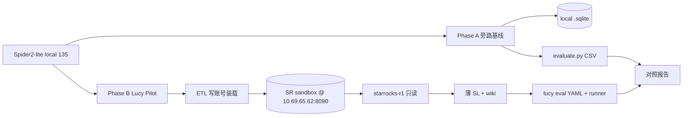

# WO-202608-58 Spider2-lite local/SQLite 135 题压力起步方案

| 元数据 | 内容 |
|---|---|
| 文档名称 | Spider2-lite local/SQLite 135 题压力起步方案 |
| 文档类型 | Plan |
| 版本 | v1.7 |
| 撰写日期 | 2026-08-08 |
| 撰写人 | Cursor Agent |
| 委托人 | zhangxingchen |
| 基于材料 | spider2-lite；`docs/test-layers-and-release-gates.md`；`docs/qa/e2e-sop.md` + ONBOARD §14 + AGENT §5；Phase 0/2 ETL；§11 已批并首期执行 |
| 适用范围 | Spider2-lite local→StarRocks sandbox 的 **分层长期 E2E**（非一次性评测）；跑 E2E 以 QA 分表为准；不替代现有业务 eval / SOW Trust |
| 输出位置 | `docs/plans/wo-202608-58-spider2-lite-sqlite-stress-harness.md` |

## 0. 执行状态

| 阶段 | 状态 | 备注 |
|---|---|---|
| Phase 0 物料与 Gate | **DONE** | `inbox/spider2-lite-sqlite/` |
| Phase 1 Spider 旁路基线 | pending（可后置） | |
| Phase 2 ETL + 薄 SL | **DONE（部分）** | sandbox 69×`s2_*`；Manifest + 10 overlays |
| **§11 长期 E2E 方案** | **APPROVED + 首期已执行；跑法已挂 QA 分表** | 复跑入口：`e2e-sop` → ONBOARD §14 / AGENT §5；摘要 `inbox/spider2-lite-sqlite/results/e2e-summary.md` |
| Phase 3 扩面 | pending | |

**已冻结：** Pilot 五库 + ETL=`starrocks-r1`/`sandbox`。

## 1. 目标

1. 建立可复现的 **Spider2-lite local\*（135 题）** 压力 harness，先拿到「无 Lucy 语义层」的底座分数。
2. 用 **小规模 Pilot（约 17 题 / 5 库）** 验证能否迁入 Lucy 连接面（**StarRocks `starrocks-r1` / schema `sandbox`**）+ 薄 semantic layer / wiki，并改编为 Lucy eval YAML。
3. 产出对照表：同一批题在 **裸 SQL Agent** vs **Lucy（SL / fallback）** 上的成功率与失败模式，支撑缺口矩阵（尤其 D1/D2/D3/D6）。

**成功标准（本 WO 结束时）：**

| 标准 | 验证方式 |
|---|---|
| 135 题物料可本地复现 | `inbox/spider2-lite-sqlite/` 目录齐全；`instance_id` 列表与上游 `spider2-lite.jsonl` 的 `local*` 一致 |
| 旁路基线可跑通 | 对 Pilot 子集跑通 Spider 官方 `evaluate.py --mode exec_result`（或等价 CSV 比对），写出分数 JSON |
| Lucy 路径可行性有明确结论 | Gate G0 通过：Pilot 表已入 `sandbox`，且 `starrocks-r1` 只读可见 |
| Pilot Lucy eval 可抽样执行 | ≥8 条改编 case 能被 `scripts/eval-runner.mjs` 消费；结果落 `inbox/` |
| 不污染产品回归 | 默认 **不进** P0/P1 CI gate；不把原始 sqlite/blob 提交进 git；不写生产 schema（`ods`/`dwd`/`ads` 等） |

## 2. 默认假设

| 项 | 默认 |
|---|---|
| 上游数据 | MIT；clone `xlang-ai/Spider2`；题面来自 `spider2-lite/spider2-lite.jsonl` 的 `instance_id` 以 `local` 开头 |
| 本地 DB 包 | 官方 Drive 的 `.sqlite` → `resource/databases/spider2-localdb/`（不入库，放 `inbox/` 或本机 cache） |
| Gold | local 题 **Gold SQL 很少（约 24）**；**exec_result CSV 覆盖更全** → 判分以 CSV / 执行结果为准；入 SR 后允许 **引擎对齐本地 gold** |
| Lucy 连接面 | 产品无 SQLite 业务 driver；Phase B 走已有 **`starrocks-r1`**（MySQL wire / `engine: starrocks`） |
| **ETL 目标（已确认）** | **`10.69.65.62:8090` → database/schema `sandbox`**（2026-08-08 核查为空库，可干净落 Pilot） |
| Lucy 读连接 | 复用 `ktx.yaml` 的 `starrocks-r1`（`readonly: true`，`schemas` 已含 `sandbox`） |
| 装载写连接 | **不得**用 Lucy 只读 token 写库；用 DBeaver/运维写账号装载，装完再扩 `enabled_tables` |
| 主路径策略 | **Phase A 旁路 SQLite** → **Phase B ETL 到 StarRocks `sandbox` + 薄 SL** |
| 语言 | Pilot Lucy eval 题干可保留英文（上游如此）；若入库正式 suite 再按术语标准决定是否中文化 |
| CI | 本 WO **不做** 默认 CI gate |

## 3. 数据集事实（已核对）

| 项 | 数值 |
|---|---|
| local 题量 | **135** |
| 库数量 | **30** |
| 带 `external_knowledge` | **13**（8 个 md 文件） |
| Gold SQL（local） | **~24** |
| exec_result（local 相关文件） | **~328**（多候选 CSV，如 `local002_a/b/c.csv`） |
| 题干长度 | 中位 ~271 字符（偏长、偏分析） |

题量最多的库（优先扩面候选）：

| 题数 | db | 备注 |
|---:|---|---|
| 15 | `bank_sales_trading` | 量大，适合扩面 |
| 11 | `IPL` | 含外部知识 |
| 10 | `city_legislation` | |
| 9 | `f1` | 含外部知识 |
| 8 | `Brazilian_E_Commerce` / `oracle_sql` | |
| 7 | `modern_data` / `sqlite-sakila` | sakila 适合 Pilot |

**Pilot 库（建议固定，共 17 题）：**

| db | 题数 | 选型理由 |
|---|---:|---|
| `sqlite-sakila` | 7 | 经典多表；题含 LTV / 窗式比较，贴近企业难度 |
| `chinook` | 3 | 小而全 |
| `northwind` | 2 | 订单/员工迟到率等口径题 |
| `Pagila` | 2 | 类 sakila，Postgres 风格命名可对照 |
| `E_commerce` | 3 | 含 RFM 外部文档（测 D2） |

## 4. 架构与两条赛道



| 赛道 | 测什么 | 不测什么 |
|---|---|---|
| **A 旁路** | 模型 + 工具在裸 schema/docs 上出正确结果的能力 | Lucy ACL / `lucy_query` / 发布门禁 |
| **B Lucy** | 语义编译后在 **StarRocks R1 目标源** 上是否更稳；fallback 是否可控 | Spider 榜单分数、BQ/SF 方言、写生产数仓 |

### 4.1 StarRocks `sandbox` 落库约定（推荐）

| 项 | 约定 |
|---|---|
| 集群 | `10.69.65.62:8090`（与 `ktx.yaml` `starrocks-r1` 一致） |
| Database | **`sandbox` only**（已存在且当前 0 表；禁止写入 `ods`/`dwd`/`ads`/`demo_finance`/`meta`/`ai`） |
| 表命名 | `s2_<db>_<table>`，例：`s2_sakila_customer`、`s2_chinook_album`（单 schema 内用前缀隔离 5 个上游库） |
| db 短名映射 | `sqlite-sakila`→`sakila`；`E_commerce`→`ecommerce`；其余小写原名（`chinook`/`northwind`/`pagila`） |
| 装载 | Stream Load / INSERT / 外部表导入均可；脚本与日志放 `inbox/spider2-lite-sqlite/etl/` |
| Lucy 可见性 | 装载后把 Pilot 表加入 `starrocks-r1.enabled_tables`（形如 `sandbox.s2_sakila_customer`）；必要时 `schemas` 已含 `sandbox` 无需再加 |
| 语义路径 | `semantic-layer/starrocks-r1/_schema/sandbox.yaml` + `semantic-layer/starrocks-r1/s2_*.yaml`（或按表拆 overlay） |
| 清理 | Pilot 结束可 `DROP TABLE sandbox.s2_*`；扩面前先盘点占用 |

## 5. 落盘约定

```text
inbox/spider2-lite-sqlite/          # tmp，可删，勿 commit 大文件
  SOURCE.md                         # 上游 commit、MIT 声明、Drive 包版本
  spider2-lite.jsonl                # 或仅 local 切片 local-135.jsonl
  local-135.ids.txt
  databases/                        # .sqlite（gitignore / 仅 inbox）
  documents/                        # external_knowledge md 拷贝
  gold/exec_result/                 # 从 upstream 同步的 local CSV
  etl/                              # SQLite→StarRocks DDL/类型映射/装载日志
  gold/starrocks_pilot/             # 引擎对齐后的 Pilot 本地 gold（标注非上游原版）
  results/
    phase-a-baseline.json
    phase-b-pilot-lucy.json
    compare-pilot.md
evals/spider2_lite_sqlite/          # 仅当决定入库时创建；默认先只放 inbox
  eval/spider2_lite_sqlite-eval-cases.yaml   # Pilot 改编后
```

大文件与 DB：**只进 `inbox/`**，不进 git。若需共享，用内部对象存储或说明下载步骤。

## 6. 任务拆解

### Phase 0 — 物料与 Gate（0.5–1 天）

1. Clone / sparse checkout `Spider2` 的 `spider2-lite`。
2. 下载官方 local sqlite 包，校验 30 库文件存在、与 `db` 字段可对齐。
3. 过滤 `local*` → `local-135.jsonl` + `local-135.ids.txt`。
4. 同步 local 相关 `exec_result` CSV 与 13 个 external md。
5. **Gate G0（已冻结）：**
   - ETL 目标 = **StarRocks `sandbox` @ `10.69.65.62:8090`**
   - 写权限：确认运维/DBeaver 写账号可对 `sandbox` 建表装数；Lucy `starrocks-r1` 保持只读
   - 连通：`ktx connection test starrocks-r1`；`SHOW TABLES FROM sandbox` 基线为空或仅允许已有 `s2_*` 实验表

**验证：** `wc -l local-135.jsonl` = 135；抽 3 个 sqlite `SELECT COUNT(*)` 成功；`SOURCE.md` 含上游 URL + commit；`sandbox` 可达。

### Phase 1 — Phase A 旁路基线（1–2 天）

1. 按 Spider README 摆好 `evaluate.py` 与 credential 占位（local 模式不需要 BQ/SF）。
2. 先跑 **Pilot 17 题**，再用同一 harness 跑 **全量 135**（可隔夜）。
3. Agent 约束（旁路）：只读；输出 CSV；允许读 schema JSON / DDL.csv / external md；禁止改库。
4. 记录：`pass/fail`、失败类（选表错 / 口径错 / SQL 方言 / 超时 / 格式）。

**验证：** `inbox/.../results/phase-a-baseline.json` 含 Pilot 与 Full 的 Success Rate；至少 Pilot 全量有判定（非全 blocked）。

### Phase 2 — Phase B Lucy Pilot（2–4 天）

1. **ETL**：Pilot 5 库 → `sandbox.s2_<db>_<table>`；记录类型映射（SQLite → StarRocks：整数/小数/日期/文本/NULL）。
2. **校准 gold**：在 StarRocks 上复算 Pilot 期望结果，写入 `gold/starrocks_pilot/`（与上游 CSV 有差时以 SR 本地 gold 为准，并在报告注明）。
3. **连接可见**：更新 `starrocks-r1.enabled_tables` 仅加 Pilot 表；catalog reload / reindex。
4. **薄 SL**：`sandbox` Manifest + 关键 `s2_*` overlay（grain / 2–5 个高频 measure）。
5. **Wiki**：Pilot 用到的 external md（至少 `RFM.md`）→ `wiki/global/spider2-*.md`，`sl_refs` 指向 `starrocks-r1` sources。
6. **改编 eval**：17 题 → Lucy YAML（`result_assertions` 对齐 **SR 本地 gold**；能走 SL 标 `semantic_layer`，否则 `raw_sql_fallback`）。
7. 抽样跑 ≥8 题 `eval-runner`；再视情况跑满 17。

**验证：** `ktx connection test starrocks-r1` + `sl validate` 过 Pilot；`phase-b-pilot-lucy.json`；`compare-pilot.md` 有逐题 A vs B。

### Phase 3 — 扩面决策（0.5 天 + 可选执行）

依据 Pilot 对照报告选一条：

| 决策 | 条件 | 动作 |
|---|---|---|
| **停在旁路** | Lucy ETL/SL 成本高或增益不明显 | 保留 Phase A 为季度底座体检；不入库 eval |
| **扩 3 个大库** | B 明显优于 A 或失败可归因到缺 SL | 扩 `bank_sales_trading` / `IPL` / `city_legislation`（约 +36 题） |
| **全量 135 Lucy 化** | 仅当有明确产品/销售证明需求 | 另开 WO；本 WO 不默认承诺 |

### Phase 4 — 文档与卫生

1. 在 `compare-pilot.md` 写清：分数不可对标 Spider 官方榜（设置不同）。
2. 引用上游 MIT；注明未用 Gold SQL 做 SFT。
3. 确认 `inbox/` 大文件未被 stage；若创建 `evals/spider2_lite_sqlite/`，补 `docs/eval-quiz-conventions` 覆盖矩阵标签。

## 7. Non-Goals

- 不跑 BigQuery / Snowflake 412 题。
- 不把本 harness 默认并入 `npm run smoke:p0*` / P1 business eval gate。
- 不提交 `.sqlite`、完整 exec_result、原始上游镜像进 git。
- 不上传分数到 Spider leaderboard（除非另有研究需求）。
- 不把「裸 SQL 成功率」宣传成 Lucy 产品准确率。
- 不在本 WO 实现通用 SQLite driver（若要做，单独立项）。
- **不向 `sandbox` 以外的 StarRocks database 装 Spider 数据**；不把本实验当作 StarRocks release-verified 认证替代（认证仍走 `docs/starrocks-r1-support-plan.md`）。

## 8. 风险与缓解

| 风险 | 影响 | 缓解 |
|---|---|---|
| KTX 无 SQLite 业务连接 | B 必须 ETL | 已冻结 SR `sandbox` |
| `starrocks-r1` 只读 | 装载失败 | 写账号与读连接分离；装完再扩 whitelist |
| SQLite→StarRocks 类型/函数差异 | 与上游 gold CSV 不一致 | Pilot 做 **SR 本地 gold**；报告标注引擎 |
| StarRocks SQL 方言（窗函数/日期） | Agent 裸 SQL fail↑ | Phase B 优先 `lucy_query`；fallback 记方言失败类 |
| sandbox 被他人占用 | 表名冲突 | 强制 `s2_` 前缀；开干前 `SHOW TABLES` |
| 与业务 eval / R1 证据混淆 | 误判回归或认证 | 独立 inbox 目录；非 CI；不写 release-verified |
| 题难、Agent 成本高 | 全量 135 贵/慢 | 先 Pilot；全量可降模型或限步数 |
| 外部知识未注入 | D2 假失败 | Pilot 必挂 RFM 等 md 到 wiki 或旁路文件 |

## 9. 工作量粗估

| 阶段 | 人天（量级） |
|---|---|
| Phase 0 | 0.5–1 |
| Phase 1（含全量 135 旁路） | 1–2 |
| Phase 2（17 题 Lucy @ StarRocks sandbox） | 2–4（含类型映射与本地 gold） |
| Phase 3 决策 + 可选扩面 | 0.5 + 另估 |
| **合计（到 Pilot 对照）** | **约 4–7 人天** |

## 10. 立即下一步

1. ~~ETL / Pilot / Phase 0 / Phase 2 ETL / §11 首期~~ → **已完成**（G-sample 待 Claude CLI）
2. **复跑 E2E**：按 QA 规范入口，**不要**把本工单当逐步手册  
   - 总指引 [`docs/qa/e2e-sop.md`](../qa/e2e-sop.md) → 选 `E2E-ONBOARD-EVAL` / `E2E-AGENT`  
   - 装载与 MCP：[`suite-semantic-onboard-mcp-eval.md`](../qa/suite-semantic-onboard-mcp-eval.md) **§14**  
   - Agent 抽样：[`suite-agent-mcp.md`](../qa/suite-agent-mcp.md) **§5**
3. Phase 1 Spider 旁路基线仍可后置，不阻塞 Lucy 分层门禁

## 11. Spider2-lite @ StarRocks — 长期 E2E 方案（对齐测试分层）

> 取代原先「一次性改编 17 题 + 抽样就结束」的设计。本 suite 必须能**重复装载、重复评测、按层进门禁**。  
> **跑法事实源（规范）**：[`docs/qa/e2e-sop.md`](../qa/e2e-sop.md) + ONBOARD §14 + AGENT §5；命令登记 [`docs/test-layers-and-release-gates.md`](../test-layers-and-release-gates.md)。  
> **本 §11 只保留设计决策与资产布局**；逐步操作以 QA 分表为准，避免双轨手册。

### 11.1 定位：三层各测什么（互不替代）

| Layer（手册定义） | 本 suite 测什么 | 不测什么 |
|---|---|---|
| **Runtime compatibility** | `starrocks-r1` connection / reindex / `sl validate` 关键 `s2_*` overlay / 只读 `sl query` 冒烟 | Agent 正确率、WebUI 交互 |
| **Platform** | `enabled_tables` 含 `sandbox.s2_*`；ACL token 可见 scope；MCP `tools/list` + `lucy_read_source`/`lucy_query` 转发 | Spider 题答案对错 |
| **Business eval** | Agent 在真实 MCP + SR 数据上答 Pilot 题；`result_assertions` vs **SR 本地 gold** | Docker 镜像构建、WebUI Playwright |

跨层主题闭环（装载/发布 → ACL → MCP vs gold）走 SOP，**不替代**任一层；本 suite 是 **gated StarRocks stress business eval**，默认：

- **不进入**客户 headless 必过门禁（`smoke:p0:docker/demo/...`）
- **不进入** SOW Trust 对外标准（`e2e:sow-trust-standard`）
- **可进入** P1「可选 / gated」证据：缺 SR 或 token 时写 **`blocked`**，禁止假 pass（与 `smoke:p1:starrocks-certification` 同纪律）

### 11.2 长期资产布局（可版本、可复跑）

```text
evals/spider2_lite_sqlite/
  eval/spider2_lite_sqlite-eval-cases.yaml   # 正式 suite（v1.4 schema）
  gold/starrocks_pilot/<id>.csv            # SR 引擎对齐金标（入库）
  gold/CALIBRATION.md                      # 与上游 Spider exec_result 的 match/drift 记录
  README.md                                # 如何跑 catalog / sample / full

semantic-layer/starrocks-r1/               # 已有 Manifest + overlays；随题扩展 measure
wiki/global/spider2-*.md                   # RFM 等外部知识；sl_refs 固定 connection

scripts/
  spider2-lite-sandbox-reseed.mjs|.py      # 幂等 ETL：SQLite→sandbox.s2_*（可重复）
  p0-spider2-lite-catalog-smoke.mjs        # 可选：YAML 可解析 + list-cases
  p1-spider2-lite-runtime-smoke.mjs        # connection + validate + 行数探针；无 SR→blocked
  p1-spider2-lite-agent-sample.mjs         # 抽样 agent eval；证据落 inbox/

inbox/spider2-lite-sqlite/                 # 大文件/上游 clone/过程日志（gitignore）
  databases/*.sqlite
  upstream/
  etl/load_*.log
  results/p1-spider2-lite-*-evidence.json
```

原则：

| 入 git | 不入 git |
|---|---|
| eval YAML、SR gold CSV、薄 SL/wiki、reseed/smoke **脚本**、CALIBRATION.md | `.sqlite` 包、上游 clone、完整 Spider gold 镜像、大日志 |

### 11.3 门禁阶梯（长期怎么跑）

| Gate ID | 层级 | 命令（拟新增） | Pass / Blocked | 何时跑 |
|---|---|---|---|---|
| **G-cat** | Business catalog | `npm run smoke:p0:spider2-lite-eval`（或并入 `smoke:p0:business-eval` 的 **optional** 列表） | YAML 可解析、case>0、`--list-cases` OK | 每次改 suite / PR（无 DB） |
| **G-rt** | Runtime | `npm run smoke:p1:spider2-lite-runtime` | `connection test` + 关键 `sl validate` + 抽样 `COUNT(*)` 与 `snapshot_rows` 一致；无 SR 凭据 → **blocked** | 有 SR 的机器；发版前可选 |
| **G-plat** | Platform | 复用 `smoke:p1:endpoint` + 专用 token（role 仅 `sandbox.s2_*`） | `tools/list` 含目标 source；越权表不可见 | ACL/proxy 变更时 |
| **G-sample** | Business agent E2E | `npm run e2e:spider2-lite:sample`（包装 `eval-runner` 固定 8 题） | 有终态证据包；**通过率门槛可配置**（首期只要求证据完整，不要求 8/8） | 周更 / 模型或 KTX 升级后 |
| **G-full** | Business agent full | `npm run e2e:spider2-lite:full`（17 题，后续可扩） | 同 sample；证据写入 `inbox/` | 里程碑 / 季度压力 |
| **G-reseed** | 数据卫生 | `npm run spider2-lite:reseed-sandbox` | 幂等装载；summary mismatches=0 | schema/数据漂移、新机器、金标重校准前 |

与现有命令关系：

```text
smoke:p0:business-eval          ← 核心 suite catalog（superstore/kx）；spider2 默认 optional
smoke:p1:business-eval-full     ← 不自动吞并 spider2（避免无 SR 拖垮 release）
smoke:p1:starrocks-certification← R1 认证；与 spider2 stress **并列**，不互相替代
smoke:p1:release-readiness      ← 默认不硬依赖 spider2；可用 --allow-blocked 收集证据
```

### 11.4 Eval 设计：可持续，而非一次改编

| 规则 | 说明 |
|---|---|
| Suite 身份 | `domain: spider2_lite_sqlite`；`runner_schema_version: v1.4`；`connectionId: starrocks-r1` |
| Case id | 稳定：`spider2_lite-<instance_id>`（如 `spider2_lite-local056`），便于跨月对比 |
| 题干 | 英文上游 + 固定前置约束句（connection / `sandbox.s2_*`）；禁止每次手改题意 |
| Gold | **只认** `evals/.../gold/starrocks_pilot/`；上游 Spider CSV 仅校准参考 |
| Drift 纪律 | 复用 `docs/eval-quiz-conventions.md`：`data_drift`/`schema_drift`/`logic_regression`/`tool_error`；禁止静默改金标 |
| expected_source | 有 overlay measure 的标 `semantic_layer`；其余 `raw_sql_fallback`——长期通过 **加 measure** 把题「升级」到 SL，而不是一次性写死 |
| 覆盖矩阵 | 在 suite metadata 声明六维 + Spider 维（D1/D3/D6…）；新增题必须挂矩阵标签 |
| 抽样集 | 版本化 `sample_case_ids` 写在 YAML metadata 或 `evals/.../sample-ids.txt`，周更跑同一集合 |

**首期 Pilot 17** 是 **seed cohort**，不是终点：后续可按矩阵缺口从 local 135 增量选题，仍走同一 gate。

### 11.5 运维节奏（长期进行）

| 节奏 | 动作 |
|---|---|
| **每次改 SL/wiki/eval** | G-cat；相关 `sl validate` |
| **每周（有 SR 的环境）** | G-rt + G-sample；证据归档 `inbox/spider2-lite-sqlite/results/YYYYWW/` |
| **KTX / 模型升级** | G-sample 必跑；对比上周 passRate（同 `sample_case_ids`） |
| **sandbox 数据可疑 / 重装机** | G-reseed → 金标抽查 → G-rt |
| **季度** | G-full；更新 CALIBRATION.md；决定是否扩题或加 overlay |
| **主题重发布** | 按 `suite-semantic-onboard-mcp-eval.md`（父指引 `e2e-sop.md`）：参数 `CONN_ID=starrocks-r1` `SCHEMA=sandbox` `EVAL_SUITE=evals/spider2_lite_sqlite/...` |

证据最小集（对齐手册「缺依赖写 blocked」）：

| Artifact | Path |
|---|---|
| Machine evidence | `inbox/spider2-lite-sqlite/results/p1-spider2-lite-*-evidence.json` |
| 含字段 | `status=pass\|fail\|blocked`, `gateKind`, `stub=false`, `passed/total`, `caseResults[]` |
| 禁止 | 无 MCP/无 SR 时输出假 `pass` |

### 11.6 首期 Sprint（批准后执行 —— 仍是长期底座的第一刀）

按分层落地，而不是「只交 17 题 YAML」：

| Step | 层级 | 内容 | 验证 |
|---|---|---|---|
| **A1** | 资产 | 幂等化现有 ETL → `scripts/spider2-lite-sandbox-reseed.*`；文档化输入（Drive sqlite / inbox path） | 二次 reseed mismatches=0 |
| **A2** | Runtime | `p1-spider2-lite-runtime-smoke`：connection + validate 10 overlay + 5 表行数 | 无 SR → blocked JSON |
| **A3** | Business | 17 题 YAML 入 `evals/spider2_lite_sqlite/` + SR gold 校准协议；`sample_case_ids`（8 题）写入 metadata | G-cat list=17 |
| **A4** | Platform | 专用 ACL 角色/token（仅 sandbox.s2_*）；endpoint 冒烟说明写入 README | 越权失败为预期 |
| **A5** | Agent E2E | `e2e:spider2-lite:sample` 包装 eval-runner；产出 evidence | 8 题有终态 |
| **A6** | 手册挂钩 | 本 WO + `test-layers-and-release-gates.md` 增补「可选 gated suite」一行；`package.json` 注册 npm scripts | 文档与命令一致 |

**Non-Goals（首期仍成立）：** 不进客户 headless 硬门禁；不并入 `business-eval-full` 默认列表；不宣称 Spider 榜分数；不全量 135。

### 11.7 批准清单

- [ ] 同意按 **三层门禁 + 可选 gated** 长期运营（§11.1–11.5），而非一次性 17 题交卷
- [ ] 同意正式资产落 `evals/spider2_lite_sqlite/` + git 内 SR gold；大 sqlite 仍在 inbox
- [ ] 同意首期 Sprint A1–A6；通过率门槛首期「证据完整优先」
- [ ] 同意 **不** 将本 suite 绑死进 `smoke:p1:release-readiness` 硬依赖

回复「批准 §11」或列出要改的门禁/落盘假设后执行。

## Changelog

| 版本 | 日期 | 变更 |
|---|---|---|
| v1.0 | 2026-08-08 | 初版；ETL 目标待选 demo-mysql / postgres |
| v1.1 | 2026-08-08 | ETL 冻结为 StarRocks `sandbox`；表命名 `s2_*`；读写分离与本地 gold 约定 |
| v1.2 | 2026-08-08 | Phase 0 完成；Pilot 冻结执行；Gate G0 全 PASS |
| v1.3 | 2026-08-08 | Phase 2 ETL：sandbox 69×`s2_*` 表装载完成；薄 SL + enabled_tables；eval 改编仍 pending |
| v1.4 | 2026-08-08 | 曾拟一次性 Pilot17 改编步骤（已由 v1.5 取代） |
| v1.5 | 2026-08-08 | **重写 §11**：对齐 `test-layers-and-release-gates` 的长期 e2e / 分层门禁方案 |
| v1.6 | 2026-08-08 | 批准后执行：suite/scripts/npm/Docker ACL；G-cat/G-rt/endpoint/datapath PASS；G-sample blocked（无 claude） |
| v1.7 | 2026-08-08 | E2E 跑法挂入 `docs/qa/` 总指引 + 分表（ONBOARD §14 / AGENT §5）；本工单降为设计背景 |

## Terminology Compliance

This feature follows `webui/docs/00-product-terminology-standard.md`.

New terms:
- **Spider2-lite local harness**：外部基准压力集（非产品功能名）；用户可见文案若出现，称「外部 SQLite 压力集 / Spider2-lite local」，不简称「官方评测分」以免与 Lucy Eval 混淆。
