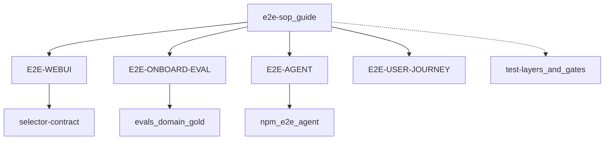

# Lucy E2E SOP 指引

| 元数据 | 内容 |
|---|---|
| 文档名称 | Lucy E2E SOP 指引 |
| 文档类型 | Checklist / Runbook |
| 版本 | v1.2 |
| 撰写日期 | 2026-08-08；v1.2 2026-08-25 |
| 撰写人 | Cursor Agent |
| 委托人 | zhangxingchen |
| 基于材料 | `docs/test-layers-and-release-gates.md`；`docs/qa/lucy-webui-e2e-test-suite.md`；KSC Financial 主题接入实跑；Spider2-lite Pilot（`evals/spider2_lite_sqlite/`）；`docs/DEVELOPMENT.md` |
| 适用范围 | 所有 Lucy 端到端验证：先读本指引选测试集，再打开对应分表执行 |
| 输出位置 | `docs/qa/e2e-sop.md` |

## Terminology Compliance

This feature follows `webui/docs/00-product-terminology-standard.md`.

New terms:

| 概念 | UI 主术语 | 英文辅助 | 禁止文案 |
|---|---|---|---|
| E2E SOP 指引 | E2E SOP 指引 | E2E SOP guide | 把本文件当成某一测试集的逐步手册 |
| 测试集分表 | 分表 / 测试集 | suite sheet | 把 WebUI E2E 与主题接入混成同一套用例 |

---

## 1. 怎么用本文档

```text
本指引（选对测试集） → 打开对应「分表」执行 → 报告落 inbox/ 或分表约定路径
```

1. 用 §2 对照「你要证明什么」→ 选定测试集 ID。  
2. 打开 §3 分表链接，按该分表 Phase / 用例跑。  
3. 分层与 `npm` 门禁总表仍以 [`docs/test-layers-and-release-gates.md`](../test-layers-and-release-gates.md) 为准；**本指引不替代三层模型**。  
4. 浏览器步骤默认仅在任务 / 分表明确要求时执行（[`docs/DEVELOPMENT.md`](../DEVELOPMENT.md)）。

---

## 2. 测试集总表（分表索引）

| 测试集 ID | 分表 | 证明什么 | 层级侧重 | 典型触发 |
|---|---|---|---|---|
| `E2E-WEBUI` | [`suite-webui-browser.md`](suite-webui-browser.md) | WebUI 交互、术语、selector、主链路点击 | Platform（浏览器） | 改导航 / 按钮 / 连接 / 发布页文案 |
| `E2E-ONBOARD-EVAL` | [`suite-semantic-onboard-mcp-eval.md`](suite-semantic-onboard-mcp-eval.md) | 上传包接入后 MCP 可答，且对得上 gold | Platform + Business eval | 新 domain / 主题首跑或复跑 |
| `E2E-AGENT` | [`suite-agent-mcp.md`](suite-agent-mcp.md) | Agent + Lucy MCP 最终答案与证据包 | Business eval / Agent | release / SOW 可信门禁、`e2e:agent*` |
| `E2E-USER-JOURNEY` | [`suite-user-journey.md`](suite-user-journey.md) | 按真实用户逐步操作（WebUI 点击 / MCP 问数）；Agent 可执行剧本 | Platform + 人工/Agent 走查 | 要模拟用户操作、交付 Agent 自动化回归 |

配套（非独立测试集，被分表引用）：

| 文档 | 用途 |
|---|---|
| [`selector-contract.md`](selector-contract.md) | `E2E-WEBUI` 的 selector 事实源 |
| [`impact-map.json`](impact-map.json) | 路由/组件/API → WebUI E2E 用例 |
| [`changelog.md`](changelog.md) | E2E / selector 变更日志 |
| [`../eval-quiz-conventions.md`](../eval-quiz-conventions.md) | eval / gold **怎么写**（不是怎么跑 E2E） |
| [`../../evals/spider2_lite_sqlite/README.md`](../../evals/spider2_lite_sqlite/README.md) | Spider2-lite Pilot suite 资产与 npm 门禁（被 ONBOARD / AGENT 分表引用） |
| [`../plans/wo-202608-58-spider2-lite-sqlite-stress-harness.md`](../plans/wo-202608-58-spider2-lite-sqlite-stress-harness.md) | Spider2 工单背景；**跑 E2E 以本指引 + 分表为准** |



---

## 3. 选用决策（一句话）

| 场景 | 选 |
|---|---|
| 只改了前端页面 / 文案 / data-testid | `E2E-WEBUI` |
| 新主题 YAML/Wiki 要进目标 Lucy，并要用 MCP 对 gold | `E2E-ONBOARD-EVAL` |
| StarRocks `sandbox.s2_*` / Spider2-lite Pilot 接入与 MCP vs gold | `E2E-ONBOARD-EVAL`（实例见分表 §14） |
| 要证明真实 Agent 端到端答案 + 证据包 / SOW | `E2E-AGENT` |
| Spider2-lite Pilot **Agent 抽样**（`e2e:spider2-lite:sample`） | `E2E-AGENT`（可选扩展，见分表 §5） |
| 要按真实用户逐步点 WebUI / 用 MCP 问数，并交给 Agent 复跑 | `E2E-USER-JOURNEY` |
| 只要 CI smoke / Docker 健康 | 不要用本 E2E 指引；直接看 `test-layers` 的 `smoke:p0*` |

可组合：例如主题首跑先 `E2E-ONBOARD-EVAL` 冒烟，release 再跑 `E2E-AGENT`。Spider2 Pilot 默认组合：**ONBOARD-EVAL（含 G-cat/G-rt/datapath）→ 可选 AGENT sample**；不进客户 headless / SOW Trust 硬门禁。

---

## 4. 各分表共同约定

| 约定 | 说明 |
|---|---|
| 目标环境 | 分表必须写明 `WEBUI_BASE` / `MCP_BASE`；**禁止** WebUI 与 MCP 跨实例混用 |
| 参数表 | 主题类分表用参数表（CONN_ID、SCHEMA、SMOKE_IDS…）；WebUI 分表用 fixture / selector 契约 |
| 产物 | 过程文件默认 `inbox/`；正式报告带元数据表 |
| 阻断 | 分表内任一步失败即停，从失败 Phase 续跑，不跳过门禁 |
| 与三层关系 | Runtime / Platform / Business eval 仍相互不可替代；分表只声明自己覆盖哪些层 |

---

## 5. 新增测试集时

1. 在本文件 §2 总表追加一行（新 `E2E-*` ID）。  
2. 新增 `docs/qa/suite-<name>.md` 分表（含元数据、适用范围、步骤/用例、通过标准、产物路径）。  
3. 更新 [`README.md`](README.md) 与本指引交叉引用。  
4. 在 [`changelog.md`](changelog.md) 记一笔。  
5. 若引入可脚本化 gate，再在 `test-layers-and-release-gates.md` §2 登记命令。

---

## 6. 相关入口

- QA 目录地图：[`README.md`](README.md)  
- 测试分层与 npm 门禁：[`../test-layers-and-release-gates.md`](../test-layers-and-release-gates.md)  
- 旧主题接入路径桩：[`../sop-semantic-upload-mcp-eval-e2e.md`](../sop-semantic-upload-mcp-eval-e2e.md) → 现分表 `suite-semantic-onboard-mcp-eval.md`
