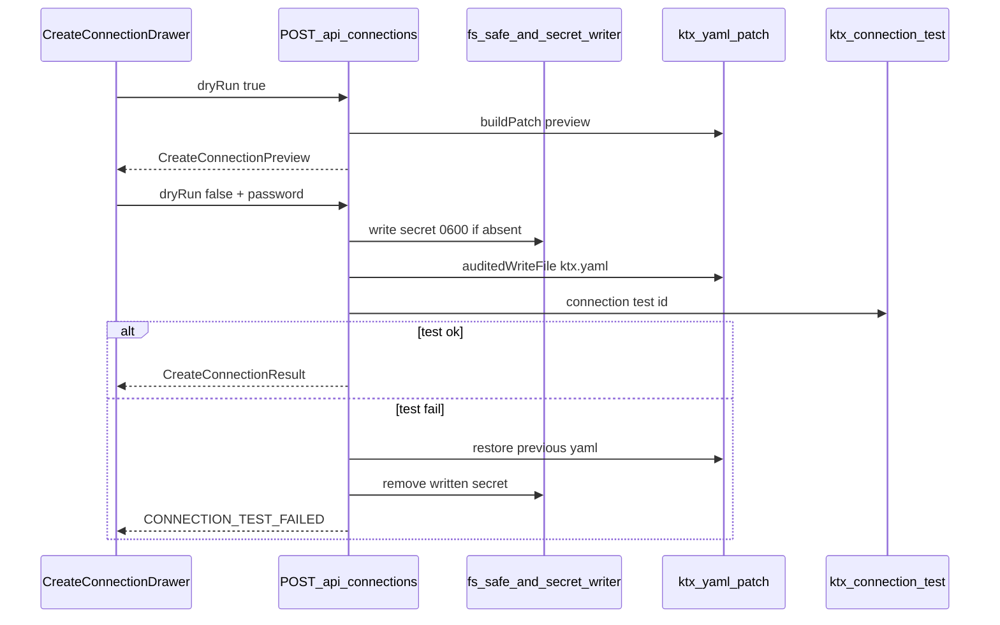

# Connection Create (Admin) Spec

| 元数据 | 内容 |
|---|---|
| 文档名称 | Connection Create (Admin) Spec |
| 文档类型 | Spec（设计 / 评估；本轮不落地代码） |
| 版本 | v0.1 |
| 撰写日期 | 2026-08-20 |
| 撰写人 | Composer |
| 委托人 | xingchen |
| 基于材料 | 产品确认：WebUI 需支持新建连接；门禁沿用现状（Q1=B）；表单可收一次明文密码并写入 `.ktx/secrets/`（Q2=B）；`docs/design-db-connection.md` §八；`webui/docs/26-database-connection-operations-runbook-spec.md`；`AddSchemaDrawer` / `addSchema` 既有 dryRun 模式；ADR-05 / ADR-11 |
| 适用范围 | `/connections` 新建连接入口；`POST /api/connections`；受控 secrets 写入通道；术语 / 手册 / 安全边界修订清单 |
| 输出位置 | `webui/docs/124-connection-create-admin-spec.md` |

| 字段 | 内容 |
|---|---|
| Spec 编号 | 124 |
| 关联工单 | `webui/docs/plans/wo-202608-58-connection-create-admin.md`（实现工单；本轮仅设计） |
| 关联页面 | `/connections`（主）；兼容空态：`/connections/enabled-tables`、`/connections/test` |
| 上游 Spec / 设计 | `docs/design-db-connection.md`；Spec 26；ADR-05；ADR-11；Spec 107 / 117（Schema 抽屉模式） |
| 状态 | Designed（未实现） |
| 日期 | 2026-08-20 |
| 范围 | WebUI 新建物理连接配置（host/port/user + 一次性密码落盘）；**不**做编辑凭据、**不**引入 WebUI 登录鉴权。删除连接见 Spec 127。 |

### Changelog

| 版本 | 变更 |
|---|---|
| v0.1 | 初稿：产品边界翻转评估、API/UX 设计、受影响面、工作量与风险 |

## 1. 背景

当前「数据库接入」模块只管理**已在 `ktx.yaml` 声明**的连接：连通测试、添加/移除 Schema、启用表范围、Manifest 上传、本地 Catalog 刷新。新建连接（host / port / username / password / driver）被 `docs/design-db-connection.md` §八与 Spec 26 明确划为 Non-Goal，运维须手改 `ktx.yaml` 并在 `.ktx/secrets/` 落密码。

产品目标变更：**允许在 WebUI 新建连接**，且表述为「只支持管理员维护」。

经确认的两条产品决议：

| 代号 | 决议 | 含义 |
|---|---|---|
| Q1=B | 门禁沿用现状 | 本单**不**新建 WebUI 登录 / 角色鉴权。能访问 WebUI 的调用方即视为运维 admin（`local-admin` 审计身份）。真实鉴权标为**已知风险 / 后续前置依赖**。 |
| Q2=B | 一次性明文密码落盘 | 表单可收一次密码；服务端写入 `.ktx/secrets/<connId>-password`，`ktx.yaml` 只存 `file:` 引用。API/UI **永不回读、永不展示**密码明文。 |

这要求**有条件放宽** `fs-safe` 对 `.ktx/secrets/` 的绝对 DENY：仅允许写入符合命名约定的单个密码文件，且不得提供读接口。

## 2. 目标

1. `/connections` 提供 **新建连接** 主入口（PageHeader + 空态 CTA）。
2. 新增 `POST /api/connections`：默认 `dryRun:true`；确认写入时落盘 secret + 追加 `connections.<id>` + 更新 `setup.database_connection_ids`。
3. 写入成功后自动跑 `ktx connection test`；失败则回滚本单写入（secret + yaml 补丁），不留下半成品连接。
4. 审计记录 `change_type=connection_create`；diff / audit payload **脱敏**（无密码、无 secret 内容）。
5. 翻转相关手册 / Spec 中「WebUI 不做新建连接」表述；登记新术语。
6. 本轮只交付设计文档与评估；**不写实现代码**。

## 3. Non-Goals

| 非目标 | 理由 |
|---|---|
| 不引入 WebUI 登录 / SSO / Admin token 门禁 | Q1=B；单独立项 |
| 不编辑已有连接的 host/port/user/password | 降低半成品与凭据漂移风险；本单仅 Create |
| 不删除连接 | 已由 Spec 127 交付；本单仍不包含删除 |
| 不提供 secrets 列表 / 读取 / 轮换 UI | 只允许本单约定路径的一次性写入 |
| 不自动 ingest / 不自动改 `access.yaml` ACL | 保持与 Spec 26 runbook 后半段人工闭环 |
| 不支持列级 / 行级权限 | 既有边界不变 |
| 不做浏览器 / E2E 验证（实现轮默认） | 与近期连接模块交付一致：Vitest + terminology + build + code review |

## 4. Terminology Compliance

This feature follows `webui/docs/00-product-terminology-standard.md`.

New terms（已同步登记到术语标准 §3 / §4.1）：

| Canonical Term | UI 主术语 | 禁止文案 | 说明 |
|---|---|---|---|
| Create Connection | 新建连接 | 新建链接、添加联接、创建数据源（作主按钮） | 在 WebUI 创建 `ktx.yaml` 连接配置对象 |
| Connection ID | 连接 ID | 连接名（易与显示名混淆）、Connection Name（作主标签） | `connections.<id>` 键；受标识符规则约束 |
| Connection Password | 数据库密码 | 密钥、Token（作主标签） | 仅创建表单一次性输入；写入后不可回显 |
| Password File Reference | 密码文件引用 | 明文密码（配置态） | `ktx.yaml` 中 `password: file:…` |
| Connection Create Preview | 新建预览 | — | dryRun：脱敏 diff + 将写入的 secret 相对路径 |

Forbidden：把「新建连接」写成「添加 Schema」；空态仍引导「请在 ktx.yaml 中添加」作为**唯一**路径（实现后须改）。

Protected DOM：`Connection ID`、driver/engine、host、`file:` 路径、`.ktx/secrets/…` → `translate="no"` + `notranslate`。

## 5. 功能评估

### 5.1 价值

| 价值点 | 说明 |
|---|---|
| 降低首接摩擦 | 运维不必同时熟悉 `ktx.yaml` 语法与 secret 落盘路径 |
| 与现有闭环衔接 | 新建后仍走：添加 Schema → 启用表 → Manifest → ACL |
| 保持安全叙事 | 持久态仍是 `file:` 引用；密码不进 git、不进 API 响应 |

### 5.2 能力边界（实现后）

| 能力 | 实现前 | 实现后 |
|---|---|---|
| 列出连接 | WebUI | WebUI |
| 新建连接（host/凭据） | 仅 `ktx.yaml` + secrets / `ktx setup` | **WebUI + 仍保留手工路径** |
| 编辑连接凭据 | 手工 | 仍手工（本单不做） |
| 删除连接 | 手工 | **Spec 127**：WebUI + 仍保留手工路径 |
| 添加 / 移除 Schema | WebUI | 不变 |
| 启用表范围 | WebUI | 不变 |
| 连通测试 | WebUI | 新建成功后强制测一次；卡内测试不变 |

### 5.3 「管理员维护」含义（诚实边界）

当前 WebUI **无登录**（ADR-05：本机 `127.0.0.1` 信任；审计身份固定 `local-admin`）。

本 Spec 将「只支持管理员维护」解释为：

1. **产品语义**：新建连接是高权限运维动作，不面向普通业务用户；UI 文案与手册按 Owner / 运维表述。
2. **工程语义（本单）**：不新增调用方鉴权；任何能打到 WebUI HTTP 端口的客户端均可调用 `POST /api/connections`。
3. **已知风险**：Docker / K8s 若将 WebUI 绑到 `0.0.0.0` 且无外层鉴权，等于公开暴露「写 secrets + 改 ktx.yaml」能力。实现说明与手册必须显性警告；真正的 Admin 鉴权作为**后续硬前置**（不在本单范围）。

不把 MCP `access.yaml` role 映射为 WebUI 写权限（角色管的是 Agent 数据可见性，不是运维控制台身份）。

### 5.4 安全评估

| 项 | 结论 |
|---|---|
| 密码传输 | 仅 `dryRun:false` 请求体携带一次；须 HTTPS/本机环回；响应与日志禁止回显 |
| 密码存储 | `.ktx/secrets/<connId>-password`；文件权限建议 `0600`；gitignored |
| 读路径 | **禁止** `assertReadable` / 任何 API 读取 secret 内容 |
| fs-safe | DENY 保留为默认；新增**窄例外**：仅 `safeWriteSecretPassword(connId)` 可写 `.ktx/secrets/<connId>-password` |
| 审计 | `auditedWriteFile` 写 yaml；secret 写入另记 audit 元数据（路径 + sha256 长度类摘要，**不含内容**） |
| 回滚 | test 失败删除本单创建的 secret；yaml 不提交或恢复 dryRun 前内容 |

### 5.5 与既有 ADR / Spec 的冲突处置

| 文档 | 现状 | 实现时动作 |
|---|---|---|
| `docs/design-db-connection.md` §八 | 不做新建连接；不做密码管理 | 修订为：允许 Create；密码仅一次性写入、不可管理/回读 |
| Spec 26 | Non-Goal：不在 WebUI 实现新建连接表单 / secret UI | 改为 Goal；区分「创建写入」与「secret 管理 UI」 |
| ADR-11 | 新增 schema 不接管新建连接 | 保持「Add Schema 不创建连接」；另增本 Spec 专责 Create |
| ADR-05 | 无登录 | 不改；在本 Spec 与手册记录暴露面风险 |
| `SYSTEM_HANDBOOK` FAQ | 「没有新建连接按钮是安全边界」 | 改为：有按钮；手工 YAML 仍为高级/灾备路径 |
| `docs/webui-feature-map.md` | 「不接管新建连接」 | 更新为已设计 / 实现后改状态 |

## 6. UX 设计

### 6.1 入口

| 位置 | 行为 |
|---|---|
| `/connections` PageHeader primary | `新建连接` |
| `/connections` 空态 | 文案改为「暂无连接配置。」+ primary `新建连接`；次要说明可保留「也可在 ktx.yaml 中手工添加」 |
| `/connections/test` 空态 | 「请先在连接概览新建连接」并链到 `/connections`（修正现有误导文案） |
| `/connections/enabled-tables` 空态 | 链到连接概览新建 |

不新增主导航项；不强制 `/connections/new` 独立路由（默认 Drawer，对齐 `AddSchemaDrawer`）。

### 6.2 `CreateConnectionDrawer` 步骤

对齐 Add Schema 的 input → preview → confirm：

```text
输入连接信息 → 新建预览（dryRun 脱敏 diff）→ 确认创建（写 secret + yaml + connection test）
```

表单字段：

| 字段 | 必填 | 规则 |
|---|---|---|
| 连接 ID | 是 | `^[a-z][a-z0-9_-]{1,63}$`；不得与已有 `connections` 键冲突 |
| driver | 是 | `mysql` \| `postgres` |
| engine | 否 | 如 `doris` / `starrocks`；选填时建议同时设 `wire_protocol` |
| wire_protocol | 否 | OLAP MySQL wire 填 `mysql` |
| readonly | 是 | 默认 `true`（checkbox，默认勾选） |
| host | 是 | 非空 |
| port | 是 | 1–65535；mysql 默认 3306，postgres 默认 5432 |
| database | 是 | 非空 |
| username | 是 | 非空 |
| 数据库密码 | 是 | 一次性；`type=password`；确认创建后清空本地 state |
| 初始 schemas | 否 | 零或多个，各匹配 `SCHEMA_NAME_PATTERN`；默认可空 |

写入默认值：

- `enabled_tables: []`
- `password: file:<projectRootAbs>/.ktx/secrets/<connId>-password`（容器部署由运行时解析为实际 project root）
- 若 `setup.database_connection_ids` 存在且未包含该 id，则追加

成功后：Toast「连接已创建」；关闭 Drawer；刷新连接列表；引导「添加 Schema」或打开该连接卡片。

### 6.3 错误文案（用户可见）

| 场景 | 文案方向 |
|---|---|
| ID 已存在 | `连接 ID 已存在` |
| ID 非法 | `连接 ID 不符合命名规则` |
| dryRun 校验失败 | 字段级错误 |
| secret 已存在 | `密码文件已存在，请更换连接 ID 或由运维清理后重试`（不覆盖） |
| connection test 失败 | 展示 ktx 失败原因；声明已回滚 |
| fs / 权限失败 | `无法写入连接配置或密码文件` |

## 7. API 设计

### 7.1 `POST /api/connections`

Body：

```ts
{
  id: string;
  driver: "mysql" | "postgres";
  engine?: string;
  wireProtocol?: string;       // → yaml wire_protocol
  readonly?: boolean;          // 默认 true
  host: string;
  port: number;
  database: string;
  username: string;
  password: string;            // 仅 dryRun:false 时需要；dryRun:true 可省略或忽略
  schemas?: string[];
  dryRun?: boolean;            // 默认 true
}
```

#### dryRun 响应 `CreateConnectionPreview`

```ts
{
  diff: string;                 // 脱敏：password 行为 file: 路径
  proposedYaml: string;         // 脱敏
  secretRelPath: string;        // ".ktx/secrets/<id>-password"
  connection: ConnectionInfo;   // 预览对象；passwordSource: "file"；无明文
}
```

#### 写入响应 `CreateConnectionResult`

```ts
{
  written: true;
  auditId: string;
  secretRelPath: string;
  connection: ConnectionInfo;
  test: { status: "ok" | "error"; message?: string; durationMs?: number };
}
```

test 失败时 HTTP 非 2xx（建议 `422 CONNECTION_TEST_FAILED`），body 含错误信息，**保证** secret 与 yaml 已回滚。

### 7.2 服务端流程



### 7.3 fs-safe 例外（实现契约）

在 [`webui/server/fs-safe.ts`](../server/fs-safe.ts) **不**把 `.ktx/secrets` 移出 DENY。

新增专用函数（示意）：

```ts
// 仅允许相对路径 `.ktx/secrets/<connId>-password`
// connId 必须已通过 CONNECTION_ID_PATTERN
// 禁止：读、列目录、覆盖已存在文件、任意其它文件名
safeWriteNewSecretPassword(projectRoot, connId, passwordPlaintext): Promise<void>
safeRemoveSecretPasswordIfExists(projectRoot, connId): Promise<void> // 仅回滚用
```

既有 `safeWrite` / `assertReadable` 对 `.ktx/secrets/**` 行为不变（仍拒绝）。

## 8. 受影响页面与文件（实现时）

### 8.1 用户可见页面

| 页面 / 路由 | 影响 |
|---|---|
| `/connections` | PageHeader CTA、空态、`CreateConnectionDrawer` |
| `/connections/enabled-tables` | 空态文案与链到新建 |
| `/connections/test` | 空态文案修正 |
| Help / SYSTEM_HANDBOOK 数据库接入 | FAQ、职责边界、误判表、Runbook |

### 8.2 代码触点（预估）

| 区域 | 文件（预期） |
|---|---|
| API 路由 | `webui/server/index.ts` |
| 连接域逻辑 | `webui/server/project.ts`（`createConnection`） |
| 安全写 | `webui/server/fs-safe.ts` 旁路或同文件专用 API |
| 审计 | `webui/server/admin/config-audit-write.ts` 调用方 |
| 类型 | `webui/src/lib/types.ts`、`webui/server/model.ts` |
| UI | `webui/src/pages/connections/ConnectionOverview.tsx`；新建 `CreateConnectionDrawer.tsx` |
| 测试 | `server/__tests__/api.create-connection.test.ts`；`project.create-connection.test.ts`；`connection-overview.test.tsx`；help-center FAQ 断言 |
| 术语 lint | 禁止旧空态「请在 ktx.yaml 中添加 connections」作为唯一路径（可保留次要说明） |

### 8.3 文档触点（实现时必须改）

- [`docs/design-db-connection.md`](../../docs/design-db-connection.md) §八
- [`webui/docs/26-database-connection-operations-runbook-spec.md`](26-database-connection-operations-runbook-spec.md)
- [`docs/SYSTEM_HANDBOOK.md`](../../docs/SYSTEM_HANDBOOK.md) §3.2 / FAQ / 职责边界
- [`docs/design-schema-onboarding.md`](../../docs/design-schema-onboarding.md)（交叉引用：Create ≠ Add Schema）
- [`webui/docs/01-architecture.md`](01-architecture.md)（ADR-11 旁注或新增 ADR）
- [`docs/webui-feature-map.md`](../../docs/webui-feature-map.md)、[`docs/webui-module-guide.md`](../../docs/webui-module-guide.md)
- Help 相关测试与 `wo-M58` FAQ 断言

## 9. 工作量评估（实现轮；非日历时间）

按子系统拆分，便于后续工单认领：

| 工作包 | 内容 | 相对体量 | 风险 |
|---|---|---|---|
| WP1 安全写通道 | `safeWriteNewSecretPassword` / 回滚删除；单测覆盖遍历、覆盖拒绝、权限 | M | 高（安全边界） |
| WP2 createConnection 核心 | YAML Document 插入连接块 + `setup.database_connection_ids`；dryRun；脱敏 | M | 中（yaml 保序保注释） |
| WP3 API + 测试回滚 | `POST /api/connections`；test 失败事务回滚；审计 | M | 高 |
| WP4 CreateConnectionDrawer | 表单、步骤、DiffViewer、错误态 | M | 中 |
| WP5 Overview / 空态接线 | CTA、query invalidate、测试页文案 | S | 低 |
| WP6 文档与术语翻转 | Spec 26 / handbook / design-db-connection / feature-map / help 测试 | M | 中（文案一致性） |
| WP7 回归 | Vitest API/UI、`lint:terminology`、`build`；定向手测本机创建+失败回滚 | S–M | 中 |

**合计**：约 **2 个中大型工作包 + 4 个中型 + 1 个小型** 量级；主风险在 secrets 例外与失败回滚正确性，不在 UI 复杂度。

建议实现分期：

1. **Phase A**：WP1–WP3 + 最小 API 集成测试（无 UI 亦可先合入 behind 无入口，或同 PR 带 Drawer）。
2. **Phase B**：WP4–WP5 UI。
3. **Phase C**：WP6 文档翻转与 help 断言，避免手册与产品长期分叉。

## 10. 验收标准（实现轮）

1. `/connections` 可见 **新建连接**；无连接时主 CTA 可完成创建。
2. dryRun 默认开启；预览 diff 中密码仅为 `file:` 路径。
3. 确认后：secret 文件存在、`ktx.yaml` 含新连接、`setup.database_connection_ids` 含 id、`GET /api/connections` 可见且 `passwordSource=file`。
4. 任意 API 响应 / 审计 / 前端 state 在成功后不含密码明文。
5. 故意错误密码：返回失败且 **不**残留 secret 与 yaml 条目。
6. 已存在 secret 或 connId：拒绝覆盖。
7. `fs-safe` 通用写仍拒绝 `.ktx/secrets/**`；仅专用函数可写约定文件名。
8. 术语标准与 help FAQ 不再声称「WebUI 不能新建连接」。
9. 本轮实现默认不做浏览器 E2E；以 Vitest + terminology + build + code review 为准。

## 11. Design System Compliance

引用：

- `webui/docs/design-system/` Patterns：Drawer 向导、PageHeader primary、Danger/确认分层
- 既有 `AddSchemaDrawer` / Agent 新建 dryRun→确认 模式

遵循点：

- 新建为 PageHeader **唯一** primary（连接概览）；危险/次要动作不升级为 primary
- 密码字段不进 Diff 明文；成功后不在 UI 残留
- 专业标识符节点加翻译防御

## 12. 开放依赖（不阻塞本设计，阻塞生产加固）

1. WebUI Admin 鉴权（登录或 mTLS / 反向代理鉴权）——Q1=B 明确外包。
2. 编辑连接 / 轮换密码——后续独立 Spec。删除连接见 Spec 127。
3. 创建后一键同步 `access.yaml` role allow.connections——可选增强，默认仍手工。
