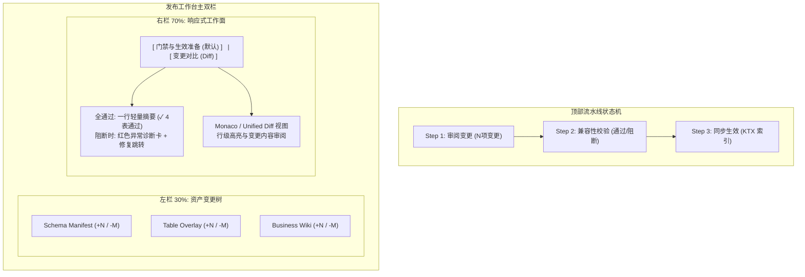

# Publish Workbench UI/UX Refinement Spec

| 元数据 | 内容 |
|---|---|
| 文档名称 | 发布工作台 UI/UX 体验重构规范 (Publish Workbench UI/UX Refinement Spec) |
| 文档类型 | Spec |
| 版本 | v1.0 |
| 撰写日期 | 2026-08-29 |
| 撰写人 | Claude (Cursor Agent) |
| 委托人 | xingchen |
| 基于材料 | CFG-CONN-01 自动化运行证据与截图 (`20260827-1315`)、Lucy WebUI 源码 (`PublishWorkbench.tsx`, `DiffViewer.tsx`, `app.css`)、全系统术语标准 (`00-product-terminology-standard.md`)、Spec 35 / Spec 112 / Spec 119 / Spec 123 |
| 适用范围 | Lucy WebUI 语义发布工作台（`/publish/workbench`）纯前端交互与视觉体验重构 |
| 输出位置 | `webui/docs/136-publish-workbench-uiux-refinement-spec.md` |

| 字段 | 内容 |
|---|---|
| Spec 编号 | 136 |
| 关联工单 | 待建 |
| 关联页面 | `/publish/workbench`（语义发布 / 发布工作台） |
| 上游 Spec | Spec 35（发布工作台 IA）、Spec 112（流程与门禁 IA）、Spec 115（校验披露）、Spec 119（队列–门禁双栏）、Spec 123（语义生效台） |
| 状态 | Draft / Ready for Review |
| 日期 | 2026-08-29 |
| 范围 | 纯前端 UI/UX 与交互重构：流水线状态机 Stepper、异常驱动静默校验展示、左侧资产树分类与 +N/-M 差异统计、右侧双视图（门禁/Diff）无缝切换、全局 Toast 防抖去重 |

---

## 1. 背景与问题定义

基于 `CFG-CONN-01/20260827-1315` 运行证据（包含 `09-overlay-*.png`、`13-publish-workbench-before-sync.png`、`14-sync-index-success.png` 等截图）以及当前前端代码实现分析，系统在发布工作台（Publish Workbench）存在以下四大核心体验痛点：

```
当前问题拓扑：
┌────────────────────────────────────────────────────────────────────────┐
│ 1. 绿框套娃 (图13): 大绿框(.pl-validation-banner) 套 4个小绿框 (.pl-validation-row) │
│ 2. 状态机断层: 顶部审阅/校验/同步为静态纯文本，点击时仅按钮灰色置灰，无流水线反馈  │
│ 3. 变更黑盒化: 列表无 +/- 行级统计，Diff 藏在隐藏 Drawer 难以直接建立审阅信心    │
│ 4. 反馈堆叠穿透 (图09): 批量保存时 Toast 未去重防抖，右下角连续多层物理覆盖        │
└────────────────────────────────────────────────────────────────────────┘
```

1. **“绿框套娃”与视觉噪音过重（图 13）**：
   - 校验摘要在外层使用了 `.pl-validation-banner--success`（大绿底框），内部又遍历渲染了每个表独立的 `.pl-validation-row--ok`（带实线边框的浅绿长条矩形）。
   - 全部通过时形成了高亮视觉堆叠；违背了企业级“Calm UI（安静设计）”与“异常驱动”原则——全绿时应当静默收敛，仅需一行轻量状态，只有异常/警告时才需高亮展开拦截。
2. **流程缺乏阶段状态机（图 09 / 13）**：
   - 顶部的 `审阅变更 ➔ 校验 ➔ 同步索引` 仅为 `<ol>` 静态纯文本，缺乏节点状态指示；
   - 触发异步操作（校验变更 / 同步索引）时，顶部按钮变成孤立的灰色 `校验中...` / `处理中...`，步骤条与执行过程完全脱节，缺乏流水线步骤条（Pipeline Stepper）与进度感知。
3. **变更内容黑盒化（审阅摩擦大）**：
   - 左侧待发布文件仅展示文件名和单个字符状态（如“已修改”），缺少类似 Git 的行级增减统计（如 `+18 -2`）和资产类型分类（Schema Manifest / Table Overlay / Business Wiki）；
   - 行级 Diff 藏在点击后弹出的 Drawer 中，用户在主界面无法直观建立改动感知，存在黑盒不确定感。
4. **全局反馈堆叠穿透（图 09）**：
   - 连续导入 overlay 或保存时，前端多次触发 `toast.success("已保存到语义层")`，Toast 队列未设 `id` 去重与防抖，导致右下角多层卡片物理堆叠穿透。

---

## 2. 核心设计原则与约束

1. **零后端改动（Zero Backend Changes）**：
   - 严格不改动 `/api/diff`、`/api/validate-changed`、`/api/semantic-assets/reindex` 等后端接口协议与入参。
2. **不丢弃发布工作台门禁职责（Dual-Mode Layout Protection）**：
   - 发布工作台不仅是 Code Review 页面，更是 **发布门禁与操作台**。
   - 避免将右侧区域完全硬性替换为纯 Diff 视图而丢失门禁概况与主操作入口；采用 **双视图（Tab 切换 / 主从分层）** 保持操作闭环。
3. **Calm UI 与异常驱动（Exception-driven UI）**：
   - 正常/全通过态保持克制（单行收敛、默认折叠明细）；
   - 异常/阻断态高对比度突出展示，并提供直达修复路径。
4. **术语与合规保护（Terminology Compliance）**：
   - 严格遵循 `00-product-terminology-standard.md` 与 Spec 123 规范。
   - 保护词：`KTX`、`MCP`、`Agent`、`Schema Manifest`、`Overlay`、表名与路径一律添加 `notranslate` / `translate="no"`。

---

## 3. 详细重构方案 (To-Be)



### 3.1 引入标准流水线状态机（Pipeline Stepper）
将顶部纯文本列表升级为高可视化的企业级 Pipeline Stepper：
- **节点 1：审阅变更 (Review Changes)**
  - 状态：`Success`（有待同步变更 `N` 项）/ `Neutral`（无待同步文件，磁盘即最新）
- **节点 2：兼容性校验 (Validation Gate)**
  - 状态：
    - `Running`：旋转 Spinner + 呼吸光晕（校验中…）
    - `Success`：绿色小勾（`全部通过`）
    - `Failed`：红色告警（`N 项阻断`）
- **节点 3：同步生效 (Sync & Activate)**
  - 状态：
    - `Pending`：等待触发
    - `Running`：旋转 Spinner（KTX 索引重建中…）
    - `Success`：完成标记（索引已生效）
    - `Failed`：索引失败报错

### 3.2 异常驱动的校验清单（Exception-driven Calm UI）
彻底废除“大绿框嵌套小绿框”的设计：
- **全部通过态（Happy Path / Calm State）**：
  - 废除 `.pl-validation-banner--success` 与多层嵌套边框；
  - 仅使用单行轻量带浅绿底色的状态条：
    `✓ 4 张表语法与兼容性校验全部通过`，附带右侧折叠按钮 `[展开明细 ▾]`；
  - 默认收起子表卡片，用户主动点击时才以无边框轻量列表展开。
- **异常阻断态（Failed / Blocked State）**：
  - 自动展开红色告警面板；
  - 置顶展示阻断原因（如 AST 解析错误、缺失依赖字段等）；
  - 提供表名直达链接与快速修复引导（跳转 TableEditor）。

### 3.3 左侧资产树 + 行级统计与右侧双视图联动
- **左栏（30% 资产变更树）**：
  - 按资产类型分组：`Schema Manifest`、`Table Overlay`、`Business Wiki`；
  - 每一项展示：文件名、变更类型 Badge（新增/修改/删除）、行级统计徽标（如 `+18` 绿标、`-4` 红标）；
- **右栏（70% 响应式双视图工作面）**：
  - 提供 Tab 导航：`[ 门禁与生效准备 ]`（默认） / `[ 变更对比 (Diff) ]`；
  - 默认停留在「门禁与生效准备」，展示全量影响评估与异常驱动校验清单；
  - 当用户在左侧点击任一具体文件时，右侧自动切换至「变更对比」Tab 并加载对应文件的行级 Diff（支持一键切回门禁）。

### 3.4 全局反馈 Toast 防抖与收敛
- 为批处理保存与发布成功的 Toast 配置全局唯一 `id`（例如 `id: "semantic-save-status"`）；
- 当短时间内多次触发时，直接更新现有 Toast 文本而不是在右下角垂直堆叠产生视觉遮挡。

---

## 4. 交付计划与验证标准

1. **样式与组件重构**：
   - 提取/封装 `PipelineStepper` 组件；
   - 优化 `WorkbenchValidationRow` 与校验摘要，实现单行收敛 + 展开明细；
   - 优化 `PublishWorkbench.tsx` 的左侧文件列表与右侧 Tab/Diff 切换逻辑；
   - 治理 `app.css` 中 `.pl-validation-*` 样式，消除高亮嵌套。
2. **自动化测试与回归验证**：
   - 运行 `pnpm test webui/src/__tests__/review.test.tsx` 确保发布流程与 gate 断言通过；
   - 运行 `pnpm lint:terminology` 确保符合全系统术语规范；
   - 运行 `pnpm build` 确保前端打包 0 错误。
