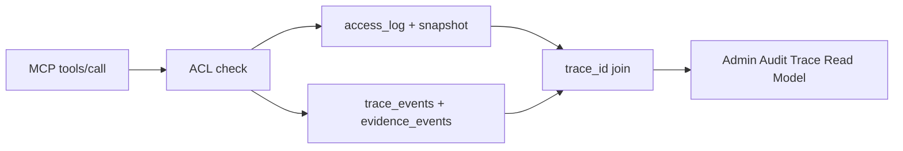

# Trace / Evidence Kernel API Spec

| 元数据 | 内容 |
|---|---|
| 文档名称 | Trace / Evidence Kernel API Spec |
| 文档类型 | Architecture / API / Data Contract Spec |
| 版本 | v0.5 |
| 撰写日期 | 2026-08-03；v0.2 更新 2026-08-03（补充 SQLite 并发与测试数据库隔离要求）；v0.3 更新 2026-08-03（补充 retention、auto_vacuum 与热库数据黑白名单）；v0.4 更新 2026-08-03（对齐 202608 Governance & Observability 主线）；v0.5 更新 2026-08-20（钉死 P0 最低充分条件、Implementation Status、Kernel Landed / P0 Closed 两档验收；明确 AC-P0 `policyVersion` 不进本 P0） |
| 关联蓝图 | `docs/lucy-202608-reliable-delivery-upgrade-spec.md` |
| 关联总控 | `docs/lucy-202608-upgrade-execution-control.md` |
| 关联 P0 计划 | `docs/plans/2026-08-20-trace-evidence-p0-plan.md` |
| 关联工单 | `webui/docs/plans/wo-202608-01-trace-evidence-kernel.md`（Kernel Landed）；P0 Closure 见上述 P0 计划 T2–T4 |
| 适用范围 | append-only trace / evidence event store、MCP Proxy 基础写入、ACL policy decision trace、Admin Audit Trace read model、Access Governance Gate 与 Security Eval 共用数据契约 |

## 1. Background

Trace / Evidence **不是**访问日志 UI 换皮（「审计 2.0 皮肤」），而是 Lucy 从「有访问控制与访问日志的 MCP」升级为「可解释、可复核、可门禁的企业 data agent 平台」的 **最低充分条件**。

- **没有它**：权限系统有裁决，但无案卷；有运营，但无答辩；有发布，但无统一证据。
- **有了它**：每一次 allow / deny 都能钉到身份、策略版本、触达范围与结果规模，且不把敏感业务数据二次落库。

Lucy 已有 `access_log`、`access_log_sources`、`conversation_turns`、`inferred_turns`、`permission_snapshots` 等审计与问题追踪能力。本 spec **不废弃**既有审计表，而是新增一套 append-only event contract，让 MCP Proxy、Access Governance Gate、Security Eval、Admin Observability 和 Release Readiness Evidence Package 能写入或引用同一语义。`access_log` 仍是调用流水事实源；Trace / Evidence 是其上的统一证据层。

## 2. Goals

1. 建立 append-only `trace_events` 和 `evidence_events`。
2. 提供服务端 helper，所有模块通过 helper 写事件，不直接拼 SQL。
3. MCP Proxy 在 `tools/call`、policy decision、error / denied 路径写入基础 trace event。
4. 事件只存 hash / metadata；不默认保存原始结果样本。
5. 提供非浏览器自检脚本证明事件不可覆盖、policy decision 可追溯。
6. 在 `/admin/audit` 提供只读 Trace Read Model，使管理员能从访问日志行进入有序 Span、策略裁决与 Evidence Ref。

## 3. Non-goals

- 不做完整 Visual Debugger UI。
- 不保存完整 SQL AST 原文或结果明细。
- 不替代现有 `access_log` 查询页面。
- 不引入 Kafka、OpenTelemetry collector 或外部 Event Store。
- 不改变 MCP Proxy ACL 判定结果。
- 不实施 Access Control AC-P0 的 `policyVersion` / capability digest（见 `docs/access-control/plans/wo-202608-59-access-control-p0.md`）；本 P0 以 `permissionSnapshotHash` 作为策略可解释绑定。
- 不把 P1 Access Governance Gate、Safe Log-to-Security-Eval、Admin Observability Dashboard，或 P2 Risk Review / Release Readiness Evidence Package 计入本 Spec 的 P0 Closed 条件（它们可消费 Kernel，但不是本 P0 Done 条件）。

## 4. P0 Minimum Sufficient Condition

P0 MVP = **Governance Evidence Kernel**，三件套不可拆：

1. **Trace / Evidence Kernel** — append-only `trace_events` / `evidence_events` + helper。
2. **ACL Policy Decision Trace** — 每次业务 `tools/call` 的 allow / deny → `policy_decision` + evidence。
3. **Admin Audit Trace Read Model** — `/admin/audit` 只读链式核查（非 Visual Debugger）。

一次 allow / deny 必须能钉到以下五元组，且敏感业务数据不二次落库：

| 钉点 | P0 必须落什么 |
|---|---|
| 身份 | `actor` / `userId` + `tokenHashPrefix`（无明文 Token） |
| 策略版本 | `permissionSnapshotHash`（+ `roleIds`）；**不要求** `policyVersion` |
| 触达范围 | `decision_reason`、tools / tables / sources refs、`effectiveTablesCount` |
| 结果规模 | `access_log` 的 `response_*`；Trace 侧在已知行 / 列数时写 `result_snapshot_hash` |
| 不二次落库 | hot-store 黑名单：结果行 / SQL AST 原文 / 完整问题 / Token / 凭据 / 客户样本 |

Join keys（必须可互查）：

```text
access_log.trace_id  ↔  trace_events.trace_id  ↔  turn_id / request_id
```

可选证据关联：`evidence_events` 可引用 `access_log` 行、`permission_snapshots` hash、source / semantic 节点 ref。



## 5. Implementation Status（相对仓库现状）

| 能力 | 状态 | 说明 |
|---|---|---|
| Schema + helper（`writeTraceEvent` / `writeEvidenceEvents` / `listTraceEvents` / `hashArtifact`） | Implemented | `webui/server/trace/evidence.ts` |
| WAL、`busyTimeout: 5000`、新库 `auto_vacuum = INCREMENTAL` | Implemented | |
| Retention 常量 `365 / 500000 / 1GiB` | Implemented | |
| MCP `tools/call` → `mcp_tools_call` + `policy_decision` + `access_policy` evidence | Implemented | best-effort；失败不打断 MCP |
| Admin `GET /api/admin/trace/events` + Audit Trace Drawer | Implemented | |
| Hot-store payload blacklist / sanitize | Implemented | |
| Self-validation `webui/scripts/verify-202608-trace-evidence.mjs` | Implemented | |
| `result_snapshot_hash` evidence（已知行 / 列数时） | Missing | P0 Closure |
| `semantic_yaml_node` / source evidence（有 `access_log_sources` 时） | Missing | P0 Closure |
| Retention purge / archive worker + 引用保护 + `incremental_vacuum` | Missing | 常量已有；worker 为 P0 Closure |
| Admin Trace UI 术语对齐标准（中文主术语 + `translate="no"`） | Partial | P0 Closure |
| `mcp_initialize` / `mcp_tools_list` spans | Deferred | 类型已有；**非** P0 Closed 阻塞项 |
| AC-P0 `policyVersion` | Out of scope | 见 Non-goals |

**Kernel Landed** = 上表 Implemented 行全部成立。  
**P0 Closed** = Kernel Landed + 全部 P0 Closure（Missing / Partial 中标为 P0 Closure 的项）完成。

## 6. Data Contract

### 6.1 `trace_events`

```sql
CREATE TABLE IF NOT EXISTS trace_events (
  id INTEGER PRIMARY KEY AUTOINCREMENT,
  trace_id TEXT NOT NULL,
  session_id TEXT,
  turn_id TEXT,
  span_id TEXT NOT NULL,
  parent_span_id TEXT,
  span_type TEXT NOT NULL,
  actor_kind TEXT NOT NULL,
  actor_id TEXT,
  status TEXT NOT NULL,
  started_at TEXT NOT NULL,
  ended_at TEXT,
  request_id TEXT,
  policy_decision_json TEXT,
  artifact_hashes_json TEXT NOT NULL DEFAULT '[]',
  metadata_json TEXT NOT NULL DEFAULT '{}',
  created_at TEXT NOT NULL
);
```

Indexes:

- `idx_trace_events_trace` on `(trace_id, created_at)`
- `idx_trace_events_turn` on `(turn_id, created_at)`
- `idx_trace_events_type_status` on `(span_type, status, created_at)`

### 6.2 `evidence_events`

```sql
CREATE TABLE IF NOT EXISTS evidence_events (
  id INTEGER PRIMARY KEY AUTOINCREMENT,
  trace_event_id INTEGER,
  trace_id TEXT NOT NULL,
  evidence_kind TEXT NOT NULL,
  evidence_ref TEXT NOT NULL,
  evidence_version TEXT,
  evidence_hash TEXT,
  relation TEXT NOT NULL,
  reviewer_json TEXT,
  metadata_json TEXT NOT NULL DEFAULT '{}',
  created_at TEXT NOT NULL,
  FOREIGN KEY(trace_event_id) REFERENCES trace_events(id)
);
```

`relation` values:

- `observed`
- `used`
- `denied_by`
- `superseded`
- `reviewer_override`
- `promoted`

### 6.3 TypeScript Contract

```ts
export type LucySpanType =
  | "reindex"
  | "mcp_initialize"
  | "mcp_tools_list"
  | "mcp_tools_call"
  | "policy_decision"
  | "ktx_retrieval"
  | "sql_plan"
  | "sql_execute"
  | "eval_run"
  | "publish_gate"
  | "copilot_candidate";
```

## 7. Storage Decision

MVP 使用现有 `.ktx-ui/audit.sqlite`，开启 WAL。不得新建第二套审计数据库。若未来迁移到独立 event store，迁移必须保持 event append-only 语义。

Default retention parameters:

| Parameter | Default | Meaning |
|---|---:|---|
| `retention_days` | `365` | 默认热库保留天数 |
| `max_rows` | `500000` | 热库事件行安全上限，包含 `trace_events` + `evidence_events` |
| `max_bytes` | `1073741824` | 热库 SQLite 文件安全上限，约 1GB |

Retention rule:

- 默认保留 365 天。
- `max_rows`、`max_bytes` 任一先到即触发归档 / purge / incremental vacuum。
- Purge 必须先按时间和容量选择候选事件，再保留 reviewer / override evidence 的可追溯摘要。
- Purge 不能删除仍被 active release、formal Eval Case 或 reviewer decision 引用的 evidence，除非已有归档证明。

**P0 分档：**

- **Kernel Landed**：retention 常量暴露于代码 / 配置，自检断言默认值。
- **P0 Closed**：实现 purge / archive worker，含引用保护与 purge 后 `PRAGMA incremental_vacuum(N)`。

SQLite 并发约束：

- `webui/server/trace/evidence.ts` 打开 SQLite 连接时必须设置 `busyTimeout: 5000`；可额外提供 retry 逻辑，但 retry 不能替代 `busyTimeout`。
- Trace / Evidence 写入 helper 必须能在短暂 writer lock 下重试或等待，不应立刻把 `SQLITE_BUSY` 暴露给调用者。
- 测试和自检脚本必须使用 `:memory:` 或独立 temp SQLite 文件，禁止写真实 `.ktx-ui/audit.sqlite`。
- 并行 subagent 执行时，不得共享同一个 test DB path。

SQLite vacuum 约束：

- 新建 DB 必须在建表前设置 `PRAGMA auto_vacuum = INCREMENTAL`。
- 已存在 DB 必须检测当前 `auto_vacuum` 模式；若不是 `INCREMENTAL`，记录 warning，不得自动对生产库执行可能长时间运行的 full `VACUUM`。
- Purge 后允许调用 `PRAGMA incremental_vacuum(N)` 回收空间。
- 自检脚本必须覆盖新建 DB 的 `auto_vacuum = INCREMENTAL` 设置。

Hot store data boundary:

| Allowed in SQLite hot store | Forbidden in SQLite hot store |
|---|---|
| Trace Envelope | 物理结果集明细 |
| Evidence Ref | 原始 SQL AST |
| Policy Decision | 未脱敏 Token / secret |
| Artifact Hashes | 完整原始问题 |
| Reviewer / Override signatures | 数据库凭据 |
| redacted metadata | 客户行级样本 |
| SQL AST hash / normalized summary / redacted structural metadata | SQL AST 原文 |

## 8. API And Helper Surface

Create `webui/server/trace/evidence.ts`:

- `ensureTraceEvidenceSchema(database)`
- `writeTraceEvent(event): Promise<number>`
- `writeEvidenceEvents(traceEventId, traceId, evidenceRefs)`
- `listTraceEvents(filter)`
- `hashArtifact(value)`

Admin read API（只读）：

- `GET /api/admin/trace/events?traceId=<id>`
- `GET /api/admin/trace/events?turnId=<id>`

（历史草案中的 `/api/trace/events` 路径以已落地的 `/api/admin/trace/events` 为准。）

## 9. MCP Proxy Integration

`webui/server/proxy/mcp-proxy.ts` must write:

### 9.1 Kernel Landed（必达，已落地）

- `mcp_tools_call` span for each business `tools/call`.
- `policy_decision` event when ACL allows / denies / warns.
- Evidence refs for `access_policy`（permission snapshot hash + reason / matchedRule metadata）.
- Failure to write trace must not break MCP request handling, but must be logged server-side and counted by self-validation / ops metrics.

### 9.2 P0 Closure（P0 Closed 前必做）

- Evidence refs for `semantic_yaml_node`（或等价 source kind）when already available through `access_log_sources`.
- `result_snapshot_hash` evidence / artifact metadata only when response row / column count is known（hash of bounded size summary，不得写入行内容）.

### 9.3 Non-blocking for P0 Closed

- `mcp_initialize` / `mcp_tools_list` spans（类型已在 union 中；可后续补写）.

Denied P0 paths that must remain representable as policy decision events include：`tool_forbidden_global`、`table_forbidden:*`、`raw_query_forbidden`、`unknown_or_forbidden_connection:*`、`sensitive_metadata_forbidden:*`.

## 10. Safety Rules

- Do not store token plaintext.
- Do not store full result rows by default.
- Do not overwrite event rows.
- Do not update event rows except SQLite internal indexes; correction uses new `superseded` or `reviewer_override` event.
- Do not expose raw args containing secrets through `metadata_json`.

## 11. Acceptance Criteria

### 11.1 Kernel Landed

- Schema migration is idempotent.
- WAL mode is enabled.
- Inserting the same logical event twice creates two event rows, not an overwrite.
- A denied MCP call creates a trace event with policy decision.
- Trace lookup by `traceId` returns ordered events and evidence refs.
- Existing `access_log` behavior remains compatible.
- Concurrent test execution does not touch the production audit SQLite file.
- Default retention parameters are exposed through code constants or config with `365 / 500000 / 1073741824` defaults.
- New temp DB self-validation proves `PRAGMA auto_vacuum = INCREMENTAL`.
- Hot store blacklisted payloads are rejected or hashed before write.
- Admin Audit can open Trace Detail from a resolvable `traceId` / `turnId` / `requestId` without mutating events.

### 11.2 P0 Closed（在 11.1 之上）

- When row / column counts are known, Trace carries `result_snapshot_hash` evidence（no row payloads）.
- When `access_log_sources` (or equivalent) is available for the call, Trace carries source / `semantic_yaml_node` evidence refs.
- Retention purge / archive worker runs against retention limits, preserves referenced reviewer / override / formal-eval evidence (or archives first), and may call `incremental_vacuum`.
- Admin Trace Read Model UI 主术语与 `webui/docs/00-product-terminology-standard.md` §4.7 Trace 子表一致；专业英文术语节点带 `translate="no"` + `notranslate`.
- Terminology lint passes for touched UI / docs.

## 12. Self-validation Script

The work order created:

```text
webui/scripts/verify-202608-trace-evidence.mjs
```

（根目录 `scripts/verify-202608-trace-evidence.mjs` 若存在则为兼容跳转；以 `webui/scripts/` 为准。）

The script must:

1. Use a temp SQLite database.
2. Run schema setup twice.
3. Insert two events with same `traceId` and assert two rows exist.
4. Insert `access_policy` and `result_snapshot_hash` evidence refs.
5. Assert no column exists for raw token or raw result payload.
6. Assert `busyTimeout: 5000` is configured.
7. Assert the script does not create or modify `.ktx-ui/audit.sqlite`.
8. Assert `retention_days = 365`, `max_rows = 500000`, and `max_bytes = 1073741824`.
9. Assert new DB setup uses `PRAGMA auto_vacuum = INCREMENTAL`.
10. Assert raw SQL AST, raw token, raw result row, and full question payload are rejected or absent.

P0 Closure 追加验证（随 T2–T3 落地扩展 verifier 或独立测试）：

- Proxy / helper path writes `result_snapshot_hash` when size meta present.
- Purge respects retention caps and referenced-evidence protection.

## 13. Terminology Compliance

This feature follows `webui/docs/00-product-terminology-standard.md`（§4.7 Trace Read Model 子表）。

New / registered terms:

| Canonical Term | UI 主术语 | 说明 |
|---|---|---|
| Trace Detail | Trace 详情 / 核查链路 | `/admin/audit` 内只读 Drawer / 面板 |
| Trace Event | Trace Event | append-only span 行 |
| Evidence Event | Evidence Event | 挂在 Trace 上的证据行 |
| Evidence Ref | Evidence Ref | 证据引用（kind + ref + hash） |
| Ordered Spans | 有序 Span | Trace 详情内按时间 / 父子排序的 span 列表 |
| Policy Decision | 策略裁决 | `policy_decision` span；与「裁决原因」（Decision Reason 展示）区分 |

**消歧（禁止混用）：**

| 概念 | 含义 | 不得称为 |
|---|---|---|
| Kernel Evidence（本 Spec） | Trace / Evidence 热库中的证据事件 | Action Evidence、发布证据包 |
| Action Evidence | 运维待办「证据来源」（Spec 100） | Trace Evidence |
| Release Readiness Evidence Package | P2 统一发布证据包 | Trace Detail |
| Access Governance Gate | P1 访问治理门禁 | 发布门禁（Publish Workbench）或 Eval 质量门禁 |

Protected terms: `Trace`、`Evidence`、`Span`、`Agent`、`MCP`、`KTX`、`Eval`、`SQL AST`、`Token`、`access.yaml`、`semantic-layer`、`trace_id`。
